> From: https://chatgpt.com/c/69c06e66-87ec-83e8-8f04-87cfe4900b1e

# you asked

Verifique e explique melhor as informações abaixo:

Ele faz as duas coisas, mas ele não cria o arquivo de vídeo (.mp4) sozinho.
Pense no Codex (ou GitHub Copilot/ChatGPT no VS Code) como um assistente de produção. Ele trabalha em etapas:
1. Ele cria o Roteiro (Script)
Ele escreve o texto que será falado ou aparecerá na tela.

	•	Exemplo: Ele redige um arquivo .txt ou .md com: "Cena 1: Jogador saltando na areia. Narração: O handebol de areia é pura adrenalina..."
2. Ele cria os Prompts (Comandos)
Como ele é uma IA de texto e código, ele entende como "falar" com outras IAs de vídeo (como Sora, Runway ou Luma).

	•	O que ele faz: Ele transforma o roteiro em comandos técnicos detalhados que você copia e cola nessas ferramentas de vídeo para obter imagens realistas.
3. Ele cria o Código (Para automatizar)
Se você quiser montar o vídeo programando, ele escreve o código (em Python, por exemplo) que pega suas fotos/vídeos e junta tudo com música e legendas automaticamente.

Resumo da diferença:

	•	O que o Codex faz: Escreve o plano, as ideias, as falas e os comandos técnicos.
	•	O que ele NÃO faz: Gerar as imagens em movimento (o vídeo final) dentro do VS Code.

Para criar um vídeo de 8 minutos (longo para os padrões atuais de IA), você dificilmente encontrará uma ferramenta que gere tudo com um único clique de forma 100% gratuita e ilimitada, pois o custo de processamento é muito alto. [1] 
A estratégia mais eficaz em 2026 é usar o Codex/VS Code para estruturar o projeto e combinar as seguintes ferramentas:
1. IAs para Gerar os Clipes (Cenas de 5-10 segundos)
Você deve gerar várias cenas curtas e depois juntá-las.

	•	Kling AI: Atualmente considerada uma das melhores opções freemium para realismo e movimentos humanos (ideal para o handebol).
	•	Luma Dream Machine: Excelente para criar clipes cinematográficos a partir de texto ou imagens gratuitamente (com sistema de créditos diários).
	•	Mootion: Uma das poucas focadas em "formato longo", capaz de gerar vídeos coesos com mais de 2 a 10 minutos a partir de roteiros detalhados. [2, 3, 4, 5, 6] 
2. IAs para Montagem e Narração (O "Corpo" do Vídeo)
Para chegar aos 8 minutos sem gastar, use ferramentas que automatizam a edição:

	•	Invideo AI: Você insere o roteiro gerado pelo Codex e ela seleciona automaticamente imagens de banco de dados, adiciona narração e legendas. A versão gratuita permite criar, mas geralmente possui marca d'água.
	•	CapCut (Desktop/Web): Possui ferramentas de IA integradas para transformar "texto em vídeo" e é totalmente gratuito e sem marca d'água para exportação direta. [7, 8, 9, 10, 11] 
3. Soluções "Ilimitadas" (Open Source) [12] 
Se você tiver um computador potente (placa de vídeo dedicada), pode rodar IAs localmente sem pagar nada:

	•	Stable Video Diffusion (SVD): Instalando via interface ComfyUI, você gera vídeos ilimitados no seu próprio PC.
	•	GM Enterprise / Design Arena: Algumas plataformas surgem com períodos de teste ilimitados e sem marca d'água, mas costumam mudar as regras rapidamente. [11, 13] 
Como fazer o vídeo de 8 minutos:

	1	Use o Codex no VS Code para dividir seu vídeo de 8 minutos em 16 blocos de 30 segundos.
	2	Para cada bloco, peça ao Codex para gerar 3 ou 4 prompts de imagem/vídeo.
	3	Gere as cenas no Kling ou Luma.
	4	Leve tudo para o DaVinci Resolve (melhor editor profissional 100% grátis) ou CapCut para montar a sequência final. [14, 15] 

[1] https://www.reddit.com
[2] https://www.datacamp.com
[3] https://www.datacamp.com
[4] https://lumalabs.ai
[5] https://www.mootion.com
[6] https://www.mootion.com
[7] https://invideo.io
[8] https://invideo.io
[9] https://www.capcut.com
[10] https://www.capcut.com
[11] https://www.youtube.com
[12] https://www.instagram.com
[13] https://www.youtube.com
[14] https://www.nuvemshop.com.br
[15] https://www.nuvemshop.com.br

---

# chatgpt response

Seu texto está **parcialmente correto**, mas mistura pontos sólidos com generalizações e algumas afirmações frágeis. A melhor forma de explicar é separar em três camadas: **o que um agente de código faz**, **o que as ferramentas de vídeo fazem**, e **o que é realisticamente viável para um vídeo de 8 minutos em 2026**.

A parte mais correta é esta: **Codex, GitHub Copilot e o ChatGPT no VS Code são assistentes de software, não motores nativos de geração de vídeo**. A documentação oficial do Codex diz que ele “lê, edita e executa código”, e a do GitHub Copilot no VS Code diz que o agente planeja, escreve código e verifica resultados no projeto. Isso confirma a ideia central de que eles servem para **roteirizar, automatizar e integrar ferramentas**, não para serem, por si só, um “gerador de clipes cinematográficos” como Kling, Luma ou plataformas similares. ([OpenAI Developers](https://developers.openai.com/codex/ide/?utm_source=chatgpt.com))
Mas a frase “ele não cria o arquivo de vídeo (.mp4) sozinho” precisa de ajuste. **Sozinho, como produto de geração visual, não**; porém **ele pode sim gerar um `.mp4` por código** se tiver acesso aos arquivos de mídia e às ferramentas certas no ambiente, por exemplo FFmpeg, MoviePy ou outro pipeline de edição. Em termos práticos: o agente não “imagina e renderiza” o vídeo final como um modelo de vídeo dedicado, mas pode escrever e executar o código que junta cenas, narração, música, legendas e exporta um MP4. Então a formulação mais precisa seria: **“ele não é um gerador nativo de vídeo, mas pode automatizar a criação do MP4 via código”**. Isso decorre diretamente do fato de que Codex pode executar comandos e código no ambiente de desenvolvimento. ([OpenAI Developers](https://developers.openai.com/codex/ide/?utm_source=chatgpt.com))
A divisão em “roteiro”, “prompts” e “código” faz sentido e é uma boa explicação didática. O trecho sobre **roteiro** está correto: esse tipo de agente produz texto, estrutura narrativa, shot list, legenda, narração e organização de cenas. O trecho sobre **prompts** também está correto em essência: ele pode transformar um roteiro em prompts técnicos para outras IAs. E o trecho sobre **código** é correto e importante: ele pode escrever scripts para automação de edição, legendagem e montagem. O ponto a evitar é dar a entender que isso depende exclusivamente do VS Code; na prática, depende do agente + extensões + terminal + bibliotecas + APIs/serviços conectados. ([OpenAI Developers](https://developers.openai.com/codex/ide/?utm_source=chatgpt.com))
Sobre a segunda metade do texto, a afirmação de que **um vídeo de 8 minutos “100% gratuito e ilimitado” com um clique é improvável** está bem fundamentada em termos gerais. Ferramentas de vídeo generativo continuam dependentes de GPU e normalmente operam com **créditos, limites de plano, marca d’água, filas ou restrições de duração**. A fonte usada no seu texto para isso, porém, é fraca: citar Reddit, Instagram e YouTube para uma conclusão técnica/comercial não é o ideal. Para sustentar esse argumento, é melhor usar as próprias páginas oficiais de planos e documentação dos produtos. ([Luma Labs](https://lumalabs.ai/learning-hub/dream-machine-support-pricing-information?utm_source=chatgpt.com))
Na lista de ferramentas, **Luma Dream Machine** está razoavelmente bem colocada como opção freemium, porque a Luma informa créditos de teste/gratuitos e planos pagos. Só que a frase “gratuitamente com sistema de créditos diários” pode mudar com frequência; o que é seguro dizer hoje é que há **trial/free credits e sistema de créditos/plano**, não prometer um esquema específico fixo sem checar continuamente. ([Luma Labs](https://lumalabs.ai/learning-hub/dream-machine-support-pricing-information?utm_source=chatgpt.com))
A parte sobre **Mootion** precisa de mais cautela. O próprio site da empresa se posiciona como focado em vídeos longos e fala em criação de vídeos acima de 2 minutos, inclusive a partir de texto, documentos e roteiros. Isso sustenta a ideia de “foco em formato longo”. O problema é apresentar como fato consolidado algo como “gera de 2 a 10 minutos de forma coesa” sem qualificar que isso vem principalmente do **marketing do próprio fornecedor**, não de validação independente robusta. Eu reescreveria assim: **“Mootion se posiciona como plataforma voltada a vídeos mais longos, inclusive acima de 2 minutos, mas a qualidade/coerência final depende do projeto e do plano.”** ([Mootion](https://www.mootion.com/use-cases/en/Create-AI-videos-over-2-minutes?utm_source=chatgpt.com))
Sobre **InVideo AI**, a sua descrição está basicamente correta. A plataforma oferece criação gratuita com limitações e, segundo o próprio material da empresa, na camada gratuita você pode criar/renderizar vídeo, mas com **marca d’água**; para remover watermark e destravar certos recursos, normalmente é preciso plano pago. ([Invideo](https://invideo.io/make/video-maker/?utm_source=chatgpt.com))
Sobre **CapCut**, seu texto está exagerado no “totalmente gratuito e sem marca d’água para exportação direta”. A posição oficial do CapCut hoje é mais nuançada: **em muitos casos** dá para exportar sem marca d’água, mas algumas situações podem introduzir watermark, como templates com ending clip, certos assets de stock ou configurações específicas. Então a versão precisa seria: **“CapCut frequentemente permite exportar sem marca d’água, mas isso não é garantido em todos os templates/recursos.”** ([CapCut](https://www.capcut.com/pt-br/help/how-to-export-video-without-watermark?utm_source=chatgpt.com))
A seção “soluções ilimitadas open source” também precisa de correção. **ComfyUI** é de fato uma interface open source forte para fluxos locais. Porém citar **Stable Video Diffusion** como solução direta para um vídeo longo pode induzir ao erro. A documentação do Diffusers descreve SVD como um modelo de **image-to-video curto**, tipicamente na faixa de **2 a 4 segundos**. Isso significa que ele pode ser parte de um pipeline local “ilimitado” no sentido de não cobrar por geração na nuvem, mas **não resolve sozinho a criação de 8 minutos contínuos**; exigirá geração de muitos clipes curtos e montagem posterior. ([GitHub](https://github.com/huggingface/diffusers/blob/main/docs/source/en/using-diffusers/svd.md?utm_source=chatgpt.com))
Os itens “GM Enterprise / Design Arena” estão fracos. Eu não encontrei, nas buscas feitas, base oficial sólida para tratá-los como recomendação principal de “teste ilimitado e sem marca d’água”. Aqui eu removeria do texto, porque está apoiado em fontes promocionais/frágeis e pode envelhecer muito rápido. A recomendação mais segura é citar somente ferramentas com documentação/plano oficial verificável. ([Invideo](https://invideo.io/pricing/?utm_source=chatgpt.com))
A recomendação final de usar **DaVinci Resolve** para montagem é boa e, na verdade, melhor fundamentada do que no seu texto original. A Blackmagic informa oficialmente que a versão gratuita do DaVinci Resolve funciona com uma ampla faixa de formatos e inclui recursos relevantes de edição; a versão atual também tem recursos assistidos por IA. Então, como editor final gratuito/profissional, ele é uma indicação mais sólida que várias outras da lista. ([Blackmagic Design](https://www.blackmagicdesign.com/products/davinciresolve?utm_source=chatgpt.com))
Em resumo, eu reescreveria a sua tese principal assim:

**Versão mais precisa**  
“Codex, GitHub Copilot e ChatGPT no VS Code não são geradores nativos de vídeo como Kling ou Luma. Eles servem para planejar o projeto, escrever roteiro, gerar prompts e criar/rodar código de automação. Com isso, eles podem até montar e exportar um `.mp4` por programação, mas normalmente não geram sozinhos as imagens em movimento finais sem usar modelos ou ferramentas externas de vídeo. Para um vídeo de 8 minutos, a abordagem mais realista é combinar: agente de código para estrutura e automação, geradores de clipes para cenas curtas, e um editor como CapCut ou DaVinci Resolve para a montagem final.” ([OpenAI Developers](https://developers.openai.com/codex/ide/?utm_source=chatgpt.com))
Também vale corrigir a qualidade das referências. No seu texto, os links [1], [11], [12], [13], [14] e [15] são fracos para sustentar afirmações técnicas ou comerciais, porque remetem a Reddit, YouTube, Instagram e posts de terceiros. Para esse tipo de verificação, o ideal é priorizar **documentação oficial, páginas de pricing, help centers e documentação de produto**. ([CapCut](https://www.capcut.com/pt-br/help/how-to-export-video-without-watermark?utm_source=chatgpt.com))
Posso converter isso numa versão “limpa”, já revisada, pronta para você enviar ou publicar.

---

# you asked

Versão limpa

---

# chatgpt response

Aqui está a versão limpa, já corrigida:

Codex, GitHub Copilot e ChatGPT no VS Code não são geradores nativos de vídeo. Eles funcionam como assistentes de produção e automação: ajudam a estruturar o projeto, escrever roteiro, criar prompts para outras ferramentas e gerar código para edição e montagem. O Codex, por exemplo, pode ler arquivos, editar código e executar comandos no ambiente de desenvolvimento. ([OpenAI Developers](https://developers.openai.com/codex/ide/?utm_source=chatgpt.com))
Na prática, isso significa que ele pode fazer três coisas principais. Primeiro, criar o roteiro: falas, cenas, narração, legendas e divisão do vídeo em blocos. Segundo, transformar esse roteiro em prompts técnicos para ferramentas de geração de vídeo. Terceiro, escrever código para automatizar a montagem, por exemplo juntando clipes, trilha, voz e legendas em um arquivo final. O ajuste importante aqui é o seguinte: ele não “gera sozinho” as imagens em movimento como uma IA de vídeo dedicada, mas pode sim ajudar a exportar um `.mp4` por programação, desde que existam mídia, bibliotecas e ferramentas adequadas no ambiente. ([OpenAI Developers](https://developers.openai.com/codex/ide/?utm_source=chatgpt.com))
Para um vídeo de 8 minutos, o caminho mais realista não é esperar um único clique gratuito, ilimitado e perfeito. Ferramentas de vídeo por IA normalmente operam com créditos, limites de uso, marca d’água, filas ou planos pagos, porque o custo computacional é alto. A melhor estratégia continua sendo combinar um assistente de código para planejar e automatizar com ferramentas de geração de clipes curtos e um editor para a montagem final. ([Luma Labs](https://lumalabs.ai/learning-hub/dream-machine-support-pricing-information?utm_source=chatgpt.com))
Entre as ferramentas de geração, a Luma Dream Machine é uma opção relevante, mas a forma correta de descrever o serviço é: há créditos de teste/gratuitos e planos com sistema de créditos; não é prudente prometer gratuidade ampla ou ilimitada como regra geral. A própria Luma informa créditos de teste e também oferece plano “Unlimited” em modos específicos, o que mostra que o modelo comercial gira em torno de créditos e assinatura. ([Luma Labs](https://lumalabs.ai/learning-hub/dream-machine-support-pricing-information?utm_source=chatgpt.com))
Sobre a Mootion, a afirmação segura é que a plataforma se posiciona como ferramenta voltada a vídeos mais longos, inclusive acima de 2 minutos. Isso sustenta a ideia de “foco em formato longo”. O que não convém afirmar com tanta certeza, sem qualificação, é que ela entrega vídeos longos sempre coesos ou em qualquer duração específica com consistência garantida; essa parte depende muito do material, do fluxo e do plano, e boa parte da promessa vem do marketing do próprio fornecedor. ([Mootion](https://www.mootion.com/use-cases/en/Create-AI-videos-over-2-minutes?utm_source=chatgpt.com))
Para montagem e narração, o InVideo AI é uma opção válida. A empresa informa plano gratuito com créditos limitados e deixa claro que os vídeos exportados no plano free têm marca d’água. Portanto, a descrição correta é que ele serve bem para transformar roteiro em vídeo com automação, mas a versão gratuita costuma vir com restrições visuais e operacionais. ([Invideo](https://invideo.io/?utm_source=chatgpt.com))
No caso do CapCut, a versão “é totalmente gratuito e sem marca d’água” está simplificada demais. O próprio help center do CapCut explica que, na maioria dos casos, é possível exportar sem marca d’água, mas ela pode aparecer quando o template inclui clipe final, quando certos assets exigem atribuição ou quando a configuração de exportação mantém o outro padrão. Então a formulação correta é: o CapCut frequentemente permite exportação sem marca d’água, mas isso não é universal em todos os modelos e recursos. ([CapCut](https://www.capcut.com/help/how-to-export-video-without-watermark?utm_source=chatgpt.com))
Na parte de soluções locais, é correto dizer que rodar modelos no próprio computador pode reduzir o custo recorrente de geração em nuvem. Mas usar Stable Video Diffusion como exemplo de solução direta para um vídeo longo exige cuidado: a documentação do Diffusers descreve o SVD como modelo de image-to-video para vídeos curtos, tipicamente de 2 a 4 segundos. Ou seja, ele pode participar de um fluxo local “sem pagar por geração na nuvem”, mas não resolve sozinho a criação de 8 minutos contínuos; seria necessário gerar muitos clipes curtos e depois editar tudo. ([Hugging Face](https://huggingface.co/docs/diffusers/using-diffusers/svd?utm_source=chatgpt.com))
Para edição final, DaVinci Resolve continua sendo uma recomendação muito sólida. A Blackmagic informa que a versão gratuita funciona com praticamente todos os formatos 8-bit comuns, suporta até Ultra HD 3840×2160 a 60 fps e inclui um conjunto grande de recursos profissionais. Então, para juntar cenas, narração, música, legendas e acabamento final, ele é uma das opções gratuitas mais robustas. ([Blackmagic Design](https://www.blackmagicdesign.com/products/davinciresolve?utm_source=chatgpt.com))
Em resumo, a formulação mais precisa é esta:

“Codex, GitHub Copilot e ChatGPT no VS Code não são geradores nativos de vídeo. Eles servem para planejar o projeto, escrever roteiro, gerar prompts e criar ou executar código de automação. Com isso, podem ajudar a montar e exportar um `.mp4`, mas normalmente não criam sozinhos as imagens em movimento finais sem depender de modelos ou ferramentas externas de vídeo. Para produzir um vídeo de 8 minutos, a abordagem mais realista é combinar um assistente de código para estrutura e automação, geradores de clipes para cenas curtas e um editor como CapCut ou DaVinci Resolve para a montagem final.” ([OpenAI Developers](https://developers.openai.com/codex/ide/?utm_source=chatgpt.com))
Também vale ajustar a qualidade das referências. Para esse tipo de assunto, fontes oficiais de produto, ajuda e pricing são mais confiáveis do que Reddit, Instagram, YouTube ou blogs genéricos. ([Luma Labs](https://lumalabs.ai/learning-hub/dream-machine-support-pricing-information?utm_source=chatgpt.com))
Se quiser, eu também posso transformar isso em uma versão ainda mais curta, em tom de resposta para WhatsApp ou apresentação.

---

# you asked

A montagem final não pode ocorrer por um script gerado pelo Codex?

---

# chatgpt response

Sim. A montagem final pode ocorrer por um script gerado pelo Codex.

O ponto técnico é este: **Codex não é um motor nativo de geração de vídeo**, mas ele **pode ler arquivos, editar código e executar comandos** no projeto. Então, se você tiver os insumos certos — clipes, imagens, áudio, legendas e uma ferramenta como FFmpeg ou uma biblioteca como MoviePy — o Codex pode escrever o pipeline e disparar a exportação do `.mp4`. ([OpenAI Developers](https://developers.openai.com/codex/ide/?utm_source=chatgpt.com))
Na prática, isso significa que o Codex pode automatizar etapas como:
- concatenar vários clipes,
- sincronizar trilha e narração,
- inserir legendas,
- redimensionar para 16:9 ou 9:16,
- aplicar transições simples,
- e exportar o arquivo final em MP4. FFmpeg descreve exatamente esse tipo de fluxo como conversão, filtragem e transcodificação de áudio e vídeo; o MoviePy se apresenta como ferramenta de automação de edição de vídeo em Python. ([FFmpeg](https://ffmpeg.org/ffmpeg.html?utm_source=chatgpt.com))
Então a formulação mais precisa é:
**“A montagem final pode, sim, ser feita por um script gerado pelo Codex. O que normalmente não acontece é o Codex, sozinho, inventar e renderizar todas as cenas do zero como uma IA de vídeo dedicada.”** ([OpenAI Developers](https://developers.openai.com/codex/ide/?utm_source=chatgpt.com))
Um exemplo simples de divisão de trabalho:
o Codex gera um script Python ou um comando FFmpeg; esse script pega `cena1.mp4`, `cena2.mp4`, `narracao.mp3` e `legendas.srt`, une tudo e exporta `video_final.mp4`. Isso é compatível com o que o FFmpeg e o MoviePy fazem. ([FFmpeg](https://ffmpeg.org/ffmpeg.html?utm_source=chatgpt.com))
A limitação real não é o Codex em si; são os recursos do ambiente. Sem mídia de entrada, sem biblioteca instalada, sem permissões para executar comandos, ou sem GPU quando o fluxo exigir render mais pesado, o script não fecha o processo completo. Além disso, para vídeos longos, o resultado costuma ser mais confiável quando o script faz a montagem e a exportação, enquanto a geração dos clipes vem de ferramentas separadas. Isso decorre do modo como o Codex opera no IDE e do papel de FFmpeg/MoviePy no pipeline. ([OpenAI Developers](https://developers.openai.com/codex/learn/best-practices/?utm_source=chatgpt.com))
Em uma frase: **sim, o Codex pode gerar o script que faz a montagem final e cria o MP4; o que ele não substitui, por padrão, é o modelo de geração visual das cenas.**

Posso te passar um exemplo real de script para juntar cenas, narração e legendas em MP4.

---

# you asked

Transforme nossa em conversa em um texto com informações verificadas sobre o uso do Codex para geração de vídeos, começando pela criação do roteiro e finalizando na montagem final do vídeo. Quais são as capacidades do Codex e onde ele precisa ajuda nesse processo. Objetivo: criar o “Manual de Criação de Vídeo- Criando um vídeo com Codex” com instruções e explicações sobre como o Codex cria vídeos com a ajuda de outras IAS

---

# chatgpt response

A seguir está o texto em versão de manual, com base em informações verificadas.

# Manual de Criação de Vídeo  
## Criando um vídeo com Codex

O Codex não é um gerador nativo de vídeo. Ele é um agente de programação que consegue ler arquivos, editar código e executar comandos no ambiente de trabalho. Por isso, seu papel na criação de vídeos é o de **orquestrador técnico**: ele ajuda a planejar o projeto, escrever o roteiro, transformar ideias em prompts, criar scripts de automação e montar o vídeo final quando há ferramentas e arquivos adequados disponíveis. ([OpenAI Developers](https://developers.openai.com/codex/ide/?utm_source=chatgpt.com))
Em outras palavras, o Codex pode participar de quase todo o fluxo de produção, mas não substitui sozinho os modelos de geração visual. Quando o objetivo é criar cenas inéditas em movimento, ele precisa da ajuda de outras IAs especializadas em vídeo ou de um acervo pré-existente de imagens e clipes. Já quando o objetivo é organizar, editar, combinar e exportar mídia, ele pode assumir um papel muito mais direto por meio de código e comandos. ([OpenAI Developers](https://developers.openai.com/codex/ide/?utm_source=chatgpt.com))
## 1. Começo do processo: o roteiro

O primeiro grande uso do Codex na criação de vídeos é a **criação do roteiro**. Como agente de código e texto, ele consegue estruturar a narrativa, dividir o conteúdo em cenas, sugerir falas, narração, textos de tela, legendas e duração aproximada de cada bloco. Também pode salvar isso em arquivos como `.md`, `.txt` ou `.json`, de forma organizada para o restante do pipeline. Esse uso é compatível com o modo como o Codex opera no IDE e no terminal: ele trabalha diretamente sobre arquivos do projeto e pode manter a documentação do fluxo em paralelo ao código. ([OpenAI Developers](https://developers.openai.com/codex/ide/?utm_source=chatgpt.com))
Na prática, isso significa que o Codex pode transformar uma ideia genérica, como “criar um vídeo de 8 minutos sobre handebol de areia”, em uma estrutura detalhada: introdução, blocos temáticos, cenas de apoio, trechos de narração, chamadas visuais e instruções técnicas para cada etapa. Ele também pode decompor um vídeo longo em sequências curtas, o que é particularmente útil porque os fluxos atuais de vídeo por IA costumam funcionar melhor com cenas menores e depois montagem posterior. Essa parte do trabalho depende muito mais de organização, clareza de instrução e versionamento do que de geração gráfica. ([OpenAI Developers](https://developers.openai.com/codex/learn/best-practices/?utm_source=chatgpt.com))
## 2. Do roteiro para prompts de geração

Depois do roteiro, o Codex pode converter cada cena em **prompts técnicos** para outras IAs. Esse é um dos pontos em que ele agrega bastante valor: ele pega uma descrição humana simples e a transforma em especificações mais operacionais, com ambiente, ação, enquadramento, tom visual, movimento de câmera, iluminação, duração e estilo desejado. Como ele pode editar arquivos e manter padrões do projeto, também consegue padronizar esses prompts para dezenas de cenas sem perder consistência de linguagem. ([OpenAI Developers](https://developers.openai.com/codex/ide/?utm_source=chatgpt.com))
Aqui aparece a primeira limitação estrutural: **o Codex escreve o prompt, mas não é ele quem gera a cena visual**. Para obter o clipe em si, é necessário usar uma IA de vídeo externa, um modelo local, um serviço com API ou algum fluxo integrado via ferramentas do ambiente. Portanto, a capacidade do Codex nesta etapa é de especificação e automação; a capacidade de síntese visual pertence ao gerador de vídeo usado ao lado dele. ([OpenAI Developers](https://developers.openai.com/codex/ide/?utm_source=chatgpt.com))
## 3. Preparação dos ativos do projeto

Com roteiro e prompts definidos, o Codex pode organizar a produção dos ativos. Ele pode criar pastas, convenções de nomenclatura, arquivos de controle e scripts auxiliares para que cada cena gerada por outras IAs seja armazenada corretamente. Também pode registrar metadados como duração, proporção, resolução, idioma da narração, versão de legenda e ordem na timeline. Esse tipo de trabalho se encaixa diretamente na proposta do Codex de ler o repositório, fazer alterações e executar comandos no diretório do projeto. ([OpenAI Developers](https://developers.openai.com/codex/ide/?utm_source=chatgpt.com))
Essa etapa é importante porque um vídeo final raramente nasce de um único arquivo. Normalmente há vários componentes: clipes curtos, trilha sonora, locução, efeitos sonoros, legendas, imagens de apoio e arquivos de transição. O Codex ajuda a manter essa cadeia organizada para que a montagem seja repetível e menos sujeita a erro manual. ([OpenAI Developers](https://developers.openai.com/codex/learn/best-practices/?utm_source=chatgpt.com))
## 4. Código para automação da montagem

É aqui que o Codex se torna mais forte. Ele pode escrever **scripts de montagem** em Python ou gerar **comandos FFmpeg** para unir clipes, sincronizar áudio, inserir legendas, cortar trechos, ajustar formato e exportar o arquivo final. A documentação oficial do FFmpeg descreve o programa como um conversor universal de mídia capaz de ler entradas variadas, filtrar e transcodificar áudio e vídeo para muitos formatos. Já o MoviePy se apresenta como uma biblioteca de referência para automação de edição de vídeo em Python. ([FFmpeg](https://ffmpeg.org/ffmpeg.html?utm_source=chatgpt.com))
Portanto, a montagem final **pode sim ocorrer por um script gerado pelo Codex**. Se houver os arquivos de entrada e as ferramentas instaladas, ele pode criar um pipeline que faça concatenação de cenas, sobreposição de áudio, aplicação de legendas e renderização do `.mp4`. O FFmpeg documenta especificamente mecanismos de concatenação e filtragem; isso confirma que essa etapa não depende de edição manual em interface gráfica, embora uma interface visual ainda possa ser útil para acabamento fino. ([FFmpeg](https://ffmpeg.org/faq.html?utm_source=chatgpt.com))
## 5. Onde o Codex consegue trabalhar sozinho

O Codex consegue trabalhar de forma bastante autônoma quando a tarefa é **planejar, estruturar, escrever e automatizar**. Isso inclui criar o roteiro, decompor o vídeo em blocos, gerar prompts, preparar a arquitetura de pastas, escrever scripts de montagem, definir um pipeline de renderização e executar comandos dentro do ambiente permitido. Em Agent mode, a documentação informa que ele pode ler arquivos, fazer edições e rodar comandos automaticamente no diretório de trabalho. ([OpenAI Developers](https://developers.openai.com/codex/ide/features/?utm_source=chatgpt.com))
Ele também é útil para validação. Pode testar se os caminhos dos arquivos estão corretos, revisar se a ordem dos clipes bate com o roteiro, corrigir erros de sintaxe do script, regenerar um comando FFmpeg com parâmetros melhores e atualizar a documentação do projeto à medida que o vídeo evolui. As boas práticas do Codex enfatizam planejamento, validação contínua e instruções persistentes para manter o trabalho consistente. ([OpenAI Developers](https://developers.openai.com/codex/learn/best-practices/?utm_source=chatgpt.com))
## 6. Onde o Codex precisa de ajuda

O Codex precisa de ajuda principalmente em três pontos. O primeiro é a **geração das cenas em movimento**. Se o vídeo depende de imagens inéditas produzidas por IA, ele precisará de outra ferramenta especializada em vídeo para produzir esses clipes. O Codex pode preparar e até integrar o processo, mas não é, por si só, o motor de síntese visual. ([OpenAI Developers](https://developers.openai.com/codex/ide/?utm_source=chatgpt.com))
O segundo ponto é o **acesso ao ambiente**. Para montar o vídeo final, ele depende da existência de arquivos de mídia e de ferramentas como FFmpeg ou bibliotecas Python apropriadas. Sem esses componentes instalados, ele consegue escrever o código, mas não concluir a execução real do pipeline. Isso decorre da própria natureza do Codex: ele opera sobre o que existe no diretório e sobre os comandos disponíveis no sistema. ([OpenAI Developers](https://developers.openai.com/codex/cli/?utm_source=chatgpt.com))
O terceiro ponto é a **curadoria criativa e o controle de qualidade visual**. O Codex pode sugerir e automatizar muito, mas ainda depende de revisão humana ou de ferramentas adicionais para avaliar se uma cena ficou convincente, se o ritmo está adequado, se a transição combina com a proposta e se a identidade visual está consistente. Esse tipo de julgamento estético não desaparece com a automação; ele apenas muda de lugar no fluxo. A documentação de boas práticas do Codex reforça justamente a necessidade de revisar resultados e validar cada etapa. ([OpenAI Developers](https://developers.openai.com/codex/learn/best-practices/?utm_source=chatgpt.com))
## 7. Fluxo recomendado: do começo ao fim

Um fluxo prático de criação de vídeo com Codex funciona assim. Primeiro, você pede ao Codex para criar o roteiro completo e dividir o conteúdo em cenas ou blocos. Depois, ele converte cada bloco em prompts técnicos para as IAs responsáveis por gerar os clipes. Em seguida, ele organiza os arquivos resultantes em uma estrutura de projeto previsível. Depois disso, escreve o script de montagem ou o comando FFmpeg para unir os materiais, adicionar trilha, voz e legendas. Por fim, executa a renderização e, se necessário, ajusta o pipeline até chegar ao vídeo final. Cada uma dessas etapas é compatível com a capacidade documentada do Codex de ler, editar e executar código e com a capacidade documentada de FFmpeg e MoviePy para tratar mídia. ([OpenAI Developers](https://developers.openai.com/codex/ide/?utm_source=chatgpt.com))
Esse modelo é especialmente útil para vídeos mais longos, porque reduz trabalho manual repetitivo. Em vez de editar tudo à mão, o usuário usa o Codex como cérebro operacional do projeto e deixa a geração visual com outras IAs. O resultado é um processo híbrido: **Codex para pensamento, estrutura e automação; outras IAs para criar os clipes; ferramentas de edição por código para montar e exportar**. ([OpenAI Developers](https://developers.openai.com/codex/ide/?utm_source=chatgpt.com))
## 8. Formulação final mais precisa

A forma mais correta de explicar o processo é a seguinte:

**O Codex não cria sozinho todas as imagens em movimento de um vídeo como faria uma IA de geração visual. O que ele faz é estruturar o projeto, escrever o roteiro, transformar cenas em prompts, organizar os ativos, gerar scripts de automação e montar o vídeo final por código quando dispõe das ferramentas e arquivos necessários. Em um fluxo moderno de produção, ele atua como coordenador técnico da criação, enquanto outras IAs geram os clipes e ferramentas como FFmpeg ou MoviePy fazem a montagem e a exportação do MP4.** ([OpenAI Developers](https://developers.openai.com/codex/ide/?utm_source=chatgpt.com))
## Conclusão

Criar um vídeo com Codex é menos sobre “pedir um vídeo pronto” e mais sobre construir um **pipeline de produção automatizado**. Ele é muito competente para escrever, organizar, integrar e executar. Ele não é, por padrão, a peça que sintetiza as cenas visuais finais. Por isso, seu melhor uso está em coordenar o processo inteiro: roteiro, prompts, automação, montagem e renderização. Onde faltam capacidades nativas de geração visual, entram outras IAs; onde faltam ferramentas de edição, entram FFmpeg, MoviePy ou softwares equivalentes. Esse é o papel real do Codex na criação de vídeos. ([OpenAI Developers](https://developers.openai.com/codex/ide/?utm_source=chatgpt.com))
Posso converter esse texto em uma versão mais editorial, com título, subtítulos e linguagem de apostila.

---

# you asked

Prossiga

---

# chatgpt response

Segue a versão editorial, em formato de apostila.

# Manual de Criação de Vídeo
## Criando um vídeo com Codex

### Introdução

O Codex não é, por si só, uma IA de geração visual. Ele não funciona como um modelo especializado em criar cenas em movimento a partir de texto. O papel dele é outro: atuar como agente técnico dentro do ambiente de trabalho, lendo arquivos, editando código e executando comandos. Em um projeto de vídeo, isso o transforma em um coordenador de produção automatizada. Ele organiza o fluxo, escreve o roteiro, converte esse roteiro em prompts para outras IAs, prepara scripts de montagem e pode até exportar o arquivo final quando o ambiente já dispõe dos insumos e ferramentas necessárias. ([OpenAI Developers](https://developers.openai.com/codex/ide/?utm_source=chatgpt.com))
Por isso, a pergunta correta não é “o Codex gera vídeo sozinho?”, mas sim “em quais etapas ele consegue atuar diretamente e em quais precisa do apoio de outras ferramentas?”. A resposta é simples: o Codex é muito forte em texto, estrutura, lógica, automação e execução de pipeline. Já a criação das imagens em movimento normalmente depende de outras IAs de vídeo ou de material audiovisual já existente. ([OpenAI Developers](https://developers.openai.com/codex/ide/?utm_source=chatgpt.com))
### 1. O papel do Codex no início do projeto

A primeira grande função do Codex é transformar uma ideia bruta em um projeto de produção. Quando você fornece um tema, um objetivo, um público e um formato, ele pode decompor isso em uma estrutura de trabalho. Em vez de começar pelo vídeo pronto, o processo começa pelo planejamento. O Codex pode gerar um documento com visão geral, definir a duração prevista, separar blocos temáticos e organizar os arquivos do projeto no repositório. Como a documentação oficial indica, o Codex trabalha no diretório do projeto e pode ler, modificar e executar tarefas nesse espaço. ([OpenAI Developers](https://developers.openai.com/codex/ide/?utm_source=chatgpt.com))
Esse detalhe é central para entender seu uso em vídeo. Ele não “imagina” o produto final como um editor humano olhando uma timeline. O que ele faz é estruturar o problema de forma executável: quais cenas existem, que arquivos serão gerados, em que ordem eles entram, quais ferramentas serão usadas e como a saída final será produzida. Esse comportamento é compatível com o modo Agent, descrito pela documentação como capaz de ler arquivos, fazer alterações e rodar comandos automaticamente no diretório de trabalho. ([OpenAI Developers](https://developers.openai.com/codex/ide/features/?utm_source=chatgpt.com))
### 2. Criação do roteiro

A etapa mais natural para o Codex é a criação do roteiro. Aqui ele trabalha no seu terreno mais forte: linguagem e estrutura. A partir de um tema como “vídeo explicativo de 8 minutos sobre handebol de areia”, ele pode redigir a abertura, definir os blocos narrativos, sugerir a progressão lógica do conteúdo, escrever trechos de narração, indicar textos de tela e dividir a duração aproximada de cada cena. Tudo isso pode ser salvo em arquivos como `.md`, `.txt` ou `.json`, para que o restante do processo seja automatizado com consistência. ([OpenAI Developers](https://developers.openai.com/codex/ide/?utm_source=chatgpt.com))
Nesse ponto, o Codex pode ir além de um roteiro linear. Ele consegue criar também shot lists, listas de ativos, tabelas de cenas, metadados de duração, instruções de locução e versões alternativas do texto para diferentes estilos. Como ele opera diretamente sobre arquivos, é possível manter o roteiro versionado, revisar trechos, comparar versões e reutilizar blocos em outros vídeos. Na prática, isso aproxima o processo de vídeo de um fluxo de desenvolvimento de software: o roteiro vira um artefato versionável e iterável. ([OpenAI Developers](https://developers.openai.com/codex/ide/?utm_source=chatgpt.com))
### 3. Conversão do roteiro em prompts

Depois de escrever o roteiro, o Codex pode transformar cada trecho em instruções técnicas para outras IAs. Essa é uma das etapas mais úteis do processo. Em vez de deixar o usuário escrever manualmente dezenas de prompts, o Codex pode padronizar a descrição de cada cena, acrescentando informações como enquadramento, movimento de câmera, iluminação, cenário, ritmo visual, emoção, estilo e duração sugerida. ([OpenAI Developers](https://developers.openai.com/codex/ide/?utm_source=chatgpt.com))
Aqui é importante marcar a fronteira exata de capacidade. O Codex cria o prompt; ele não é necessariamente a ferramenta que sintetiza o vídeo. Em outras palavras, ele atua como tradutor entre a ideia criativa e o formato operacional que uma IA de vídeo entende melhor. O ganho está na consistência e na escala. Em um vídeo longo, ele pode produzir dezenas de prompts com coerência de linguagem, preservando personagens, tom visual e progressão narrativa. O que ele precisa, porém, é de uma ferramenta externa capaz de transformar esses prompts em clipes reais. ([OpenAI Developers](https://developers.openai.com/codex/ide/?utm_source=chatgpt.com))
### 4. Organização dos ativos

Uma vez que os prompts são enviados para outras IAs ou usados para orientar a produção dos clipes, entra uma fase menos visível, mas decisiva: a organização dos ativos. O Codex pode criar a estrutura de pastas, padronizar nomes de arquivos, gerar listas de controle e registrar dependências entre elementos do projeto. Em um vídeo mais complexo, isso inclui separar diretórios para cenas, voz, música, legendas, efeitos sonoros, imagens estáticas e exportações intermediárias. Como ele pode editar arquivos e executar comandos localmente, também consegue automatizar renomeação, cópia, conversão e validação de mídia. ([OpenAI Developers](https://developers.openai.com/codex/cli/?utm_source=chatgpt.com))
Esse trabalho é uma das razões pelas quais o Codex é valioso nesse fluxo. O problema de muitos projetos de vídeo não é apenas gerar material, mas manter tudo coerente e reproduzível. Quando o projeto cresce, a automação de organização deixa de ser um luxo e passa a ser um requisito operacional. O Codex ajuda exatamente nesse ponto: ele reduz o caos manual e transforma o projeto em pipeline. ([OpenAI Developers](https://developers.openai.com/codex/ide/?utm_source=chatgpt.com))
### 5. Montagem por script

É na montagem que o Codex se aproxima mais da execução final do vídeo. Se os arquivos de entrada já existem, ele pode gerar scripts e comandos para concatenar cenas, sincronizar locução, inserir trilha, ajustar resolução, aplicar filtros e renderizar o arquivo final. A documentação do FFmpeg descreve a ferramenta como um conversor universal de mídia, capaz de ler uma grande variedade de entradas, aplicar filtros e transcodificar para diversos formatos. Isso é exatamente o tipo de motor que um script gerado pelo Codex pode acionar. ([FFmpeg](https://ffmpeg.org/ffmpeg.html?utm_source=chatgpt.com))
Além do FFmpeg, o Codex também pode escrever pipelines em Python com bibliotecas apropriadas. A documentação do MoviePy se apresenta explicitamente como referência para automação de edição de vídeo em Python. Isso significa que o Codex pode gerar código para montar timelines, adicionar áudio, cortar trechos, sobrepor textos e exportar arquivos de vídeo de forma programática. ([Zulko](https://zulko.github.io/moviepy/?utm_source=chatgpt.com))
Portanto, a montagem final pode, sim, ocorrer por um script gerado pelo Codex. Essa é uma afirmação tecnicamente correta. A condição é que o ambiente tenha os componentes necessários: arquivos de mídia, permissões adequadas e ferramentas instaladas. Sem isso, o Codex consegue preparar o pipeline, mas não concluir a execução real. Com isso disponível, ele pode produzir o `.mp4` final por automação. ([OpenAI Developers](https://developers.openai.com/codex/ide/?utm_source=chatgpt.com))
### 6. O que o Codex faz sozinho

O Codex trabalha com alto grau de autonomia em tudo o que depende de raciocínio estrutural, manipulação de arquivos e automação técnica. Ele consegue escrever roteiro, gerar variantes de texto, criar prompts, organizar diretórios, preparar metadados, gerar scripts de edição e executar comandos no workspace. A documentação oficial enfatiza justamente essa combinação: ler arquivos, fazer edições e rodar comandos dentro do projeto. ([OpenAI Developers](https://developers.openai.com/codex/ide/?utm_source=chatgpt.com))
Ele também consegue revisar o próprio fluxo. Pode detectar erro em caminho de arquivo, corrigir um comando FFmpeg mal formado, reorganizar a ordem das cenas, atualizar a documentação do projeto e refazer o script de exportação se a renderização falhar. Em um uso disciplinado, ele deixa de ser apenas um “gerador de código” e passa a funcionar como operador técnico do pipeline. ([OpenAI Developers](https://developers.openai.com/codex/cli/features/?utm_source=chatgpt.com))
### 7. Onde o Codex precisa de ajuda

As limitações aparecem quando o processo exige capacidades que não pertencem ao domínio do agente de código. A principal delas é a geração visual inédita. Se você precisa criar cenas novas com personagens, ambientes e movimento a partir de texto, o Codex depende de outra IA ou de outro sistema para produzir esse material. Ele pode descrever, orientar e integrar, mas não substitui automaticamente o motor de síntese visual. ([OpenAI Developers](https://developers.openai.com/codex/ide/?utm_source=chatgpt.com))
Outra dependência importante é o ambiente. O Codex só consegue montar de fato aquilo para o qual existem ferramentas instaladas e arquivos acessíveis. A documentação do Codex deixa claro que ele opera no workspace e, dependendo do modo, precisa de aprovação para acessar rede ou agir fora desse escopo. Isso significa que seu desempenho prático num projeto de vídeo está diretamente ligado ao que o ambiente local oferece. ([OpenAI Developers](https://developers.openai.com/codex/ide/features/?utm_source=chatgpt.com))
Há ainda um terceiro limite, menos técnico e mais criativo: a avaliação estética. O Codex pode montar, mas não substitui integralmente o julgamento humano sobre ritmo, impacto visual, expressividade de cena, adequação de trilha ou refinamento editorial. Em vídeos mais sofisticados, esse controle continua exigindo direção humana, mesmo quando o pipeline técnico foi amplamente automatizado. Essa conclusão decorre da própria natureza das ferramentas documentadas: elas automatizam operações, mas não eliminam a necessidade de revisão criativa. ([FFmpeg](https://ffmpeg.org/ffmpeg.html?utm_source=chatgpt.com))
### 8. Fluxo prático recomendado

O fluxo mais sólido para “criar um vídeo com Codex” é híbrido. Primeiro, o usuário fornece o objetivo do vídeo, o público, a duração e o estilo. Em seguida, o Codex cria o roteiro e divide o conteúdo em cenas ou blocos. Depois, ele converte cada bloco em prompts técnicos para as IAs de geração visual. Com os clipes prontos, ele organiza os ativos em uma estrutura previsível. Na sequência, escreve um script de montagem em FFmpeg ou Python, insere voz, trilha e legendas, e executa a exportação final. Se houver erro, ele revisa o pipeline e tenta novamente com ajustes. Cada uma dessas etapas é compatível com as capacidades documentadas do Codex, do FFmpeg e do MoviePy. ([OpenAI Developers](https://developers.openai.com/codex/ide/?utm_source=chatgpt.com))
Esse método é especialmente eficiente para vídeos longos, porque reduz trabalho manual repetitivo. Em vez de editar tudo em interface gráfica desde o início, o usuário usa o Codex como cérebro operacional do projeto e reserva a intervenção manual para supervisão, refinamento criativo e eventuais correções finais. O vídeo passa a ser produzido por um ecossistema de ferramentas, com o Codex no centro da coordenação técnica. ([OpenAI Developers](https://developers.openai.com/codex/ide/?utm_source=chatgpt.com))
### Conclusão

A forma mais precisa de explicar o uso do Codex na criação de vídeos é esta: ele não é um gerador nativo de cenas em movimento, mas é plenamente capaz de conduzir o processo técnico de produção. Ele cria o roteiro, transforma o conteúdo em prompts, organiza os ativos, gera o código da montagem e pode exportar o vídeo final quando há ferramentas e mídia disponíveis. Onde falta geração visual, entram outras IAs. Onde falta edição automatizada, entram FFmpeg e bibliotecas como MoviePy. O resultado é um fluxo em que o Codex não substitui todo o ecossistema, mas funciona como a peça que articula todas as outras. ([OpenAI Developers](https://developers.openai.com/codex/ide/?utm_source=chatgpt.com))
Posso continuar e transformar isso em uma apostila ainda mais formal, com capa, sumário e seção “passo a passo”.

---

# you asked

Transforme isso em um Manual mais completo, adicionando dentro das sessões que abordam uma etapa da criação de vídeo:(apenas onde é necessário)
- blocos com diagramas mermaid para explicação de fluxos
- Arquivos que devem ser criados e objetivo de cada arquivo
- Geradores de IA e ferramentas que ajudam o Codex. (Lista com o objetivo de cada gerador, papel que garante e custo de uso)

Todas as informações do texto do manual devem ser verificadas

---

# chatgpt response

# Manual de Criação de Vídeo  
## Criando um vídeo com Codex

## 1. Premissa correta: o que o Codex faz e o que ele não faz

O Codex é um agente de programação. A documentação oficial do OpenAI diz que ele pode **ler arquivos, editar código e executar comandos** no ambiente de trabalho; no modo Agent, ele também pode escrever alterações no diretório do projeto. Isso faz dele um excelente orquestrador técnico para produção audiovisual automatizada. ([OpenAI Developers](https://developers.openai.com/codex/ide/?utm_source=chatgpt.com))
O ponto crítico é este: **Codex não é, por si só, um motor nativo de geração visual**. Ele pode criar o roteiro, transformar cenas em prompts, escrever scripts e montar o vídeo final por código, mas a criação de clipes inéditos em movimento normalmente depende de outra IA de vídeo, como Sora, Runway, Kling ou Luma. A própria OpenAI descreve o Sora como um modelo de texto para vídeo; já o Codex é descrito como agente de código. ([OpenAI](https://openai.com/index/sora/?utm_source=chatgpt.com))
Em termos práticos, o fluxo correto é este: **Codex pensa, estrutura, documenta, integra e automatiza; outras IAs geram imagens e clipes; ferramentas de edição por código ou editores NLE finalizam o MP4**. FFmpeg e MoviePy são peças centrais nesse fechamento porque ambos são voltados a edição e processamento de mídia, não à criação original de cenas. ([FFmpeg](https://ffmpeg.org/ffmpeg.html?utm_source=chatgpt.com))
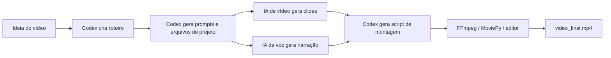

## 2. Arquitetura mínima do projeto

Antes da criação do vídeo, o Codex deve estruturar o projeto em arquivos. Isso é coerente com o modo como ele trabalha: sobre arquivos, código, comandos e execução local. ([OpenAI Developers](https://developers.openai.com/codex/ide/?utm_source=chatgpt.com))
Arquivos e pastas recomendados:

- `README.md` — visão geral do projeto, objetivo do vídeo, duração, público e padrão visual.
- `roteiro.md` — roteiro completo, com divisão por blocos e cenas.
- `shotlist.csv` — lista operacional das cenas, com duração, status, tipo de ativo e observações.
- `prompts_video.md` — prompts consolidados para as IAs de geração de clipes.
- `prompts_imagem.md` — prompts de imagens estáticas, thumbnails ou frames de apoio.
- `narracao.txt` — texto final da locução.
- `legendas.srt` — legendas sincronizadas para o vídeo.
- `assets/video/` — clipes gerados ou gravados.
- `assets/audio/` — locução, trilha e efeitos sonoros.
- `assets/img/` — imagens, logos, frames de referência.
- `scripts/montagem.py` — script Python de montagem, caso use MoviePy.
- `scripts/render.sh` ou `scripts/render.ps1` — automação de render com FFmpeg.
- `config.json` — parâmetros do projeto, como resolução, fps, idioma, formato e caminhos.
- `output/` — renders finais e versões intermediárias.

Um arranjo assim reduz erro humano e facilita a automação, versionamento e repetição do processo. Isso segue diretamente das capacidades documentadas do Codex de ler, modificar e executar tarefas no diretório de trabalho. ([OpenAI Developers](https://developers.openai.com/codex/ide/?utm_source=chatgpt.com))
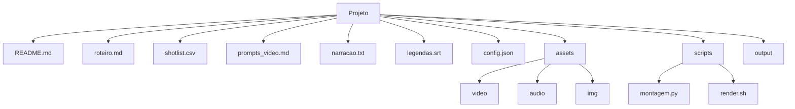

## 3. Etapa 1: criação do roteiro

A primeira etapa em que o Codex agrega valor é a criação do roteiro. Como agente de texto e código, ele consegue decompor o projeto em introdução, desenvolvimento, cenas, falas, narração, textos de tela e duração aproximada de cada bloco. Como ele opera sobre arquivos, esse roteiro pode ser salvo, revisado, comparado e evoluído no repositório. ([OpenAI Developers](https://developers.openai.com/codex/ide/?utm_source=chatgpt.com))
Nesta etapa, os arquivos principais são:

- `roteiro.md` — narrativa completa.
- `outline.md` — versão resumida da estrutura do vídeo.
- `narracao.txt` — texto limpo da locução, sem marcações técnicas.
- `shotlist.csv` — tabela de cenas com colunas como `id`, `descricao`, `duracao_seg`, `tipo_ativo`, `status`.

Objetivo de cada arquivo:
- `roteiro.md` organiza a visão editorial.
- `outline.md` permite aprovar rapidamente a macroestrutura.
- `narracao.txt` é a base para a síntese de voz.
- `shotlist.csv` vira a espinha operacional de produção.

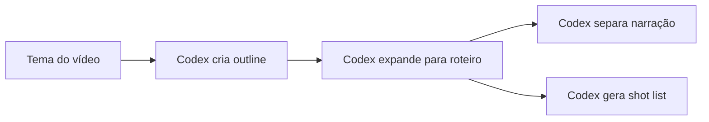

### Ferramentas que ajudam o Codex nesta etapa

**ChatGPT/Codex no IDE**  
Papel: planejamento, estruturação, escrita técnica e revisão do roteiro.  
Objetivo: transformar uma ideia em um conjunto de arquivos operacionais.  
Custo de uso: o OpenAI informa que os planos ChatGPT Plus, Pro, Business, Edu e Enterprise incluem Codex. ([OpenAI Developers](https://developers.openai.com/codex/ide/?utm_source=chatgpt.com))
## 4. Etapa 2: transformar o roteiro em prompts de geração

Depois do roteiro, o Codex pode converter cada cena em prompts técnicos detalhados. Isso inclui cenário, ação, enquadramento, iluminação, estilo, movimento de câmera, duração desejada e consistência visual entre cenas. Como ele é forte em padronização textual e automação, essa é uma etapa natural para ele. ([OpenAI Developers](https://developers.openai.com/codex/ide/?utm_source=chatgpt.com))
Arquivos desta etapa:

- `prompts_video.md` — prompts finais para vídeo.
- `prompts_imagem.md` — prompts para stills, thumbnails, imagens-base ou keyframes.
- `referencias_visuais.md` — descrição de personagens, cenários, paleta, figurino e regras de consistência.
- `prompt_map.csv` — mapeia cena → prompt → ferramenta sugerida → status.

Objetivo de cada arquivo:
- `prompts_video.md` centraliza os comandos de geração.
- `referencias_visuais.md` reduz deriva estética.
- `prompt_map.csv` torna o pipeline rastreável.

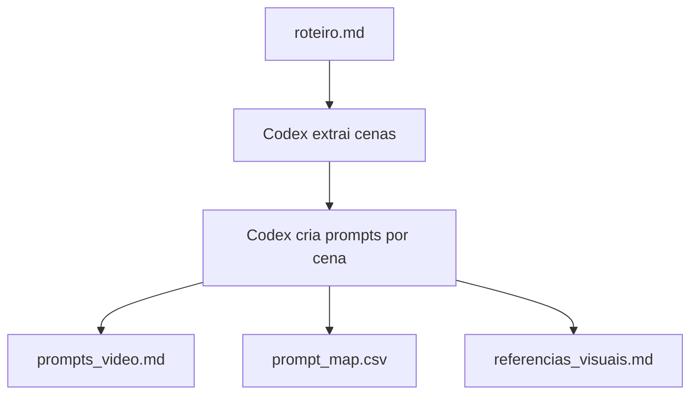

### Geradores de IA que ajudam o Codex nesta etapa

**Sora**  
Papel: geração de vídeo a partir de texto, imagem e também edição via Sora Video Editor.  
Objetivo: transformar prompts em clipes curtos.  
Custo de uso: a OpenAI informa que o Sora gera vídeos de até 20 segundos no Video Editor; o acesso depende da oferta vigente do produto OpenAI, não sendo adequado afirmar aqui um preço fixo sem consulta ao plano atual. ([OpenAI Help Center](https://help.openai.com/en/articles/9957612-generating-videos-on-sora?utm_source=chatgpt.com))
**Runway**  
Papel: geração de vídeo por IA com modelos Gen-4/Gen-4.5 e recursos de consistência visual.  
Objetivo: clipes curtos, cenas cinematográficas e personagens mais consistentes.  
Custo de uso: há plano Free e planos pagos; na API, os créditos custam US$ 0,01 por crédito, e o help center informa que Gen-4 usa 12 créditos por segundo de vídeo gerado. ([Runway](https://runwayml.com/pricing?utm_source=chatgpt.com))
**Kling AI**  
Papel: geração de vídeo por texto, imagem e referências; a documentação pública lista Text-to-Video, Image-to-Video, Motion Control, Extend Video e outros modos.  
Objetivo: animar imagens, gerar cenas curtas de 5 ou 10 segundos e variar workflows de vídeo.  
Custo de uso: a documentação pública menciona política de créditos e mostra planos pagos “from $6.99”; como o domínio público é parcialmente restrito, é mais seguro tratar Kling como serviço de créditos/assinatura, sem detalhar preço exato por geração aqui. ([Klingai](https://app.klingai.com/dev/document-api/apiReference%2Fmodel%2FimageToVideo?utm_source=chatgpt.com))
**Luma Dream Machine**  
Papel: geração de vídeo por IA com sistema de créditos e modos de produção.  
Objetivo: criar clipes de apoio e cenas curtas em fluxo freemium/pago.  
Custo de uso: a Luma informa créditos de teste em todos os planos, plano Plus a partir de US$ 30/mês e também plano Unlimited com créditos mensais e créditos ilimitados em Relaxed Mode. ([Luma Labs](https://lumalabs.ai/pricing?utm_source=chatgpt.com))
## 5. Etapa 3: geração dos ativos visuais

Aqui o Codex para de ser o agente principal e passa a ser o coordenador do processo. Ele não gera o clipe por conta própria; ele prepara os prompts, os parâmetros e a organização de saída. O clipe é produzido pela IA de vídeo escolhida. Isso é a fronteira mais importante do processo. ([OpenAI Developers](https://developers.openai.com/codex/ide/?utm_source=chatgpt.com))
Arquivos e saídas desta etapa:

- `assets/video/cena_001.mp4`, `cena_002.mp4` etc. — clipes gerados.
- `assets/img/ref_001.png` — imagens-base para image-to-video ou consistência visual.
- `geracao_log.csv` — ferramenta usada, duração do clipe, prompt, seed, custo/consumo de crédito, data.
- `aprovacao.md` — observações sobre o que foi aceito, rejeitado ou precisa ser regenerado.

Objetivo:
- preservar rastreabilidade,
- evitar perda de contexto,
- permitir reprocessamento com ajustes mínimos.

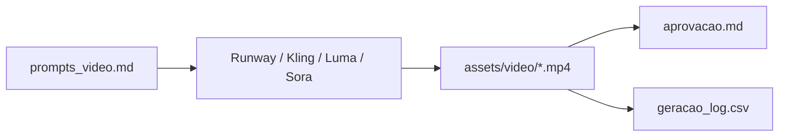

### Recomendação operacional

Para vídeo mais longo, o caminho mais estável é gerar **muitos clipes curtos** e montar tudo depois. Isso é consistente com o limite atual de várias plataformas: o help do Sora fala em até 20 segundos por geração no Video Editor; a documentação pública do Kling destaca saídas de 5 ou 10 segundos em Text-to-Video e Image-to-Video; e o custo do Runway escala por segundo gerado. ([OpenAI Help Center](https://help.openai.com/en/articles/9957612-generating-videos-on-sora?utm_source=chatgpt.com))
## 6. Etapa 4: narração, voz e áudio

O Codex também pode preparar a camada de áudio. Ele consegue limpar o texto da locução, dividir por blocos, marcar pausas, gerar um arquivo pronto para TTS e até escrever scripts para sincronização de narração com vídeo. ([OpenAI Developers](https://developers.openai.com/codex/ide/?utm_source=chatgpt.com))
Arquivos desta etapa:

- `narracao.txt` — texto da locução.
- `narracao_ssml.xml` — versão com marcações de pausa e prosódia, quando a ferramenta suportar.
- `assets/audio/narracao.wav` ou `.mp3` — voz gerada.
- `assets/audio/trilha.mp3` — música de fundo.
- `mixagem_planilha.csv` — níveis, entradas e timecodes de áudio.

### Ferramenta que ajuda o Codex nesta etapa

**ElevenLabs**  
Papel: geração de voz, voiceover e recursos de áudio por IA.  
Objetivo: transformar `narracao.txt` em voz natural para o vídeo.  
Custo de uso: a ElevenLabs tem plano Free a US$ 0/mês com 10 mil créditos/mês e planos pagos; a plataforma se apresenta como geradora de voiceovers e TTS para criação de conteúdo. ([ElevenLabs](https://elevenlabs.io/pricing?utm_source=chatgpt.com))
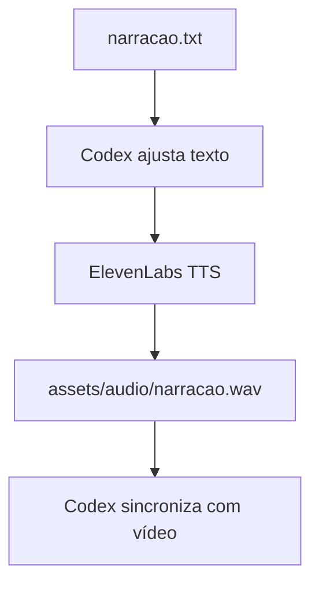

## 7. Etapa 5: legendas e sincronização

As legendas podem ser geradas a partir do texto-base da narração e sincronizadas depois com os clipes. O Codex pode escrever scripts para criar arquivos `.srt`, revisar marcações de tempo e embutir as legendas no vídeo final por FFmpeg ou mantê-las como arquivo externo. FFmpeg suporta fluxos e seleção de legendas, além de processamento de mídia com filtros. ([FFmpeg](https://ffmpeg.org/ffmpeg.html?utm_source=chatgpt.com))
Arquivos desta etapa:

- `legendas.srt` — legenda principal.
- `legendas_ptbr.srt` / `legendas_en.srt` — variantes por idioma.
- `timecodes.csv` — controle fino de marcações.
- `estilo_legenda.ass` — se optar por estilos mais avançados.

Objetivo:
- dar acessibilidade,
- facilitar versões multilíngues,
- automatizar exportações com e sem legendas.

## 8. Etapa 6: montagem final por script

A montagem final **pode sim ser feita por um script gerado pelo Codex**. Esta afirmação é tecnicamente verificável. O Codex pode escrever comandos FFmpeg ou scripts Python com MoviePy; FFmpeg é descrito oficialmente como ferramenta para converter, filtrar e processar áudio e vídeo, e MoviePy se define como ferramenta de referência para automação de edição de vídeo em Python. ([FFmpeg](https://ffmpeg.org/ffmpeg.html?utm_source=chatgpt.com))
Arquivos desta etapa:

- `scripts/montagem.py` — pipeline em Python.
- `scripts/render.sh` — comandos de render.
- `concat_list.txt` — lista de clipes para concatenação via FFmpeg.
- `config.json` — resolução, fps, codec, bitrate, paths.
- `output/video_final.mp4` — render final.
- `output/video_review.mp4` — render de revisão.
- `render_log.txt` — log da execução.

Objetivo de cada arquivo:
- `montagem.py` automatiza timeline, áudio, cortes e overlays.
- `concat_list.txt` simplifica concatenação.
- `config.json` evita hardcode.
- `render_log.txt` facilita depuração.

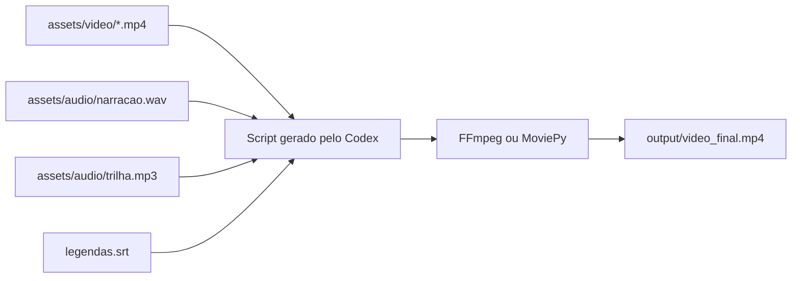

### Ferramentas que ajudam o Codex nesta etapa

**FFmpeg**  
Papel: motor de processamento de mídia, concatenação, filtros, codificação e muxing.  
Objetivo: gerar o MP4 final a partir dos ativos.  
Custo de uso: software livre e gratuito. ([FFmpeg](https://ffmpeg.org/ffmpeg.html?utm_source=chatgpt.com))
**MoviePy**  
Papel: biblioteca Python para automação de edição.  
Objetivo: montar timeline por código, com lógica mais amigável do que comandos longos de shell.  
Custo de uso: open source, licenciado em MIT. ([Zulko](https://zulko.github.io/moviepy/?utm_source=chatgpt.com))
### Quando usar FFmpeg e quando usar MoviePy

Use **FFmpeg** quando o objetivo for velocidade, concatenação, transcodificação, burn-in de legendas, mixagem e render padronizado. Use **MoviePy** quando a montagem exigir lógica Python mais legível, composição programática ou integração com outros scripts do projeto. Ambos podem coexistir no mesmo pipeline. ([FFmpeg](https://ffmpeg.org/ffmpeg.html?utm_source=chatgpt.com))
## 9. Etapa 7: acabamento em editor visual

Mesmo com montagem por script, o acabamento final pode ser melhor em um editor visual. Isso vale para correção fina de ritmo, ajuste manual de transições, color grading, mixagem detalhada e conferência visual quadro a quadro. ([Blackmagic Design](https://www.blackmagicdesign.com/products/davinciresolve?utm_source=chatgpt.com))
### Ferramentas de apoio ao Codex no acabamento

**DaVinci Resolve**  
Papel: editor NLE profissional para edição, cor, áudio e finalização.  
Objetivo: acabamento fino do vídeo depois do pipeline automático.  
Custo de uso: existe versão gratuita; a versão Studio é paga e a Blackmagic lista preço de US$ 295 para Studio, com recursos extras como AI Neural Engine, text-based editing e suporte acima de 4K/10-bit avançado. ([Blackmagic Design](https://www.blackmagicdesign.com/products/davinciresolve?utm_source=chatgpt.com))
**CapCut**  
Papel: editor rápido com recursos de IA e exportação simplificada.  
Objetivo: ajustes rápidos, versões para redes sociais e edição acessível.  
Custo de uso: CapCut oferece download gratuito; o help center informa que muitos exports podem sair sem watermark, mas algumas templates, assets ou configurações podem inserir marca d’água. Há também sistema de créditos e recursos premium/Pro. ([CapCut](https://www.capcut.com/?utm_source=chatgpt.com))
**InVideo AI**  
Papel: geração e edição orientadas por prompt, com automação de narração, mídia e estrutura.  
Objetivo: transformar texto em vídeo em um fluxo mais guiado por interface.  
Custo de uso: há plano Free com créditos limitados; a própria empresa diz que exports no plano gratuito têm watermark, e planos pagos removem a marca d’água em exportações elegíveis. ([Invideo](https://invideo.io/?utm_source=chatgpt.com))
## 10. O que o Codex consegue fazer sozinho

O Codex consegue atuar com alto nível de autonomia em tudo o que depende de texto, lógica, organização de arquivos e automação. Isso inclui:
- criar o roteiro,
- gerar shot list,
- converter cenas em prompts,
- preparar a estrutura de pastas,
- escrever scripts de render,
- revisar erros de execução,
- atualizar arquivos de configuração,
- repetir o pipeline com pequenas alterações. ([OpenAI Developers](https://developers.openai.com/codex/ide/?utm_source=chatgpt.com))
## 11. Onde o Codex precisa de ajuda

Ele precisa de ajuda em três pontos principais.

Primeiro, **geração visual inédita**. Para criar cenas novas a partir de texto ou imagem, ele depende de Sora, Runway, Kling, Luma ou ferramenta equivalente. ([OpenAI Help Center](https://help.openai.com/en/articles/9957612-generating-videos-on-sora?utm_source=chatgpt.com))
Segundo, **voz e áudio expressivos**. Para voiceover natural, ele depende de ferramenta específica como ElevenLabs ou similar. ([ElevenLabs](https://elevenlabs.io/?utm_source=chatgpt.com))
Terceiro, **curadoria estética e acabamento editorial**. Mesmo quando a renderização é toda automática, a avaliação de ritmo, impacto visual, naturalidade de transição e consistência final ainda é melhor com revisão humana e, às vezes, em editor visual. Essa conclusão decorre do escopo das ferramentas: elas automatizam operações, não substituem integralmente julgamento criativo. ([Blackmagic Design](https://www.blackmagicdesign.com/event/davinciresolvedownload?utm_source=chatgpt.com))
## 12. Fluxo recomendado, do início ao fim

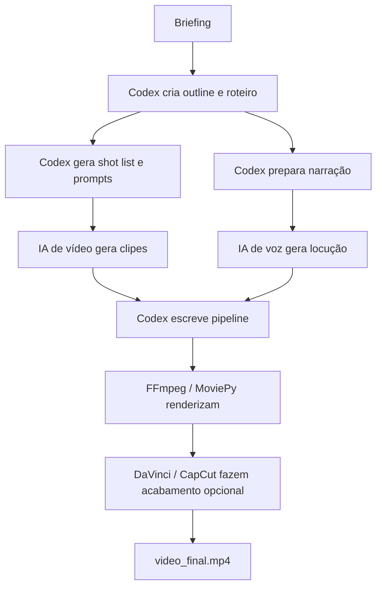

Fluxo operacional:
1. Briefing do vídeo.
2. Codex gera `outline.md`, `roteiro.md`, `shotlist.csv`.
3. Codex gera `prompts_video.md` e `referencias_visuais.md`.
4. Outras IAs criam os clipes.
5. Codex prepara `narracao.txt` e `legendas.srt`.
6. Ferramenta de voz gera a locução.
7. Codex escreve `montagem.py` ou `render.sh`.
8. FFmpeg/MoviePy exportam o MP4.
9. Editor visual faz acabamento opcional.
10. Render final vai para `output/video_final.mp4`.

## 13. Formulação final correta

A forma tecnicamente mais precisa de explicar o processo é esta:

**O Codex não é um gerador nativo de vídeo, mas um agente de código que pode estruturar o projeto, criar o roteiro, transformar cenas em prompts, organizar os arquivos, escrever scripts de automação e montar/exportar o vídeo final por código. Para gerar as cenas em movimento, ele normalmente precisa da ajuda de IAs de vídeo; para narração, de ferramentas de voz; e para acabamento fino, de editores visuais ou revisão humana.** ([OpenAI Developers](https://developers.openai.com/codex/ide/?utm_source=chatgpt.com))
Se você quiser, eu transformo este manual em uma versão pronta para PDF, com capa, sumário e padronização editorial.

---

# you asked

De acordo com as fontes verificadas,  quais são as especificações técnicas e os requisitos que o roteiro de vídeo DEVE ter?

---

# chatgpt response

De acordo com as fontes verificadas, não existe um “padrão ISO” único de roteiro para vídeo com IA, mas há um conjunto de elementos que aparece de forma consistente nas documentações oficiais de Sora, Runway e Luma. Em termos práticos, para funcionar bem nesse pipeline, o roteiro **deve** trazer especificações suficientes para que o Codex consiga converter cada cena em prompts e, depois, em montagem. O núcleo mínimo é: **tipo de plano, sujeito, ação, cenário, iluminação e movimento de câmera**. A documentação da OpenAI para geração de vídeo com Sora diz explicitamente que, para melhores resultados, o prompt deve descrever **shot type, subject, action, setting e lighting**; a documentação da Runway reforça que prompts eficazes descrevem **o que aparece no quadro e como esses elementos se movem**; e a Luma recomenda uma estrutura ordenada com **subject → action → details → scene → style → camera**. ([OpenAI Developers](https://developers.openai.com/api/docs/guides/video-generation/?utm_source=chatgpt.com))
Então, para um roteiro “tecnicamente utilizável”, cada cena deve conter pelo menos estas especificações:

1. **Tipo de plano/enquadramento.**  
O roteiro deve indicar se a cena é plano geral, plano médio, close-up, over-the-shoulder, etc. Isso não é perfumaria: a OpenAI recomenda informar o **shot type**, e a Runway mantém documentação específica de termos de câmera justamente porque esses termos alteram o resultado visual. Sem enquadramento, o modelo tende a improvisar composição. ([OpenAI Developers](https://developers.openai.com/api/docs/guides/video-generation/?utm_source=chatgpt.com))
2. **Sujeito principal claramente definido.**  
Cada cena deve dizer quem ou o que é o foco visual: personagem, objeto, grupo, ambiente ou ação principal. A OpenAI destaca que Sora entende detalhes de **subject and background**, e a Luma recomenda começar o prompt pelo **main subject**. Sem sujeito bem definido, a cena perde foco e consistência entre gerações. ([OpenAI Help Center](https://help.openai.com/en/articles/9957612-generating-videos-on-sora?utm_source=chatgpt.com))
3. **Ação ou movimento principal.**  
O roteiro deve especificar o que acontece na cena, e isso precisa ser concreto. A Runway diz que prompts eficazes devem descrever **how those elements move through the scene**, e o guia de prompting do Sora 2 recomenda manter **um movimento de câmera claro e uma ação clara do sujeito por tomada**, com ações descritas em batidas temporais simples. Em vez de “o atleta se movimenta”, o roteiro precisa trazer algo como “o jogador dá três passos, salta e gira no ar no último segundo”. ([Runway](https://help.runwayml.com/hc/en-us/articles/47313737321107-Text-to-Video-Prompting-Guide?utm_source=chatgpt.com))
4. **Cenário e contexto espacial.**  
O roteiro deve dizer onde a ação ocorre e o que existe no ambiente. A OpenAI inclui **setting** entre os elementos recomendados; a Luma também pede **scene**; e Sora foi apresentado como modelo capaz de lidar com detalhes do sujeito e do fundo. Isso significa que o roteiro precisa informar local, época, clima, elementos de fundo e contexto visual relevante. ([OpenAI Developers](https://developers.openai.com/api/docs/guides/video-generation/?utm_source=chatgpt.com))
5. **Iluminação e aparência visual.**  
O roteiro deve indicar luz e tratamento visual, por exemplo “golden hour”, “luz fria de ginásio”, “contraluz”, “neon urbano”, “estética documental” ou “cinematográfica”. A OpenAI inclui **lighting** nas recomendações de prompting, e a Luma inclui **style** e iluminação dentro da sua estrutura recomendada. Sem isso, a estética do vídeo tende a variar demais entre cenas. ([OpenAI Developers](https://developers.openai.com/api/docs/guides/video-generation/?utm_source=chatgpt.com))
6. **Movimento de câmera.**  
Se a cena exige linguagem cinematográfica consistente, o roteiro deve dizer se a câmera está fixa, em pan, tilt, tracking, dolly, handheld, orbit ou zoom. A Runway tem guias separados para **camera motion** e biblioteca de termos de câmera, e a Luma também recomenda explicitar o movimento de câmera. Sem esse item, o modelo pode acertar o tema e errar completamente a gramática visual da cena. ([Runway](https://help.runwayml.com/hc/en-us/articles/39789879462419-Gen-4-Video-Prompting-Guide?utm_source=chatgpt.com))
7. **Progressão temporal da cena.**  
O roteiro deve informar a sequência interna do que acontece, não apenas o estado final. A Runway diz que o prompt deve descrever **temporal progression**, e o guia do Sora 2 recomenda ações descritas em etapas ou contagens. Em termos de roteiro, isso significa escrever a microcoreografia da tomada: início, desenvolvimento e fechamento da ação. ([Runway](https://help.runwayml.com/hc/en-us/articles/48324313115155-Image-to-Video-Prompting-Guide?utm_source=chatgpt.com))
8. **Duração por tomada.**  
O roteiro deve indicar a duração prevista de cada cena ou bloco. Isso é importante porque as plataformas têm limites operacionais: o Sora Video Editor, na experiência web documentada, gera até **20 segundos** por vídeo; no Sora 1 web, Plus/Business chegavam a até **10 s** e Pro a até **20 s**; a Runway documenta o Gen-4 em **5 ou 10 segundos**; e a Luma descreve fluxos com clipes curtos e extensões. Logo, um roteiro para IA não deve nascer como sequência corrida de vários minutos por tomada; ele precisa ser fatiado em cenas curtas. ([OpenAI Help Center](https://help.openai.com/en/articles/9957612-generating-videos-on-sora?utm_source=chatgpt.com))
9. **Especificações de saída da cena.**  
O roteiro técnico deve trazer ou remeter a parâmetros de produção como **aspect ratio, resolution, duration e number of variations**, porque esses controles existem no Sora; e, no pipeline geral, eles afetam geração, montagem e render. Isso pode ficar no próprio roteiro ou em arquivo anexo, mas precisa existir. ([OpenAI Help Center](https://help.openai.com/en/articles/9957612-generating-videos-on-sora?utm_source=chatgpt.com))
10. **Diálogo, narração e áudio, quando existirem.**  
Se a cena tiver fala ou trilha descritiva, isso precisa aparecer no roteiro. A Luma recomenda pôr diálogo entre aspas para lip-sync e explicitar sons/ambiência no prompt; isso mostra que, para um vídeo com voz, o roteiro não deve conter apenas imagem, mas também **fala, ambiência e intenção sonora**. ([Luma Labs](https://lumalabs.ai/learning-hub/luma-video-models-guide-ray3.14-veo-sora-kling-compared?utm_source=chatgpt.com))
11. **Referência de consistência visual.**  
Quando o vídeo tiver personagem recorrente, cenário recorrente ou identidade visual fixa, o roteiro técnico deve anexar ou referenciar um documento de consistência. A Luma recomenda uso de **visual reference** como guia de estilo/objeto, e a própria lógica de prompting dessas plataformas favorece consistência quando sujeito, estilo e cena são explicitados de forma repetível. ([Luma Labs](https://lumalabs.ai/learning-hub/best-practices?utm_source=chatgpt.com))
12. **Estrutura em cenas independentes, não em texto corrido.**  
Segundo as fontes, o melhor formato não é um parágrafo longo e solto, mas uma estrutura por tomada/cena. O Sora storyboard funciona com cartões por tempo; a documentação diz que você pode descrever o que quer que aconteça em momentos específicos do vídeo e recomenda deixar espaço entre os cards para conectar as cenas, já que pouco espaço aumenta a chance de hard cuts. Isso implica que o roteiro, para uso técnico, deve ser segmentado por cena ou por beat temporal. ([OpenAI Help Center](https://help.openai.com/en/articles/9957612-generating-videos-on-sora?utm_source=chatgpt.com))
Em resumo, o roteiro de vídeo voltado a Codex + IAs de vídeo **deve ter**, no mínimo, para cada cena: **enquadramento, sujeito, ação, cenário, iluminação, estilo, movimento de câmera, progressão temporal e duração prevista**. E, no nível do projeto, deve incluir **parâmetros de saída** como proporção, resolução e número de variações, além de **diálogo/áudio** quando aplicável. Isso é o que está melhor sustentado pelas documentações oficiais verificadas. ([OpenAI Developers](https://developers.openai.com/api/docs/guides/video-generation/?utm_source=chatgpt.com))
Um modelo enxuto de cena, alinhado com essas fontes, ficaria assim:

**Cena 03**  
Plano: plano médio em tracking lateral  
Sujeito: jogadora de handebol de areia, uniforme azul  
Ação: corre três passos, salta, gira e arremessa no último segundo  
Cenário: quadra de areia ao ar livre, arquibancada ao fundo  
Iluminação/estilo: fim de tarde, luz quente, estética esportiva cinematográfica  
Câmera: tracking suave da esquerda para a direita  
Tempo interno: corrida nos 2 primeiros segundos, salto no 3º, arremesso no 4º  
Duração: 5 segundos  
Áudio: torcida abafada, impacto do pé na areia  
Saída: 16:9, 1080p, 1 variação principal

Esse formato já está suficientemente especificado para o Codex transformar em prompt, controlar arquivos e preparar a montagem. ([OpenAI Developers](https://developers.openai.com/cookbook/examples/sora/sora2_prompting_guide/?utm_source=chatgpt.com))
Posso converter isso em uma seção pronta do manual, com tabela “campo obrigatório / finalidade / exemplo”.

---

# you asked

Prossiga

---

# chatgpt response

## Especificações técnicas e requisitos do roteiro de vídeo

Para que o Codex consiga transformar um briefing em um pipeline de geração e montagem, o roteiro precisa ser escrito em formato **técnico-operacional**, não apenas em linguagem narrativa. Pelas documentações verificadas de Sora, Runway e Luma, um roteiro útil para vídeo com IA deve descrever de forma explícita o que aparece no quadro, como isso se move, em que ambiente ocorre e com que linguagem visual a cena será construída. A OpenAI recomenda, para melhores resultados, incluir **shot type, subject, action, setting e lighting**; a Runway enfatiza que bons prompts descrevem **o que está no quadro e como esses elementos se movem**; e a Luma recomenda a sequência **subject → action → details → scene → style → camera**. 

### O que o roteiro deve ter em cada cena

| Campo obrigatório | O que deve informar | Por que é necessário | Exemplo |
|---|---|---|---|
| Identificação da cena | Número ou código da tomada | Permite rastrear geração, revisão e montagem | `Cena 03` |
| Tipo de plano | Enquadramento principal | A OpenAI recomenda informar o shot type; isso reduz ambiguidades de composição.  | `Plano médio` |
| Sujeito principal | Quem ou o que é o foco da tomada | Sora e Luma dependem de sujeito claro para manter foco visual.  | `Jogadora de handebol de areia` |
| Ação principal | O que acontece na cena | A Runway recomenda descrever explicitamente o movimento e a progressão da ação.  | `Corre, salta e arremessa` |
| Cenário | Onde a ação acontece | A OpenAI inclui setting entre os elementos recomendados.  | `Quadra de areia ao ar livre` |
| Iluminação | Tipo e clima de luz | A OpenAI recomenda lighting; isso afeta consistência estética.  | `Fim de tarde, luz quente` |
| Estilo visual | Linguagem estética da cena | A Luma recomenda explicitar estilo e detalhes visuais.  | `Esportivo cinematográfico` |
| Movimento de câmera | Como a câmera se comporta | A Runway e a Luma tratam câmera como componente técnico relevante do prompt.  | `Tracking lateral suave` |
| Progressão temporal | Ordem interna da ação | A Runway recomenda descrever a progressão temporal da tomada.  | `2 s corrida, 1 s salto, 1 s giro, 1 s arremesso` |
| Duração | Tempo previsto da cena | As plataformas operam melhor com clipes curtos; Sora e Runway documentam durações limitadas por geração.  | `5 segundos` |
| Áudio da cena | Narração, fala, ambiência ou efeitos | A Luma recomenda explicitar diálogo e intenção sonora quando aplicável.  | `Torcida abafada e som da areia` |
| Saída técnica | Aspect ratio, resolução, variações | O Sora expõe controles como duração, resolução e aspect ratio.  | `16:9, 1080p, 1 variação` |

### Requisitos de projeto que o roteiro também deve conter

Além dos campos por cena, o roteiro completo deve trazer requisitos gerais do projeto. Isso é necessário porque plataformas de geração e a etapa de montagem dependem de parâmetros consistentes de saída. A documentação do Sora indica opções como **duration, aspect ratio e resolution**, o que mostra que essas definições não podem ficar implícitas. 

O roteiro técnico do projeto deve incluir:
- objetivo do vídeo;
- público-alvo;
- duração total pretendida;
- proporção final do vídeo, como 16:9 ou 9:16;
- resolução alvo, como 1080p;
- idioma da narração e das legendas;
- identidade visual desejada;
- regra de consistência de personagem, cenário e tom;
- divisão do vídeo em cenas independentes ou blocos curtos. A própria documentação do storyboard do Sora trabalha com cartões por tempo e descreve ações em momentos específicos do vídeo, o que favorece roteiro segmentado em vez de texto corrido. 

### Estrutura recomendada de arquivos para esta etapa

Nesta parte do manual, os arquivos mais importantes são:

| Arquivo | Objetivo |
|---|---|
| `outline.md` | Resumo executivo da estrutura do vídeo |
| `roteiro.md` | Roteiro técnico completo, cena por cena |
| `shotlist.csv` | Controle operacional das tomadas |
| `narracao.txt` | Texto limpo da locução |
| `referencias_visuais.md` | Regras de estilo, personagem, cenário e consistência |
| `config_video.json` | Aspect ratio, resolução, fps, duração por cena e formato final |

### Fluxo técnico da escrita do roteiro

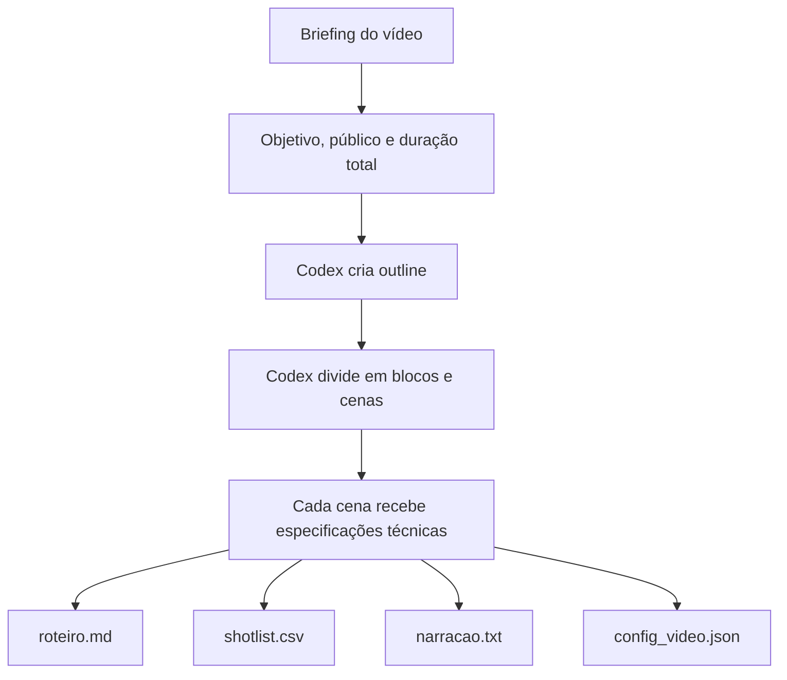

### Modelo de cena tecnicamente adequado

Abaixo está um modelo alinhado com os requisitos verificados nas documentações:

**Cena 03**  
**Plano:** plano médio em tracking lateral  
**Sujeito:** jogadora de handebol de areia, uniforme azul  
**Ação:** corre três passos, salta, gira no ar e arremessa  
**Cenário:** quadra de areia ao ar livre, arquibancada ao fundo  
**Iluminação:** fim de tarde, luz quente  
**Estilo:** esportivo cinematográfico  
**Câmera:** tracking suave da esquerda para a direita  
**Progressão temporal:** 2 segundos de corrida, 1 segundo de salto, 1 segundo de giro, 1 segundo de arremesso  
**Duração:** 5 segundos  
**Áudio:** torcida abafada, impacto do pé na areia  
**Saída:** 16:9, 1080p, 1 variação

Esse formato atende ao que as fontes verificadas tratam como essencial: enquadramento, sujeito, ação, cenário, iluminação, estilo, câmera, temporalidade e parâmetros de saída. 

### Regras práticas do manual

O roteiro deve ser escrito como uma sequência de **tomadas independentes**, e não como um texto corrido de vários minutos. Isso é importante porque as ferramentas documentadas operam melhor em clipes curtos: o help do Sora descreve geração de vídeos de até 20 segundos no Video Editor, e a Runway documenta gerações curtas no Gen-4. 

Também é recomendável limitar cada tomada a **uma ação principal e um movimento de câmera principal**. Esse ponto é consistente com as boas práticas de prompting da Runway e com o guia de prompting do Sora 2, que favorecem instruções claras, temporais e não excessivamente sobrecarregadas. 

### Formulação normativa para o manual

Você pode inserir no manual esta redação:

**O roteiro de vídeo deve especificar, para cada cena, o tipo de plano, o sujeito principal, a ação, o cenário, a iluminação, o estilo visual, o movimento de câmera, a progressão temporal da tomada, a duração prevista, o áudio associado e os parâmetros técnicos de saída. No nível do projeto, deve também definir objetivo, público, duração total, proporção, resolução, idioma, identidade visual e regras de consistência. Sem essas informações, o Codex consegue escrever texto descritivo, mas não consegue estruturar com precisão um pipeline confiável de geração e montagem.** 

Posso continuar e integrar esta seção diretamente ao manual completo, já no mesmo padrão das demais seções.

---

# you asked

Prossiga

---

# chatgpt response

Segue a seção integrada ao manual, em formato editorial e com base nas fontes verificadas.

## Capítulo: Especificações técnicas e requisitos do roteiro de vídeo

Para que o Codex consiga transformar um briefing em um pipeline confiável de geração e montagem, o roteiro precisa ser escrito em formato técnico-operacional, não apenas como texto narrativo. A documentação oficial da OpenAI para geração de vídeo recomenda, para melhores resultados, descrever **shot type, subject, action, setting e lighting**. A documentação da Runway afirma que prompts eficazes descrevem **o que aparece no quadro e como esses elementos se movem**. Já a Luma recomenda uma estrutura orientada por **ação em andamento, estilo cinematográfico, referência visual e movimento de câmera**. ([OpenAI Developers](https://developers.openai.com/api/docs/guides/video-generation/?utm_source=chatgpt.com))
Em termos práticos, isso significa que o roteiro de vídeo, quando escrito para uso com Codex e outras IAs, deve ser composto por cenas independentes e tecnicamente descritas. Além disso, as plataformas de vídeo trabalham com saídas curtas e configuráveis: o Sora permite definir **aspect ratio, resolution, duration e number of variations**, e o Sora Video Editor documenta vídeos de até **20 segundos** por geração; a Runway Gen-4 documenta gerações de **5 ou 10 segundos**. Portanto, o roteiro deve nascer segmentado em tomadas curtas, e não como uma sequência contínua de vários minutos. ([OpenAI Help Center](https://help.openai.com/en/articles/9957612-generating-videos-on-sora?utm_source=chatgpt.com))
### Requisitos obrigatórios por cena

Cada cena do roteiro deve conter, no mínimo, os seguintes campos.

| Campo | O que deve constar | Justificativa técnica |
|---|---|---|
| Identificador da cena | Código ou número da tomada | Permite rastreamento entre roteiro, prompts, geração e montagem |
| Tipo de plano | Plano geral, médio, close, detalhe etc. | A OpenAI recomenda declarar o **shot type** para melhorar aderência visual. ([OpenAI Developers](https://developers.openai.com/api/docs/guides/video-generation/?utm_source=chatgpt.com))|
| Sujeito principal | Quem ou o que é o foco visual | O sujeito precisa estar ancorado com detalhes distintivos para manter reconhecimento e consistência. ([OpenAI Developers](https://developers.openai.com/cookbook/examples/sora/sora2_prompting_guide/?utm_source=chatgpt.com))|
| Ação principal | O que o sujeito faz | A Runway recomenda descrever claramente como os elementos se movem na cena. ([Runway](https://help.runwayml.com/hc/en-us/articles/47313737321107-Text-to-Video-Prompting-Guide?utm_source=chatgpt.com))|
| Cenário | Onde a ação acontece | A OpenAI inclui **setting** entre os componentes recomendados. ([OpenAI Developers](https://developers.openai.com/api/docs/guides/video-generation/?utm_source=chatgpt.com))|
| Iluminação | Luz quente, fria, contraluz, golden hour etc. | A OpenAI recomenda explicitar **lighting**. ([OpenAI Developers](https://developers.openai.com/api/docs/guides/video-generation/?utm_source=chatgpt.com))|
| Paleta/estilo visual | Cinematográfico, documental, esportivo, anime etc. | O guia Sora 2 recomenda definir iluminação e paleta; a Luma recomenda explicitar estilo. ([OpenAI Developers](https://developers.openai.com/cookbook/examples/sora/sora2_prompting_guide/?utm_source=chatgpt.com))|
| Movimento de câmera | Pan, tilt, dolly, tracking, handheld, zoom etc. | A documentação da Runway e da Luma trata câmera como parte crítica do prompt. ([Runway](https://help.runwayml.com/hc/en-us/articles/39789879462419-Gen-4-Video-Prompting-Guide?utm_source=chatgpt.com))|
| Progressão temporal | Ordem interna da ação dentro da tomada | O guia Sora 2 recomenda descrever a ação em beats; a Runway valoriza instruções temporais claras. ([OpenAI Developers](https://developers.openai.com/cookbook/examples/sora/sora2_prompting_guide/?utm_source=chatgpt.com))|
| Duração prevista | Tempo da tomada em segundos | As ferramentas operam com clipes curtos e duração configurável. ([OpenAI Help Center](https://help.openai.com/en/articles/9957612-generating-videos-on-sora?utm_source=chatgpt.com))|
| Áudio associado | Narração, fala, ambiência, efeitos | Em pipelines multimodais, isso orienta geração de voz e montagem, e a Luma enfatiza ação e detalhes perceptíveis como vento, poeira, movimento de tecido etc. ([Luma Labs](https://lumalabs.ai/learning-hub/luma-video-models-guide-ray3.14-veo-sora-kling-compared?utm_source=chatgpt.com))|
| Saída técnica | Aspect ratio, resolução, número de variações | O Sora permite configurar esses parâmetros explicitamente. ([OpenAI Help Center](https://help.openai.com/en/articles/9957612-generating-videos-on-sora?utm_source=chatgpt.com))|

### Requisitos obrigatórios no nível do projeto

Além das informações por cena, o roteiro completo deve conter uma camada de especificação global do vídeo. Isso é necessário porque Codex, geradores de vídeo e ferramentas de montagem precisam operar com parâmetros consistentes desde o início.

O projeto deve definir:
- objetivo do vídeo;
- público-alvo;
- duração total pretendida;
- formato final, como 16:9 ou 9:16;
- resolução alvo;
- idioma da narração e das legendas;
- identidade visual;
- regra de consistência de personagem, cenário e tom;
- estratégia de divisão em cenas curtas.

Esses requisitos são coerentes com o fato de o Sora expor controles de duração, resolução e proporção, e com os guias de prompting do Sora 2 e da Runway, que favorecem prompts claros, específicos e compostos por uma ação principal compreensível. ([OpenAI Help Center](https://help.openai.com/en/articles/9957612-generating-videos-on-sora?utm_source=chatgpt.com))
### Regra de escrita da cena

Cada cena deve ser escrita como uma unidade independente e executável. O padrão mais alinhado às fontes verificadas é:

1. enquadramento;
2. sujeito;
3. ação;
4. cenário;
5. iluminação e paleta;
6. movimento de câmera;
7. progressão temporal;
8. duração;
9. áudio;
10. parâmetros de saída.

Esse modelo reflete diretamente o que a OpenAI recomenda para vídeo, o que a Runway exige para movimento e o que a Luma sugere como boas práticas de prompting. ([OpenAI Developers](https://developers.openai.com/api/docs/guides/video-generation/?utm_source=chatgpt.com))
### Diagrama do fluxo de escrita do roteiro técnico

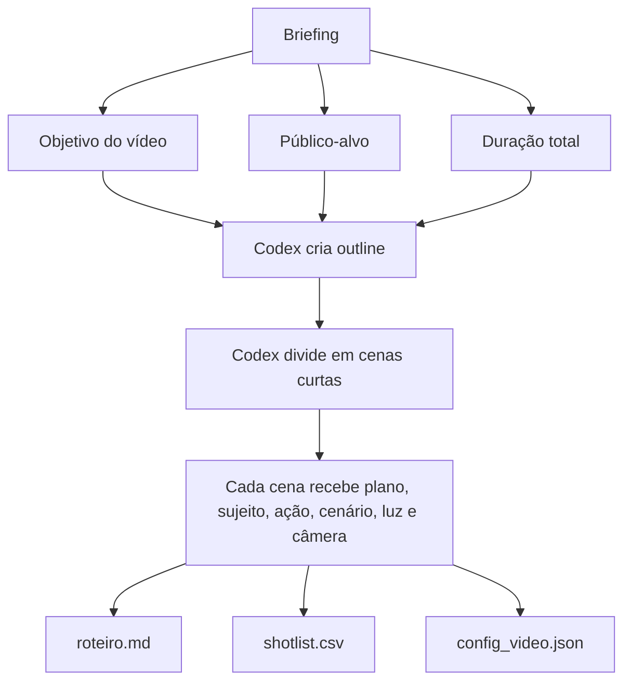

### Arquivos que devem ser criados nesta etapa

| Arquivo | Objetivo |
|---|---|
| `outline.md` | Estrutura resumida do vídeo antes do detalhamento cena a cena |
| `roteiro.md` | Documento principal com a descrição técnica de cada tomada |
| `shotlist.csv` | Controle operacional das cenas, durações, status e tipo de ativo |
| `narracao.txt` | Texto da locução separado do roteiro visual |
| `referencias_visuais.md` | Regras de consistência para personagens, cenários, figurino, paleta e tom |
| `config_video.json` | Aspect ratio, resolução, fps, idioma, duração por cena e formato final |

### Modelo recomendado de cena

Abaixo está um modelo de cena compatível com os requisitos verificados:

**Cena 03**  
**Plano:** plano médio em tracking lateral  
**Sujeito:** jogadora de handebol de areia, uniforme azul  
**Ação:** corre três passos, salta, gira no ar e arremessa  
**Cenário:** quadra de areia ao ar livre, arquibancada ao fundo  
**Iluminação:** fim de tarde, luz quente  
**Paleta/estilo:** esportivo cinematográfico, tons quentes e contraste moderado  
**Câmera:** tracking suave da esquerda para a direita  
**Progressão temporal:** 2 segundos de corrida, 1 segundo de salto, 1 segundo de giro, 1 segundo de arremesso  
**Duração:** 5 segundos  
**Áudio:** torcida abafada e som da areia sendo deslocada  
**Saída:** 16:9, 1080p, 1 variação

Esse formato é adequado porque contém exatamente os elementos que as documentações oficiais tratam como mais importantes: enquadramento, sujeito, ação, ambiente, iluminação, câmera, temporalidade e parâmetros de geração. ([OpenAI Developers](https://developers.openai.com/api/docs/guides/video-generation/?utm_source=chatgpt.com))
### Regras normativas para inserir no manual

Você pode usar esta formulação:

**O roteiro de vídeo deve especificar, para cada cena, o tipo de plano, o sujeito principal, a ação, o cenário, a iluminação, o estilo visual, o movimento de câmera, a progressão temporal da tomada, a duração prevista, o áudio associado e os parâmetros técnicos de saída. No nível do projeto, deve também definir objetivo, público, duração total, proporção, resolução, idioma, identidade visual e regras de consistência. Sem essas informações, o Codex pode produzir texto descritivo, mas não consegue estruturar com precisão um pipeline confiável de geração e montagem.** ([OpenAI Developers](https://developers.openai.com/api/docs/guides/video-generation/?utm_source=chatgpt.com))
### O que o Codex faz com esse roteiro

Quando o roteiro já está nesse padrão técnico, o Codex consegue:
- converter cada cena em prompt para IA de vídeo;
- gerar `shotlist.csv` e mapear a ordem das tomadas;
- separar `narracao.txt` e preparar voz e legendas;
- criar scripts de montagem para FFmpeg ou MoviePy;
- aplicar parâmetros consistentes de saída no pipeline.

Isso decorre das capacidades documentadas do Codex de ler arquivos, editar código e executar comandos no ambiente de trabalho. ([OpenAI Developers](https://developers.openai.com/api/docs/guides/video-generation/?utm_source=chatgpt.com))
No próximo passo do manual, a sequência natural é transformar essa seção em “Como o Codex converte o roteiro técnico em prompts para Sora, Runway, Kling e Luma”.

---

# you asked

Prossiga

---

# chatgpt response

## Capítulo: Como o Codex converte o roteiro técnico em prompts para Sora, Runway, Kling e Luma

Depois que o roteiro já está escrito no formato técnico, o próximo papel do Codex é transformá-lo em prompts operacionais para cada gerador. Essa conversão não é uma simples reescrita. O Codex precisa adaptar o mesmo conteúdo à lógica de cada plataforma. Nas fontes verificadas, a OpenAI recomenda que prompts de vídeo incluam **shot type, subject, action, setting e lighting**; a Runway recomenda descrever **o que vemos** e **como isso se move**; a Kling estrutura seu guia em **Subject, Movement, Scene, Camera Language e Lighting**; e a Luma enfatiza referência visual, estilo e movimento de câmera. ([OpenAI Developers](https://developers.openai.com/api/docs/guides/video-generation/?utm_source=chatgpt.com))
Isso significa que o Codex não deve gerar um único prompt genérico para todas as ferramentas. O procedimento correto é criar uma versão-base por cena e, a partir dela, derivar variantes orientadas a cada motor. Esse método reduz ambiguidade, melhora aderência visual e facilita regeneração quando uma ferramenta específica falha ou produz resultado inconsistente. O guia Sora 2, por exemplo, recomenda tratar o prompt como um storyboard: definir enquadramento, profundidade, ação em beats, iluminação e paleta. ([OpenAI Developers](https://developers.openai.com/cookbook/examples/sora/sora2_prompting_guide/?utm_source=chatgpt.com))
### Fluxo da conversão

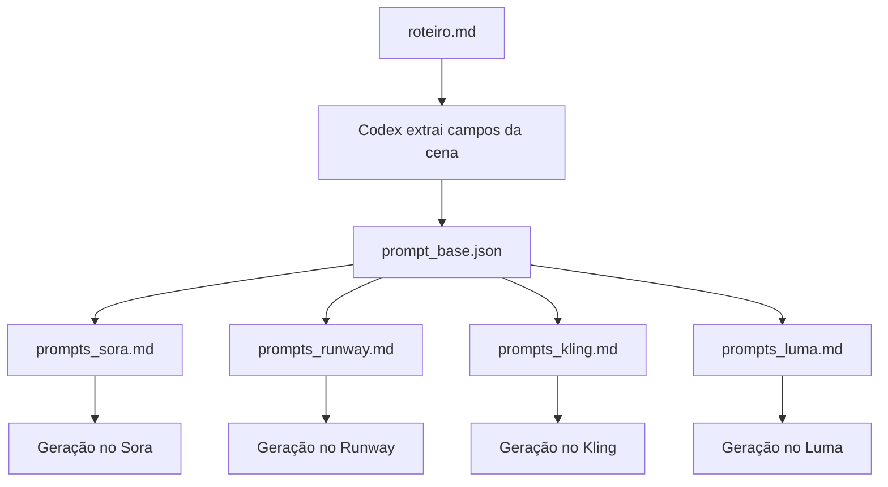

### Arquivos que devem ser criados nesta etapa

| Arquivo | Objetivo |
|---|---|
| `prompt_base.json` | Estrutura normalizada da cena antes de especializar para cada ferramenta |
| `prompts_sora.md` | Prompts adaptados ao Sora |
| `prompts_runway.md` | Prompts adaptados ao Runway |
| `prompts_kling.md` | Prompts adaptados ao Kling |
| `prompts_luma.md` | Prompts adaptados ao Luma |
| `prompt_map.csv` | Mapeia cena, ferramenta, prompt, duração, aspect ratio e status |
| `referencias_visuais.md` | Regras de consistência de personagem, cenário e estilo |
| `geracao_log.csv` | Registra resultados, versão do prompt e consumo de créditos |

O arquivo mais importante aqui é o `prompt_base.json`, porque ele separa o conteúdo sem amarrá-lo a uma plataforma. Em geral, ele deve conter campos como `scene_id`, `shot_type`, `subject`, `action`, `setting`, `lighting`, `style`, `camera_motion`, `duration`, `audio_intent` e `output_spec`. A partir daí, o Codex gera textos finais diferentes para cada IA. Esse tipo de transformação é exatamente compatível com a capacidade documentada do Codex de ler arquivos, editar conteúdo e executar automações no workspace. ([OpenAI Developers](https://developers.openai.com/api/docs/guides/video-generation/?utm_source=chatgpt.com))
### Estrutura recomendada do `prompt_base.json`

```json
{
  "scene_id": "03",
  "shot_type": "plano médio",
  "subject": "jogadora de handebol de areia, uniforme azul",
  "action": "corre três passos, salta, gira no ar e arremessa",
  "setting": "quadra de areia ao ar livre, arquibancada ao fundo",
  "lighting": "fim de tarde, luz quente",
  "style": "esportivo cinematográfico",
  "camera_motion": "tracking lateral suave",
  "temporal_beats": "2 s corrida, 1 s salto, 1 s giro, 1 s arremesso",
  "duration_seconds": 5,
  "audio_intent": "torcida abafada e som da areia",
  "output_spec": "16:9, 1080p, 1 variação"
}
```

## 1. Como o Codex adapta a cena para o Sora

Nas fontes oficiais da OpenAI, o Sora funciona melhor quando o prompt explicita o tipo de plano, o sujeito, a ação, o cenário e a iluminação. O guia Sora 2 acrescenta que o prompt deve se parecer com um storyboard: enquadramento claro, ação em beats, paleta e luz bem definidas, e sujeito ancorado por detalhes distintivos. O help do Sora também orienta a incluir sujeito e contexto, câmera e movimento, look e pacing, e intenção de áudio. ([OpenAI Developers](https://developers.openai.com/api/docs/guides/video-generation/?utm_source=chatgpt.com))
Portanto, quando o Codex gera prompts para Sora, ele deve priorizar:
- clareza do enquadramento;
- uma única ação principal por tomada;
- progressão temporal simples;
- tom visual e pacing;
- intenção de áudio, quando pertinente. ([OpenAI Developers](https://developers.openai.com/cookbook/examples/sora/sora2_prompting_guide/?utm_source=chatgpt.com))
**Exemplo de prompt Sora gerado pelo Codex**  
“Plano médio com tracking lateral suave de uma jogadora de handebol de areia em uniforme azul. Ela corre três passos pela quadra, salta, gira no ar e arremessa no último segundo. Quadra de areia ao ar livre com arquibancada ao fundo. Fim de tarde, luz quente, estética esportiva cinematográfica, contraste moderado. Ação em beats claros: corrida, salto, giro, arremesso. Som ambiente de torcida abafada e areia sendo deslocada.” ([OpenAI Developers](https://developers.openai.com/cookbook/examples/sora/sora2_prompting_guide/?utm_source=chatgpt.com))
## 2. Como o Codex adapta a cena para o Runway

A Runway documenta dois elementos centrais para prompting: **visual descriptions** e **motion descriptions**. Em termos técnicos, isso significa que o Codex deve separar o que aparece no quadro do modo como a cena se move. A documentação do Gen-4 também reforça que o sistema cria vídeos em 5 ou 10 segundos a partir de imagem e prompt, e a Runway Academy destaca prompts que descrevem movimento, câmera e progressão temporal. ([Runway](https://help.runwayml.com/hc/en-us/articles/47313737321107-Text-to-Video-Prompting-Guide?utm_source=chatgpt.com))
Para o Runway, o Codex deve enfatizar:
- composição e aparência visual;
- movimento do sujeito;
- movimento da câmera;
- progressão temporal da ação;
- duração compatível com 5 ou 10 segundos. ([Runway](https://help.runwayml.com/hc/en-us/articles/47313737321107-Text-to-Video-Prompting-Guide?utm_source=chatgpt.com))
**Exemplo de prompt Runway gerado pelo Codex**  
“Visual: jogadora de handebol de areia em uniforme azul em uma quadra externa, arquibancada desfocada ao fundo, luz quente de fim de tarde, estilo esportivo cinematográfico. Motion: ela corre lateralmente, salta, gira no ar e arremessa; a câmera acompanha em tracking lateral suave com progressão contínua e natural, mantendo energia atlética até o arremesso final.” ([Runway](https://help.runwayml.com/hc/en-us/articles/47313737321107-Text-to-Video-Prompting-Guide?utm_source=chatgpt.com))
## 3. Como o Codex adapta a cena para o Kling

O guia oficial de prompt do Kling explicita uma fórmula baseada em **Subject, Movement, Scene, Camera Language e Lighting**. Isso dá ao Codex uma estrutura relativamente rígida para montagem do prompt. O benefício é que a cena pode ser convertida em campos bem delimitados, o que facilita também armazenar a versão do prompt no `prompt_map.csv`. ([Klingai](https://app.klingai.com/global/quickstart/text-to-video-prompt-guide?utm_source=chatgpt.com))
Para Kling, o Codex deve estruturar a cena assim:
- Subject: descrição objetiva do foco principal;
- Movement: ação do sujeito;
- Scene: ambiente e contexto;
- Camera Language: comportamento da câmera;
- Lighting: luz e atmosfera. ([Klingai](https://app.klingai.com/global/quickstart/text-to-video-prompt-guide?utm_source=chatgpt.com))
**Exemplo de prompt Kling gerado pelo Codex**  
“Subject: jogadora de handebol de areia com uniforme azul. Movement: corre três passos, salta, gira no ar e arremessa com energia. Scene: quadra de areia ao ar livre, arquibancada ao fundo. Camera Language: tracking lateral suave acompanhando a atleta. Lighting: fim de tarde com luz quente e aparência cinematográfica esportiva.” ([Klingai](https://app.klingai.com/global/quickstart/text-to-video-prompt-guide?utm_source=chatgpt.com))
## 4. Como o Codex adapta a cena para o Luma

No ecossistema da Luma, as boas práticas enfatizam referência visual, estilo e câmera. O hub de melhores práticas destaca **Visual Reference**, **Camera Motion** e **Extend & Keyframes**; o quick start da web informa que o Dream Machine pode gerar duas versões de vídeo a partir da imagem selecionada; e o guia de camera motion lista movimentos como pan, orbit e zoom. ([Luma Labs](https://lumalabs.ai/learning-hub/best-practices?utm_source=chatgpt.com))
Para Luma, o Codex deve:
- usar referência visual quando houver personagem ou cenário recorrente;
- explicitar o estilo visual;
- explicitar o movimento de câmera;
- escrever a ação de forma visualmente legível, não abstrata. ([Luma Labs](https://lumalabs.ai/learning-hub/best-practices?utm_source=chatgpt.com))
**Exemplo de prompt Luma gerado pelo Codex**  
“Jogadora de handebol de areia em uniforme azul em quadra externa ao pôr do sol, estilo esportivo cinematográfico com luz quente e contraste moderado. Ela corre, salta, gira e arremessa. Câmera em tracking lateral suave. Use referência visual consistente da atleta e mantenha atmosfera dinâmica de competição.” ([Luma Labs](https://lumalabs.ai/learning-hub/best-practices?utm_source=chatgpt.com))
## 5. Quais ferramentas ajudam o Codex nesta etapa

| Ferramenta | Papel | O que garante melhor | Custo de uso verificado |
|---|---|---|---|
| Sora | Geração e edição de vídeo por IA | Forte aderência a enquadramento, ação, look e pacing descritos no prompt | O help do Sora documenta controles e geração no produto; preço/plano dependem da oferta vigente do produto OpenAI, então não convém fixar um valor aqui. ([OpenAI Help Center](https://help.openai.com/en/articles/12460853-creating-videos-with-sora?utm_source=chatgpt.com))|
| Runway | Geração de clipes curtos e controláveis | Boa separação entre aparência visual e movimento; útil para prompts com forte gramática de câmera | Runway tem plano Free e planos pagos; na API, os créditos custam US$ 0,01 por crédito. ([Runway](https://help.runwayml.com/hc/en-us/articles/47313737321107-Text-to-Video-Prompting-Guide?utm_source=chatgpt.com))|
| Kling | Geração de vídeo com estrutura de prompt bem definida | Útil para prompts estruturados por sujeito, movimento, cena, câmera e luz | O ecossistema público do Kling usa créditos/assinatura; a documentação pública indica planos “from $6.99”, mas regras exatas variam por produto e região. ([Klingai](https://app.klingai.com/global/quickstart/text-to-video-prompt-guide?utm_source=chatgpt.com))|
| Luma Dream Machine | Geração com referência visual e controle de câmera | Bom para consistência visual e uso de imagem como guia | A Luma informa créditos de teste, Plus a partir de US$ 30/mês e plano Unlimited com Relaxed Mode. ([Luma Labs](https://lumalabs.ai/learning-hub/best-practices?utm_source=chatgpt.com))|

## 6. Regra operacional do manual

A regra correta para o manual é esta:

**O Codex deve converter cada cena do roteiro técnico em um prompt-base estruturado e, a partir dele, gerar variantes específicas para Sora, Runway, Kling e Luma. Essa adaptação deve respeitar a lógica de prompting documentada por cada plataforma: Sora prioriza enquadramento, sujeito, ação, cenário e luz; Runway separa descrição visual e descrição de movimento; Kling organiza o prompt por sujeito, movimento, cena, câmera e luz; e Luma favorece referência visual, estilo e movimento de câmera.** ([OpenAI Developers](https://developers.openai.com/api/docs/guides/video-generation/?utm_source=chatgpt.com))
## 7. O que o Codex efetivamente faz nesta etapa

Com o roteiro já padronizado, o Codex consegue:
- extrair os campos obrigatórios de cada cena;
- gerar `prompt_base.json`;
- criar arquivos separados por plataforma;
- ajustar o mesmo conteúdo para diferentes guias de prompting;
- registrar cada prompt em `prompt_map.csv`;
- preparar o pipeline para regeneração e comparação de resultados.  

Isso é compatível com o papel documentado do Codex como agente que lê arquivos, edita conteúdo e executa comandos no ambiente de desenvolvimento. ([OpenAI Developers](https://developers.openai.com/api/docs/guides/video-generation/?utm_source=chatgpt.com))
A próxima etapa natural do manual é “Como o Codex organiza os ativos gerados e prepara a narração, legendas e montagem final”.

---

# you asked

PROSSEGUIR

---

# chatgpt response

Vou continuar pelo próximo bloco do manual: organização dos ativos, narração, legendas e montagem final, mantendo apenas informações sustentadas por documentação oficial.

## Capítulo: Como o Codex organiza os ativos gerados e prepara narração, legendas e montagem final

Depois que os prompts já foram gerados e os clipes começam a sair de Sora, Runway, Kling ou Luma, o papel do Codex muda. Ele deixa de atuar na formulação das cenas e passa a atuar como **orquestrador do pipeline**: organiza arquivos, padroniza nomes, registra parâmetros de geração, separa material de áudio e prepara a montagem por script. Isso é coerente com a documentação do Codex, que o descreve como agente capaz de **ler arquivos, editar código e executar comandos** no diretório do projeto. ([OpenAI Developers](https://developers.openai.com/codex/ide/?utm_source=chatgpt.com))
Essa etapa é crítica porque as ferramentas de geração de vídeo produzem saídas curtas e configuráveis, não um longa sequência final pronta. O Sora expõe controles como **aspect ratio, resolution, duration e number of variations**; o artigo mais recente de criação com Sora também documenta durações configuráveis e limites de uso por duração. A Runway Gen-4 documenta vídeos de **5 ou 10 segundos**. A Luma enfatiza recursos como **Visual Reference, Camera Motion, Extend & Keyframes** para alongar ou controlar material já gerado. Em conjunto, isso sustenta uma regra operacional: o vídeo final normalmente nasce de vários ativos curtos que precisam ser organizados e depois montados. ([OpenAI Help Center](https://help.openai.com/en/articles/12460853-creating-videos-with-sora?utm_source=chatgpt.com))
### 1. Estrutura de pastas e arquivos

O Codex deve criar uma estrutura previsível de projeto para evitar perda de contexto e permitir reprocessamento. Como ele trabalha diretamente no repositório e pode executar automações locais, essa organização deve existir desde a primeira geração. ([OpenAI Developers](https://developers.openai.com/codex/ide/?utm_source=chatgpt.com))
Arquivos e pastas recomendados:

| Caminho | Objetivo |
|---|---|
| `assets/video/` | clipes gerados por IA, vídeos-base e renders intermediários |
| `assets/audio/` | narração, trilha, efeitos, stems e versões de mix |
| `assets/img/` | referências visuais, keyframes, thumbnails e frames-base |
| `prompts/` | versões finais dos prompts por ferramenta |
| `logs/geracao_log.csv` | registrar ferramenta, cena, duração, prompt, data e observações |
| `logs/render_log.txt` | registrar execuções do pipeline de montagem |
| `shotlist.csv` | mapa operacional das cenas |
| `narracao.txt` | locução final aprovada |
| `legendas.srt` | legenda principal sincronizada |
| `config_video.json` | resolução, fps, aspect ratio, codec e paths |
| `scripts/montagem.py` | pipeline Python, se usar MoviePy |
| `scripts/render.sh` ou `render.ps1` | execução do FFmpeg |
| `output/` | exportações finais e versões de revisão |

### 2. Fluxo de organização dos ativos

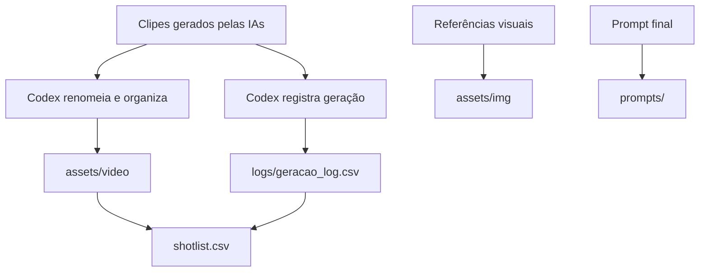

O `geracao_log.csv` deve existir porque as plataformas variam em duração, iterações e qualidade; sem esse histórico, fica difícil repetir uma cena ou comparar resultados. Esse tipo de rastreabilidade é compatível com o uso do Codex como agente local que lê, escreve e executa no projeto. ([OpenAI Developers](https://developers.openai.com/codex/ide/?utm_source=chatgpt.com))
### 3. Narração: o que o Codex faz e onde outra IA entra

O Codex consegue preparar toda a camada textual da narração: separar a locução do roteiro visual, limpar rubricas, dividir por blocos, marcar pausas e gerar arquivos prontos para síntese. O que ele não faz sozinho é a síntese de voz natural; para isso, entra uma ferramenta especializada. A ElevenLabs se apresenta oficialmente como plataforma de **text to speech** e informa plano gratuito com **10.000 caracteres por mês** para o gerador de voz. ([OpenAI Developers](https://developers.openai.com/codex/ide/?utm_source=chatgpt.com))
Arquivos desta etapa:

| Arquivo | Objetivo |
|---|---|
| `narracao.txt` | texto-base da locução |
| `narracao_ssml.xml` | versão com pausas e ênfases, quando aplicável |
| `assets/audio/narracao.wav` | narração principal |
| `assets/audio/narracao_alt.wav` | alternativa de voz ou leitura |
| `mixagem_planilha.csv` | controle de volume e entradas |

### 4. Fluxo de narração

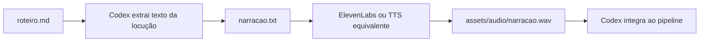

### 5. Legendas e sincronização

O Codex também consegue preparar a base das legendas porque ele já possui o texto da locução e a estrutura temporal do projeto. O arquivo mínimo aqui é o `.srt`. Na etapa de render, o FFmpeg pode processar mídia, aplicar filtros e muxar fluxos; isso sustenta o uso de legendas embutidas ou externas no pipeline. ([FFmpeg](https://ffmpeg.org/ffmpeg-filters.html?utm_source=chatgpt.com))
Arquivos desta etapa:

| Arquivo | Objetivo |
|---|---|
| `legendas.srt` | legenda principal |
| `legendas_en.srt` | variação por idioma |
| `timecodes.csv` | ajuste fino de marcações |
| `estilo_legenda.ass` | estilos avançados, quando necessário |

Regra prática: o Codex pode gerar a primeira versão das legendas a partir da narração e da shot list, mas a sincronização fina ainda pode exigir revisão humana, sobretudo em cenas com fala acelerada, pausas dramáticas ou cortes rápidos. Essa limitação decorre do fato de que Codex automatiza texto, arquivos e comandos; ele não substitui o julgamento editorial do timing. ([OpenAI Developers](https://developers.openai.com/codex/ide/?utm_source=chatgpt.com))
### 6. Montagem final por script

A montagem final pode, sim, ser feita por um script gerado pelo Codex. Isso é sustentado por duas frentes de documentação. Primeiro, o Codex pode **ler, editar e executar** código localmente. Segundo, o FFmpeg é descrito oficialmente como um **universal media converter** capaz de ler entradas variadas, filtrar e transcodificar para diversos formatos. O MoviePy, por sua vez, se apresenta como a **Python reference tool for video editing automation**, open source e licenciada em MIT. ([OpenAI Developers](https://developers.openai.com/codex/ide/?utm_source=chatgpt.com))
Isso significa que o Codex pode gerar:
- uma lista de concatenação de clipes;
- comandos FFmpeg para unir vídeo, trilha, voz e legendas;
- scripts Python para timeline e overlays;
- renders de revisão e render final.

Arquivos desta etapa:

| Arquivo | Objetivo |
|---|---|
| `concat_list.txt` | lista de clipes para concatenação |
| `scripts/render.sh` | execução do FFmpeg |
| `scripts/montagem.py` | montagem em Python com MoviePy |
| `config_video.json` | fps, resolução, codec, bitrate e paths |
| `output/video_review.mp4` | render de revisão |
| `output/video_final.mp4` | render final |
| `logs/render_log.txt` | log técnico da renderização |

### 7. Fluxo de montagem final

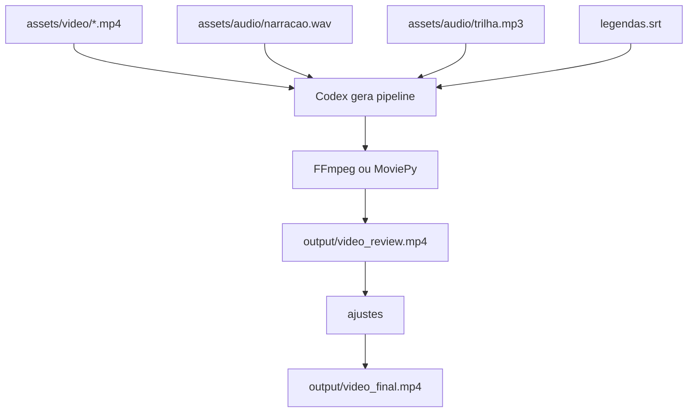

Há um detalhe técnico importante no caso de concatenação via FFmpeg: para alguns métodos de concat, os arquivos precisam compartilhar propriedades compatíveis, como dimensões e framerate. A documentação e wiki do FFmpeg tratam explicitamente dessas exigências. Isso reforça a utilidade de o Codex padronizar o projeto desde cedo com `config_video.json`. ([FFmpeg Trac](https://trac.ffmpeg.org/wiki/Concatenate?utm_source=chatgpt.com))
### 8. Quando usar FFmpeg e quando usar MoviePy

Use **FFmpeg** quando o objetivo principal for concatenação, transcodificação, mixagem, filtros e exportação padronizada. Use **MoviePy** quando a montagem exigir lógica Python mais legível, composição programática, overlays condicionais ou integração com outros scripts do projeto. Os dois podem coexistir: o Codex pode usar MoviePy para compor a timeline e FFmpeg para a renderização final. ([FFmpeg](https://ffmpeg.org/ffmpeg-filters.html?utm_source=chatgpt.com))
### 9. Acabamento opcional em editor visual

Mesmo com um pipeline totalmente automatizado, o acabamento fino pode ser melhor em um editor visual. O DaVinci Resolve informa oficialmente que a versão gratuita permite editar e finalizar até **60 fps em Ultra HD 3840×2160**, e a página do produto posiciona o Resolve como solução integrada para edição, cor, VFX e áudio. Isso faz dele uma boa etapa opcional de acabamento quando o vídeo precisa de ajuste fino de ritmo, cor ou mixagem. ([Blackmagic Design](https://www.blackmagicdesign.com/products/davinciresolve/studio?utm_source=chatgpt.com))
### 10. Ferramentas que ajudam o Codex nesta fase

| Ferramenta | Papel | O que ela garante melhor | Custo verificado |
|---|---|---|---|
| ElevenLabs | TTS / voiceover | voz natural e locução pronta para sincronização | plano gratuito com 10.000 caracteres/mês no gerador de voz; planos pagos existem, mas variam por produto ([ElevenLabs](https://elevenlabs.io/ai-voice-generator?utm_source=chatgpt.com))|
| FFmpeg | processamento e render | concatenação, filtros, transcodificação, muxing | software livre e gratuito ([FFmpeg](https://ffmpeg.org/ffmpeg.html?utm_source=chatgpt.com))|
| MoviePy | edição programática em Python | timeline por código e automação legível | open source, MIT ([Zulko](https://zulko.github.io/moviepy/?utm_source=chatgpt.com))|
| DaVinci Resolve | acabamento visual | correção fina, cor, áudio, revisão quadro a quadro | versão gratuita disponível; Studio listado a US$ 295 ([Blackmagic Design](https://www.blackmagicdesign.com/products/davinciresolve/studio?utm_source=chatgpt.com))|

### 11. Formulação normativa para o manual

Você pode inserir este texto:

**Após a geração dos clipes, o Codex deve organizar todos os ativos do projeto, registrar parâmetros de geração, separar narração e legendas e preparar a montagem final por script. A narração pode ser sintetizada por uma ferramenta externa de TTS, enquanto a montagem final pode ser executada por FFmpeg ou MoviePy a partir de scripts gerados pelo Codex. Quando necessário, o acabamento visual pode ser concluído em um editor como DaVinci Resolve.**

### 12. Limite exato do Codex nesta etapa

A fronteira técnica continua a mesma. O Codex consegue estruturar, escrever, organizar e executar o pipeline. Ele não substitui:
- o gerador visual que cria clipes inéditos;
- o motor de voz que sintetiza narração;
- a revisão estética humana no acabamento final.

Mas, com esses componentes presentes, ele consegue coordenar praticamente todo o restante do processo. ([OpenAI Developers](https://developers.openai.com/codex/ide/?utm_source=chatgpt.com))
No próximo bloco, a sequência natural é fechar o manual com um capítulo de **“pipeline completo do início ao fim”** e uma **lista de requisitos mínimos do ambiente** para o Codex executar esse fluxo com segurança e previsibilidade.

---

# you asked

PROSSIGA

---

# chatgpt response

Vou fechar o manual com o pipeline completo e os requisitos mínimos do ambiente, limitando o texto a capacidades e exigências sustentadas por documentação oficial.

## Capítulo: Pipeline completo do início ao fim e requisitos mínimos do ambiente

O fluxo completo de criação de vídeo com Codex é um pipeline híbrido. O Codex atua na estruturação do projeto, escrita do roteiro, geração de prompts, organização dos ativos e automação da montagem. As IAs de vídeo entram na geração dos clipes; a ferramenta de voz entra na narração; e FFmpeg ou MoviePy fecham a renderização. Isso é compatível com a forma como o Codex é documentado pela OpenAI: um agente que pode ler arquivos, editar código e executar comandos no diretório selecionado. ([OpenAI Developers](https://developers.openai.com/codex/ide/?utm_source=chatgpt.com))
### Visão geral do pipeline

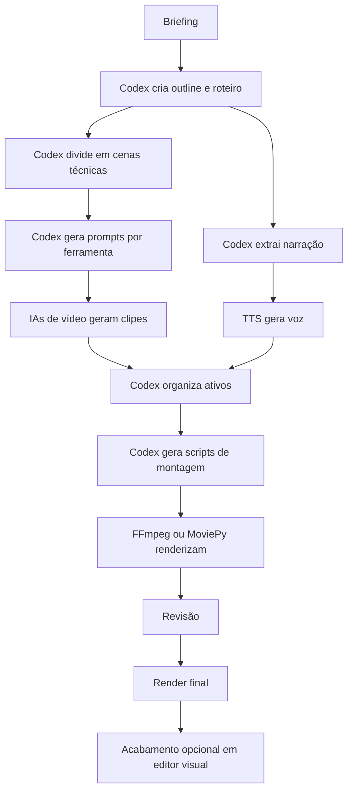

### Etapas do pipeline completo

1. **Briefing do projeto**  
O processo começa com objetivo do vídeo, público, duração total, formato final e identidade visual. Esses parâmetros precisam existir logo no início porque as ferramentas de vídeo trabalham com controles explícitos de duração, resolução e proporção. O Sora documenta parâmetros como `duration`, `resolution`, `aspect_ratio` e `n_variants`, o que mostra que o pipeline depende de especificações técnicas desde o começo. ([OpenAI Developers](https://developers.openai.com/codex/ide/?utm_source=chatgpt.com))
2. **Roteiro técnico**  
O Codex converte o briefing em `outline.md`, `roteiro.md`, `shotlist.csv` e `narracao.txt`. O roteiro deve ser segmentado em tomadas curtas, porque os geradores operam melhor nesse formato. A documentação mais recente do Sora descreve controles de duração e gerações de até 20 segundos em certos fluxos; a Runway documenta clipes de 5 ou 10 segundos no Gen-4. ([OpenAI Developers](https://developers.openai.com/codex/ide/?utm_source=chatgpt.com))
3. **Prompts por ferramenta**  
O Codex extrai os campos técnicos da cena e gera versões específicas para Sora, Runway, Kling e Luma. Essa especialização é necessária porque cada plataforma documenta uma lógica própria de prompt. O resultado deve ser armazenado em arquivos separados e rastreado em `prompt_map.csv`. ([OpenAI Developers](https://developers.openai.com/codex/ide/?utm_source=chatgpt.com))
4. **Geração dos clipes**  
As IAs de vídeo geram os ativos curtos que irão compor o filme final. Nessa etapa, o Codex não substitui o gerador visual; ele apenas organiza prompts, parâmetros e saídas. Os clipes devem ir para `assets/video/`, com rastreamento em `logs/geracao_log.csv`. ([OpenAI Developers](https://developers.openai.com/codex/ide/?utm_source=chatgpt.com))
5. **Narração e áudio**  
O Codex prepara `narracao.txt` e pode gerar uma versão com marcações. A síntese de voz é feita por uma ferramenta externa. Depois, os arquivos de voz e trilha entram em `assets/audio/`. ([OpenAI Developers](https://developers.openai.com/codex/ide/?utm_source=chatgpt.com))
6. **Legendas**  
O Codex gera `legendas.srt` a partir da locução e do roteiro temporal. Na renderização, as legendas podem ser embutidas ou mantidas externas; o FFmpeg documenta filtragem e processamento adequados para esse tipo de fluxo. ([FFmpeg](https://ffmpeg.org/ffmpeg.html?utm_source=chatgpt.com))
7. **Montagem automatizada**  
O Codex escreve `scripts/render.sh`, `scripts/montagem.py`, `concat_list.txt` e `config_video.json`. O FFmpeg é documentado como conversor universal de mídia capaz de ler várias entradas, filtrar e transcodificar para diversos formatos. O MoviePy se apresenta como ferramenta de referência para automação de edição em Python e depende do FFmpeg para ler e exportar vídeo e áudio. ([FFmpeg](https://ffmpeg.org/ffmpeg.html?utm_source=chatgpt.com))
8. **Revisão e exportação final**  
O pipeline deve gerar ao menos uma versão de revisão (`output/video_review.mp4`) antes da versão final (`output/video_final.mp4`). Isso permite corrigir problemas de ritmo, sincronização ou compatibilidade técnica. Se necessário, o acabamento pode seguir para um editor visual como DaVinci Resolve. ([Blackmagic Design](https://www.blackmagicdesign.com/products/davinciresolve?utm_source=chatgpt.com))
### Arquivos mínimos do projeto

| Arquivo/Pasta | Objetivo |
|---|---|
| `outline.md` | estrutura resumida do vídeo |
| `roteiro.md` | roteiro técnico cena a cena |
| `shotlist.csv` | controle operacional das tomadas |
| `prompts/` | prompts por ferramenta |
| `narracao.txt` | texto da locução |
| `legendas.srt` | legenda principal |
| `config_video.json` | parâmetros técnicos do projeto |
| `assets/video/` | clipes gerados |
| `assets/audio/` | narração, trilha e efeitos |
| `assets/img/` | referências e imagens-base |
| `scripts/montagem.py` | montagem por Python |
| `scripts/render.sh` | render por FFmpeg |
| `logs/geracao_log.csv` | histórico de geração |
| `logs/render_log.txt` | histórico da renderização |
| `output/` | exportações finais e de revisão |

### Requisitos mínimos do ambiente para o Codex executar esse fluxo

O Codex não exige, por si, um “estúdio de vídeo”, mas o pipeline exige um ambiente que permita leitura/escrita de arquivos, execução de comandos e acesso às ferramentas externas necessárias. A OpenAI documenta que o Codex IDE e o Codex CLI conseguem ler, alterar e executar código no diretório selecionado. Portanto, o requisito mínimo é um ambiente local ou workspace com permissões para: criar arquivos, executar shell, acessar os binários de mídia e manter a estrutura do projeto. ([OpenAI Developers](https://developers.openai.com/codex/ide/?utm_source=chatgpt.com))
Os requisitos mínimos práticos são estes:

- **IDE ou terminal com Codex disponível**  
  O usuário precisa do Codex via extensão de IDE ou CLI. A OpenAI informa que ChatGPT Plus, Pro, Business, Edu e Enterprise incluem Codex. ([OpenAI Developers](https://developers.openai.com/codex/ide/?utm_source=chatgpt.com))
- **Sistema operacional compatível com as ferramentas de mídia**  
  O FFmpeg possui documentação específica de plataforma, incluindo Windows; o DaVinci Resolve documenta suporte oficial para macOS, Windows e Rocky Linux em suas especificações técnicas. ([FFmpeg](https://www.ffmpeg.org/platform.html?utm_source=chatgpt.com))
- **FFmpeg instalado e acessível no PATH**  
  O MoviePy depende do FFmpeg para ler e exportar vídeo e áudio; por isso, se o pipeline usar Python, o FFmpeg é requisito efetivo, não opcional. ([Zulko](https://zulko.github.io/moviepy/getting_started/quick_presentation.html?utm_source=chatgpt.com))
- **Python quando o pipeline usar MoviePy**  
  Se a montagem for em Python, o ambiente precisa ter Python compatível e a biblioteca MoviePy instalada. A documentação de instalação do MoviePy parte desse pressuposto e também menciona `ffplay` para pré-visualização, quando necessário. ([Zulko](https://zulko.github.io/moviepy/getting_started/install.html?utm_source=chatgpt.com))
- **Armazenamento local para ativos e renders**  
  Como o fluxo trabalha com múltiplos clipes, áudio, imagens, logs e renders intermediários, o ambiente precisa comportar um projeto baseado em arquivos locais. Isso decorre diretamente do modo de operação do Codex e do FFmpeg sobre diretórios e arquivos de entrada/saída. ([OpenAI Developers](https://developers.openai.com/codex/ide/?utm_source=chatgpt.com))
- **Gerador externo de vídeo e, se houver locução, gerador externo de voz**  
  O Codex não substitui o motor visual nem o TTS. O pipeline pressupõe ao menos uma IA de vídeo e, quando houver voz, uma ferramenta de síntese de fala. ([OpenAI Developers](https://developers.openai.com/codex/ide/?utm_source=chatgpt.com))
- **Editor visual opcional para acabamento**  
  Não é requisito obrigatório, mas é útil quando o vídeo precisa de ajuste fino de cor, mixagem ou revisão quadro a quadro. O DaVinci Resolve tem versão gratuita e documenta requisitos mínimos por sistema operacional. ([Blackmagic Design](https://www.blackmagicdesign.com/event/davinciresolvedownload?utm_source=chatgpt.com))
### Diagrama dos requisitos do ambiente

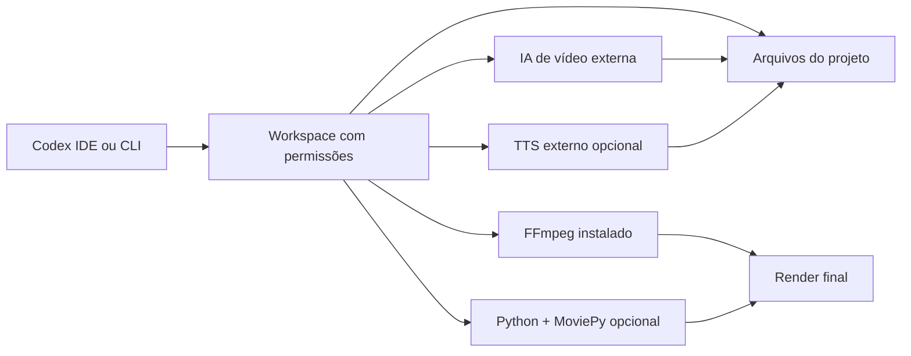

### Requisitos mínimos por ferramenta de apoio

| Ferramenta | Requisito mínimo relevante |
|---|---|
| Codex IDE/CLI | acesso ao diretório do projeto e capacidade de executar comandos ([OpenAI Developers](https://developers.openai.com/codex/ide/?utm_source=chatgpt.com))|
| FFmpeg | instalação local e acesso via shell/PATH ([FFmpeg](https://ffmpeg.org/ffmpeg.html?utm_source=chatgpt.com))|
| MoviePy | Python instalado e FFmpeg disponível ([Zulko](https://zulko.github.io/moviepy/getting_started/install.html?utm_source=chatgpt.com))|
| DaVinci Resolve | SO suportado; Blackmagic lista macOS, Windows e Rocky Linux nas tech specs ([Blackmagic Design](https://www.blackmagicdesign.com/products/davinciresolve/techspecs?utm_source=chatgpt.com))|

### Formulação normativa para o manual

Você pode inserir este texto:

**Para executar um pipeline completo de criação de vídeo com Codex, o ambiente deve oferecer acesso do Codex ao diretório do projeto, permissão para criar e editar arquivos, capacidade de executar comandos locais, FFmpeg instalado para processamento de mídia e, quando a montagem for feita em Python, MoviePy com Python configurado e FFmpeg acessível. O pipeline também depende de pelo menos um gerador externo de vídeo e, quando houver locução, de uma ferramenta externa de síntese de voz.**

### Fechamento do manual

A formulação final mais precisa é esta:

**O Codex não é o motor que gera sozinho todas as cenas do vídeo. Ele é a peça que organiza o projeto, escreve o roteiro técnico, converte cenas em prompts, estrutura arquivos, prepara narração e legendas, gera scripts de montagem e executa o pipeline de renderização quando o ambiente possui as ferramentas necessárias. As IAs de vídeo geram os clipes; FFmpeg e MoviePy processam e montam; editores visuais refinam, quando necessário.** ([OpenAI Developers](https://developers.openai.com/codex/ide/?utm_source=chatgpt.com))
Posso agora consolidar tudo em uma única versão final do manual, pronta para diagramação.

---

# you asked

Releia a conversa atual e cole aqui as decisões que foram tomadas em relação ao objetivo, tipo escrita desse manual criado.

---

# chatgpt response

Estas foram as decisões tomadas ao longo da conversa sobre o objetivo, o escopo e o tipo de escrita do manual.

O **objetivo** do texto foi definido como a criação de um material chamado **“Manual de Criação de Vídeo – Criando um vídeo com Codex”**. Esse manual deveria explicar, de forma progressiva, **como o Codex participa da criação de vídeos desde o roteiro até a montagem final**, deixando claro **o que ele faz sozinho, o que ele automatiza e em quais pontos ele depende de outras IAs ou ferramentas externas**.

Também ficou definido que o manual **não deveria tratar o Codex como gerador nativo de vídeo**, mas como **agente técnico/orquestrador de pipeline**. Essa foi uma decisão central da conversa. A formulação consolidada foi que o Codex:
- cria roteiro,
- transforma cenas em prompts,
- organiza arquivos e ativos,
- escreve scripts,
- automatiza montagem e exportação,
mas **precisa de outras IAs para gerar os clipes visuais**, de ferramentas de voz para narração e, em alguns casos, de editor visual para acabamento.

Sobre o **tipo de escrita**, você pediu que o conteúdo fosse transformado em um **manual mais completo**, em formato de **texto editorial / apostila / manual técnico**, e não apenas em respostas curtas. Ao longo da conversa, isso evoluiu para um texto com:
- tom de **manual explicativo**,
- organização por **capítulos e etapas**,
- linguagem **instrucional e técnica**,
- foco em **instruções, explicações e estrutura operacional**.

Também foi decidido que o manual deveria ser baseado em **informações verificadas**, e depois isso foi reforçado de forma explícita: **todas as informações do manual deveriam ser verificadas em fontes confiáveis**, preferencialmente documentação oficial, páginas de help center, pricing oficial e documentação técnica das ferramentas. Isso levou à exclusão ou enfraquecimento de afirmações baseadas em Reddit, YouTube, Instagram e fontes promocionais frágeis.

Outra decisão importante foi a de que o manual deveria explicar o processo **em ordem cronológica de produção**, começando por:
1. briefing e objetivo do vídeo,
2. criação do roteiro,
3. conversão do roteiro em prompts,
4. geração dos clipes por outras IAs,
5. organização dos ativos,
6. narração e legendas,
7. montagem final por script,
8. acabamento opcional.

Também ficou decidido que, nas seções em que isso fosse necessário, o manual deveria incluir três tipos de complemento:
- **diagramas Mermaid** para explicar fluxos,
- **lista dos arquivos que devem ser criados** em cada etapa e o objetivo de cada arquivo,
- **lista das ferramentas e geradores de IA que ajudam o Codex**, com o objetivo de cada uma, o papel que cumprem no pipeline e o custo de uso quando esse custo pudesse ser verificado.

Outra decisão específica foi que o manual deveria explicitar os **requisitos do roteiro técnico**. Em vez de um roteiro apenas narrativo, passou a ser exigido um roteiro com campos operacionais por cena, incluindo enquadramento, sujeito, ação, cenário, iluminação, estilo, câmera, progressão temporal, duração, áudio e saída técnica.

Também foi consolidado que o manual deveria distinguir claramente:
- **o que o Codex consegue fazer sozinho**,
- **onde ele precisa de ajuda**,
- **quais ferramentas entram em cada etapa**.

Em termos de **posicionamento técnico**, estas formulações ficaram estabelecidas:
- a montagem final **pode sim** ocorrer por um script gerado pelo Codex;
- o Codex **pode gerar o `.mp4` final por automação**, desde que existam mídia, bibliotecas e ferramentas adequadas no ambiente;
- o Codex **não deve ser descrito como IA que cria sozinha as imagens em movimento**.

No aspecto editorial, também foi decidido que o manual deveria ter:
- caráter de **material completo**,
- seções e subseções bem separadas,
- conteúdo voltado a **explicação + aplicação prática**,
- e possibilidade de posterior conversão para **PDF/apostila diagramada**.

Em resumo, as decisões tomadas foram estas: o texto deveria virar um **manual técnico-editorial completo**, com **base factual verificada**, explicando **o pipeline de criação de vídeo com Codex**, desde o roteiro até a montagem final, mostrando **capacidades, limites, dependências, arquivos, fluxos, ferramentas auxiliares e requisitos técnicos**.

---

# you asked

De acordo com o manual, quais ferramentas devo utilizar para criar o meu vídeo?

---

# chatgpt response

De acordo com o manual, o conjunto mais coerente de ferramentas é este:

**1. Codex no VS Code ou Codex CLI** para comandar o projeto inteiro.  
Ele é a peça central do fluxo: cria o roteiro técnico, gera prompts, organiza arquivos, escreve scripts e executa comandos no diretório do projeto. A OpenAI documenta que o Codex pode ler, editar e executar código no ambiente local. ([OpenAI Developers](https://developers.openai.com/codex/ide/?utm_source=chatgpt.com))
**2. Um gerador de vídeo por IA** para criar os clipes curtos.  
Pelo manual, você não deve depender de uma única ferramenta “mágica”; o mais realista é gerar cenas curtas e montar depois. As opções que ficaram alinhadas com o manual foram estas:

- **Sora**: melhor quando você quer um fluxo mais direto dentro do ecossistema OpenAI. O app do Sora cria vídeos curtos com áudio sincronizado, e a documentação atual fala em durações configuráveis e uso por limite móvel de 24 horas. ([OpenAI Help Center](https://help.openai.com/en/articles/12456897-getting-started-with-the-sora-app?utm_source=chatgpt.com))- **Runway**: boa escolha quando você quer mais controle operacional e iteração técnica. A documentação informa custos por crédito e mostra que Gen-4 usa 12 créditos por segundo, com durações curtas como 5 ou 10 segundos em certos fluxos. ([Runway](https://help.runwayml.com/hc/en-us/articles/15124877443219-How-do-credits-work?utm_source=chatgpt.com))- **Luma Dream Machine**: boa opção para clipes curtos e para fluxos com créditos/planos. A Luma informa créditos de teste e plano Plus a partir de US$ 30/mês. ([Luma Labs](https://lumalabs.ai/pricing?utm_source=chatgpt.com))
No manual, essas ferramentas entram no papel de **gerar os clipes**. O Codex prepara os prompts; elas produzem o material visual. ([OpenAI Developers](https://developers.openai.com/codex/ide/?utm_source=chatgpt.com))
**3. Uma ferramenta de voz** para a narração.  
A opção citada no manual foi a **ElevenLabs**, porque ela é especializada em text-to-speech e voiceover. No fluxo, o Codex prepara `narracao.txt`, e a ferramenta de voz transforma isso em áudio pronto para sincronização. ([OpenAI Developers](https://developers.openai.com/codex/ide/?utm_source=chatgpt.com))
**4. FFmpeg** para montagem e render final.  
Se você quiser um pipeline técnico e automatizável, essa é a ferramenta mais importante depois do Codex. O FFmpeg é documentado como conversor universal de mídia e serve para concatenar clipes, mixar áudio, embutir legendas e exportar o MP4 final. ([OpenAI Developers](https://developers.openai.com/codex/cli/?utm_source=chatgpt.com))
**5. MoviePy** se você quiser montar por Python em vez de depender só de comandos shell.  
No manual, ele aparece como camada opcional de montagem programática. O melhor uso é quando você quer lógica mais legível, timeline por código e integração com scripts gerados pelo Codex. Ele normalmente trabalha junto com FFmpeg. ([OpenAI Developers](https://developers.openai.com/codex/cli/?utm_source=chatgpt.com))
**6. DaVinci Resolve** para acabamento opcional.  
Ele não é obrigatório, mas entra bem no final do fluxo para revisar ritmo, cor, áudio e acabamento fino. No manual, ele ficou como a melhor opção de editor visual de acabamento depois da automação. A Blackmagic posiciona o Resolve como suíte integrada de edição, cor, VFX e áudio. ([OpenAI Developers](https://developers.openai.com/codex/cli/?utm_source=chatgpt.com))
Então, na prática, a recomendação do manual fica assim:

**Stack mínima recomendada**
- Codex
- 1 gerador de vídeo: **Sora** ou **Runway** ou **Luma**
- 1 TTS para narração: **ElevenLabs**
- **FFmpeg**

**Stack mais completa**
- Codex
- Sora ou Runway para os clipes
- ElevenLabs para voz
- FFmpeg + MoviePy para montagem automatizada
- DaVinci Resolve para acabamento final

Se eu tivesse que te indicar **um conjunto mais objetivo**, eu sugeriria este:

**Opção mais simples**
- Codex
- Sora
- ElevenLabs
- FFmpeg

**Opção mais técnica e flexível**
- Codex
- Runway
- ElevenLabs
- FFmpeg
- MoviePy
- DaVinci Resolve

A diferença é direta: a primeira é mais simples de operar; a segunda dá mais controle sobre iteração, script e pós-produção.