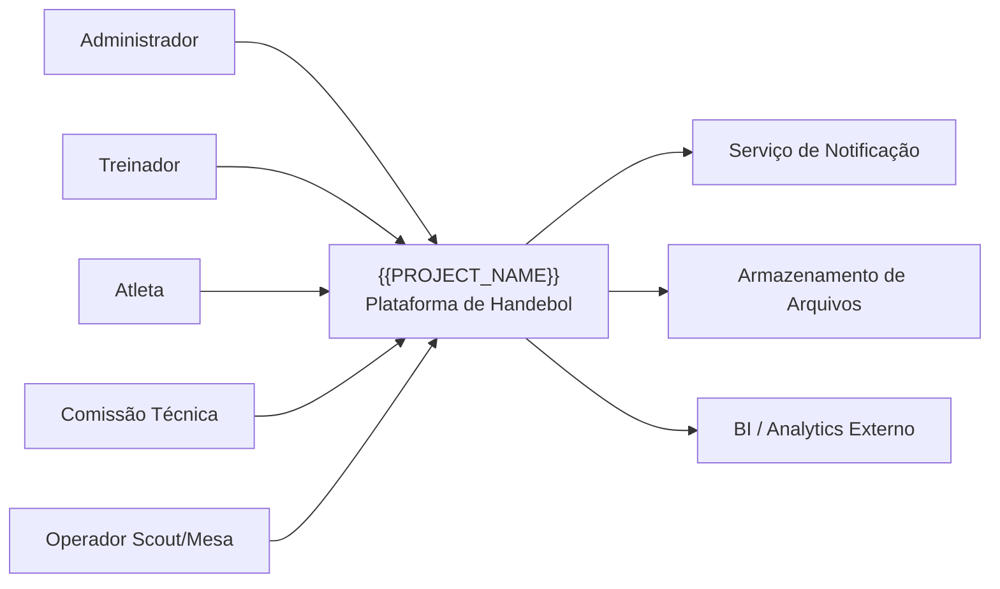
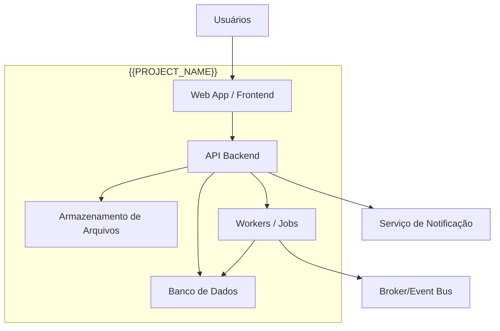
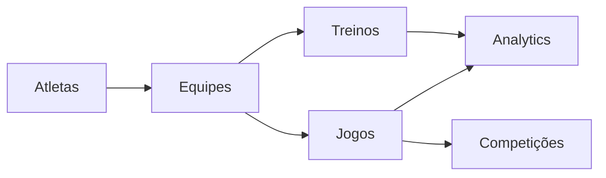
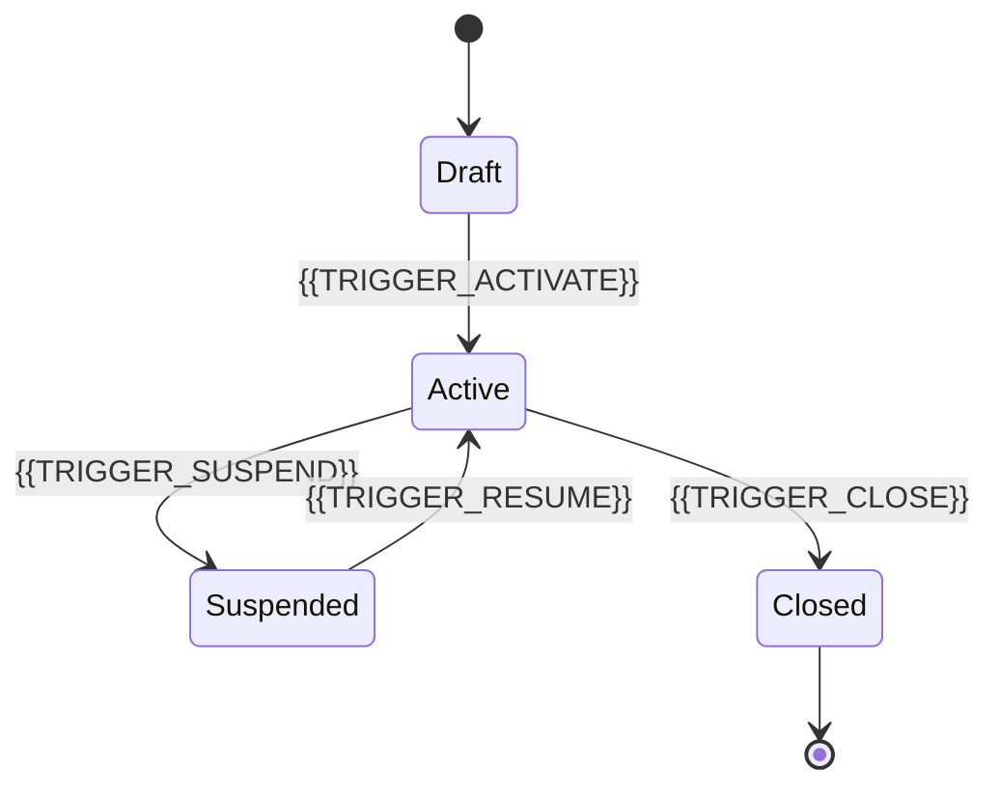

# GLOBAL_TEMPLATES.md

## 0. Cross-Document Index

This document is part of the **HB Track Contract-Driven Manual** trilogy:

1. **CONTRACT_SYSTEM_LAYOUT.md**
   - **Responsibility**: Canonical filesystem structure, module taxonomy, naming conventions, artifact placement rules
   - **Use when**: Determining where to create artifacts, validating module names, checking naming rules

2. **CONTRACT_SYSTEM_RULES.md**
   - **Responsibility**: Operational rules, precedence hierarchy, agent boot protocol, blocking codes, validation tooling, evolution procedures
   - **Use when**: Understanding how to create/modify contracts, determining precedence in conflicts, blocking behavior, validation steps

3. **GLOBAL_TEMPLATES.md** (this file)
   - **Responsibility**: Official scaffolds and examples for all normative documentation and contract artifacts
   - **Use when**: Creating new module docs, contracts, or governance artifacts

**Navigation rule**: These three files must be read together. Cross-references between them are explicit and binding.

---

## Purpose
This file provides official scaffolds for normative documentation and contract artifacts.

Templates are **not normative by themselves**.
The instantiated files become normative only when created in the canonical location and governed by the rules.

---

## 1. Placeholder Registry

### 1.1 Naming Convention
**All placeholders use UPPER_SNAKE_CASE**: `{{PLACEHOLDER_NAME}}`

Exceptions for module-specific technical identifiers:
- `{{MODULE_NAME}}` — lower_snake_case technical identifier (ex: "training", "identity_access")
- All other module-derived placeholders use uppercase variants ({{MODULE_NAME_UPPER}}, {{MODULE_NAME_PASCAL}})

### 1.2 Required Core Placeholders
- `{{PROJECT_NAME}}` — nome do projeto/sistema
- `{{MODULE_NAME}}` — identificador técnico canônico lower_snake_case (ex: "training", "identity_access")
- `{{MODULE_NAME_UPPER}}` — versão uppercase (ex: "TRAINING", "IDENTITY_ACCESS")
- `{{MODULE_NAME_PASCAL}}` — versão PascalCase para código (ex: "Training", "IdentityAccess")
- `{{DOMAIN_ENTITY}}` — entidade de domínio principal em linguagem natural
- `{{DOMAIN_ENTITY_SNAKE}}` — entidade em lower_snake_case técnico
- `{{DOMAIN_ENTITY_PASCAL}}` — entidade em PascalCase para código

### 1.3 Project & System Placeholders
- `{{CDD_MATURITY_LEVEL}}` — nível de maturidade contract-driven
- `{{LAST_REVIEW_DATE}}` — data da última revisão
- `{{SYSTEM_TYPE}}` — tipo de sistema
- `{{ORG_NAME}}` — nome da organização
- `{{TARGET_USERS}}` — usuários-alvo
- `{{PRIMARY_MARKET}}` — mercado primário
- `{{PROJECT_DOMAIN}}` — domínio HTTP do projeto (ex: "hbtrack.com")

### 1.4 Architecture Placeholders
- `{{BACKEND_STYLE}}` — estilo arquitetural backend
- `{{FRONTEND_STYLE}}` — estilo arquitetural frontend
- `{{DATA_STYLE}}` — estilo de persistência
- `{{INTEGRATION_STYLE}}` — estilo de integração
- `{{BACKEND_STACK}}` — stack tecnológica backend
- `{{FRONTEND_STACK}}` — stack tecnológica frontend
- `{{DATABASE_STACK}}` — stack de banco de dados
- `{{EVENT_STACK}}` — stack de mensageria
- `{{TEST_STACK}}` — stack de testes

### 1.5 Scope & Risk Placeholders
- `{{OUT_OF_SCOPE_1}}`, `{{OUT_OF_SCOPE_2}}`, `{{OUT_OF_SCOPE_3}}` — itens fora do escopo
- `{{EXTERNAL_DEPENDENCY_1}}`, `{{EXTERNAL_DEPENDENCY_2}}` — dependências externas
- `{{RESPONSIBILITY_1}}`, `{{RESPONSIBILITY_2}}`, `{{RESPONSIBILITY_3}}` — responsabilidades
- `{{RISK_1}}`, `{{RISK_2}}`, `{{RISK_3}}` — riscos conhecidos
- `{{OPEN_DECISION_1}}`, `{{OPEN_DECISION_2}}` — decisões em aberto

### 1.6 API Convention Placeholders
- `{{CHOSEN_STYLE}}` — estilo de nomenclatura escolhido (kebab-case ou snake_case)
- `{{FIELD_NAMING_STYLE}}` — estilo de nomenclatura de campos
- `{{RESPONSE_ENVELOPE_POLICY}}` — política de envelopes de resposta
- `{{PAGINATION_POLICY}}` — política de paginação
- `{{SORT_POLICY}}` — política de ordenação
- `{{FILTER_POLICY}}` — política de filtros
- `{{AUTH_STRATEGY}}` — estratégia de autenticação
- `{{AUTHZ_STRATEGY}}` — estratégia de autorização
- `{{VERSIONING_STRATEGY}}` — estratégia de versionamento
- `{{DEPRECATION_POLICY}}` — política de depreciação

### 1.7 Data Convention Placeholders
- `{{ID_STRATEGY}}` — estratégia de IDs
- `{{DATE_TIME_STANDARD}}` — padrão de data/hora
- `{{TIMEZONE_POLICY}}` — política de fuso horário
- `{{ENUM_POLICY}}` — política de enums
- `{{NULLABILITY_POLICY}}` — política de nullability
- `{{TABLE_NAMING}}` — nomenclatura de tabelas
- `{{FIELD_NAMING}}` — nomenclatura de campos

### 1.8 Security Placeholders
- `{{SENSITIVE_DATA_POLICY}}` — política de dados sensíveis
- `{{RETENTION_POLICY}}` — política de retenção
- `{{MASKING_POLICY}}` — política de mascaramento
- `{{SECRETS_POLICY}}` — origem de secrets
- `{{ROTATION_POLICY}}` — política de rotação de secrets
- `{{LOGGING_POLICY}}` — política de logs

### 1.9 UI & Accessibility Placeholders
- `{{BREAKPOINT_STRATEGY}}` — estratégia de breakpoints
- `{{TARGET_DEVICES}}` — dispositivos-alvo
- `{{A11Y_CONTRAST_RULE}}` — regra de contraste de acessibilidade
- `{{A11Y_LABEL_RULE}}` — regra de labels de acessibilidade

### 1.10 Error & Trace Placeholders
- `{{RESOURCE_PATH}}` — caminho do recurso HTTP
- `{{TRACE_ID}}` — identificador de rastreamento
- `{{ERROR_MESSAGE}}` — mensagem de erro
- `{{ERROR_CODE}}` — código de erro
- `{{ERROR_CASE}}` — caso de erro
- `{{HTTP_STATUS}}` — status HTTP

### 1.11 Handball Domain Placeholders
- `{{RULEBOOK_TITLE}}` — título do regulamento oficial
- `{{RULEBOOK_VERSION}}` — versão do regulamento
- `{{RULEBOOK_EFFECTIVE_DATE}}` — data de vigência
- `{{HANDBALL_TOPIC}}` — tema do handebol
- `{{HANDBALL_RULE}}` — regra oficial do handebol
- `{{PRODUCT_RULE}}` — regra de produto derivada
- `{{MODULES}}` — módulos impactados
- `{{RULE_REFERENCE}}` — referência à regra

### 1.12 Module Content Placeholders
- `{{MODULE_PURPOSE}}` — propósito do módulo
- `{{MODULE_MISSION}}` — missão do módulo
- `{{ACTOR}}`, `{{ACTOR_1}}`, `{{ACTOR_2}}`, `{{ACTOR_3}}` — atores do módulo
- `{{DOMAIN_ENTITY_2}}`, `{{DOMAIN_ENTITY_3}}` — entidades adicionais
- `{{IN_SCOPE_1}}`, `{{IN_SCOPE_2}}`, `{{IN_SCOPE_3}}` — itens dentro do escopo do módulo
- `{{UPSTREAM_MODULES}}` — módulos upstream (dependências)
- `{{DOWNSTREAM_MODULES}}` — módulos downstream (consumidores)

### 1.13 Domain Rules Placeholders
- `{{BUSINESS_RULE_1}}`, `{{BUSINESS_RULE_2}}`, `{{BUSINESS_RULE_3}}` — regras de negócio
- `{{AFFECTED_ENTITIES}}` — entidades afetadas
- `{{NOTES}}` — observações
- `{{SOURCE}}` — fonte da regra/invariante

### 1.14 State Model Placeholders
- `{{STATE_NAME}}` — nome de estado
- `{{TRIGGER_ACTIVATE}}` — gatilho de ativação
- `{{STATE_DESCRIPTION_DRAFT}}` — descrição de estado (draft/active/etc)

### 1.15 Permissions, Errors & UI Placeholders
- `{{ACTION}}` — ação/operação
- `{{ROLE}}` — papel/perfil
- `{{YES_NO}}` — sim/não
- `{{NOTE}}` — nota/observação
- `{{INPUT}}` — entrada de UI
- `{{OUTPUT}}` — saída de UI

### 1.16 Test & Evidence Placeholders
- `{{STATE_TEST_TOOL}}` — ferramenta de teste de transição de estado
- `{{BUSINESS_RULE_TOOL}}` — ferramenta de teste de regra de negócio
- `{{INVARIANT_TEST_TOOL}}` — ferramenta de teste de invariante
- `{{CONTRACT_TEST_TOOL}}` — ferramenta de teste contratual
- `{{SCHEMA_TEST_TOOL}}` — ferramenta de validação de schema
- `{{UNIT_TEST_TOOL}}` — ferramenta de teste unitário
- `{{INTEGRATION_TEST_TOOL}}` — ferramenta de teste de integração
- `{{E2E_TEST_TOOL}}` — ferramenta de teste E2E
- `{{EVIDENCE}}` — evidência de teste
- `{{AREA}}` — área de teste
- `{{RISK_LEVEL}}` — nível de risco
- `{{TEST_TYPE}}` — tipo de teste

### 1.17 ADR Placeholders
- `{{ADR_NUMBER}}` — número do ADR
- `{{DECISION_TITLE}}` — título da decisão
- `{{DATE}}` — data
- `{{DECIDERS}}` — tomadores de decisão
- `{{TAGS}}` — tags
- `{{CONTEXT}}` — contexto
- `{{DECISION}}` — decisão
- `{{POSITIVE_1}}`, `{{POSITIVE_2}}` — consequências positivas
- `{{NEGATIVE_1}}`, `{{NEGATIVE_2}}` — consequências negativas
- `{{ALTERNATIVE_1}}`, `{{ALTERNATIVE_2}}` — alternativas consideradas
- `{{RELATED_DOCS}}` — documentos relacionados
- `{{RELATED_CONTRACTS}}` — contratos relacionados

### 1.18 OpenAPI & Schema Technical Placeholders
- `{{FIELD_NAME}}` — nome de campo
- `{{FIELD_TYPE}}` — tipo de campo
- `{{FIELD_DESCRIPTION}}` — descrição de campo
- `{{EXAMPLE_ID}}` — ID de exemplo
- `{{EXAMPLE_CREATED_AT}}` — exemplo de data de criação
- `{{EXAMPLE_UPDATED_AT}}` — exemplo de data de atualização
- `{{FIELD_EXAMPLE_VALUE}}` — valor de exemplo de campo

### 1.19 MODULE_MAP Specific Placeholders
- `{{RESP_ATLETAS}}`, `{{DEP_ATLETAS}}` — responsabilidade e dependências de Atletas
- `{{RESP_EQUIPES}}`, `{{DEP_EQUIPES}}` — responsabilidade e dependências de Equipes
- `{{RESP_TREINOS}}`, `{{DEP_TREINOS}}` — responsabilidade e dependências de Treinos
- `{{RESP_JOGOS}}`, `{{DEP_JOGOS}}` — responsabilidade e dependências de Jogos
- `{{RESP_COMPETICOES}}`, `{{DEP_COMPETICOES}}` — responsabilidade e dependências de Competições
- `{{RESP_ANALYTICS}}`, `{{DEP_ANALYTICS}}` — responsabilidade e dependências de Analytics

### 1.20 Gates & CI Placeholders
- `{{API_BASE_URL}}` — URL base da API para testes

### 1.21 Glossary Placeholders
- `{{TERM}}` — termo
- `{{DEFINITION}}` — definição
- `{{CONTEXT}}` — contexto

### 1.22 Invariants Placeholders
- `{{INVARIANT}}` — invariante
- `{{CHECK_METHOD}}` — método de verificação

### 1.23 General Purpose Placeholders
- `{{PURPOSE}}` — propósito geral
- `{{EVENT_NAME}}` — nome de evento

Rule:
- Unresolved placeholders are forbidden in ready-for-implementation artifacts
- All placeholders must use UPPER_SNAKE_CASE except {{MODULE_NAME}} (lower_snake_case) and its derivatives
- When creating new placeholders, register them in this section first

---

## 2. Template Sovereignty Rule

Templates are scaffolds only.

They become normative only when:
- instantiated in the canonical location
- filled without forbidden placeholders
- aligned to `CONTRACT_SYSTEM_LAYOUT.md`
- aligned to `CONTRACT_SYSTEM_RULES.md`

If a template conflicts with a normative rule, the normative rule wins.

---

## 2A. Canonical Instantiation Paths

Templates must be instantiated only in the canonical paths below.

### 2A.1 Contract-system governance
- `.contract_driven/`

### 2A.2 Global normative canon
- `docs/_canon/`

### 2A.3 Module normative documentation
- `docs/hbtrack/modulos/<module>/`

### 2A.4 Technical contracts
- `contracts/`

Rule:
A correctly filled template instantiated outside canonical path is not considered compliant by default.

---

## 3. Required Header Template for Module Human Docs

```yaml
module: "{{MODULE_NAME}}"
system_scope_ref: "../../../_canon/SYSTEM_SCOPE.md"
handball_rules_ref: "../../../_canon/HANDBALL_RULES_DOMAIN.md"
contract_path_ref: "../../../../contracts/openapi/paths/{{MODULE_NAME}}.yaml"
schemas_ref: "../../../../contracts/schemas/{{MODULE_NAME}}/"
```

Use this header in:
- `docs/hbtrack/modulos/{{MODULE_NAME}}/README.md`
- `docs/hbtrack/modulos/{{MODULE_NAME}}/MODULE_SCOPE_{{MODULE_NAME_UPPER}}.md`
- `docs/hbtrack/modulos/{{MODULE_NAME}}/DOMAIN_RULES_{{MODULE_NAME_UPPER}}.md`
- `docs/hbtrack/modulos/{{MODULE_NAME}}/INVARIANTS_{{MODULE_NAME_UPPER}}.md`
- `docs/hbtrack/modulos/{{MODULE_NAME}}/STATE_MODEL_{{MODULE_NAME_UPPER}}.md`
- `docs/hbtrack/modulos/{{MODULE_NAME}}/PERMISSIONS_{{MODULE_NAME_UPPER}}.md`
- `docs/hbtrack/modulos/{{MODULE_NAME}}/ERRORS_{{MODULE_NAME_UPPER}}.md`
- `docs/hbtrack/modulos/{{MODULE_NAME}}/UI_CONTRACT_{{MODULE_NAME_UPPER}}.md`
- `docs/hbtrack/modulos/{{MODULE_NAME}}/TEST_MATRIX_{{MODULE_NAME_UPPER}}.md`
- `docs/hbtrack/modulos/{{MODULE_NAME}}/SCREEN_MAP_{{MODULE_NAME_UPPER}}.md`

### 3.1 Header rules
- `module` must use the canonical English module identifier (lower_snake_case from CONTRACT_SYSTEM_LAYOUT.md section 2)
- `system_scope_ref` is always mandatory
- **`handball_rules_ref` is ALWAYS present in header for navigability** — The reference is provided for convenient navigation to handball domain rules; semantic mandatory usage (when the module must actually comply with handball-derived rules) is governed by CONTRACT_SYSTEM_RULES.md section 12 (Handball Trigger Rule)
- `contract_path_ref` must point to the canonical OpenAPI path file
- `schemas_ref` must point to the canonical schema folder

**Note**: MODULE_NAME placeholder deve usar identificador técnico canônico lower_snake_case da taxonomia (ex: 'training', 'identity_access', 'competitions').

---

## 4. Documentation Architecture Rule (Diátaxis)

**For the complete Documentation Architecture Rule using the Diátaxis framework, see `CONTRACT_SYSTEM_RULES.md` section 7.**

Templates in this file target reference and explanation artifacts only.

---

## 5. Global Template — README.md

```md
# {{PROJECT_NAME}}

{{PROJECT_NAME}} é uma plataforma sports-tech orientada a contratos para gestão e operação de handebol.

## Objetivo
Descrever o sistema, sua organização documental, seus contratos e a forma correta de evoluí-lo sem quebrar compatibilidade.

## Estrutura
- `docs/_canon/SYSTEM_SCOPE.md`
- `docs/_canon/ARCHITECTURE.md`
- `docs/_canon/C4_CONTEXT.md`
- `docs/_canon/C4_CONTAINERS.md`
- `docs/_canon/MODULE_MAP.md`
- `docs/_canon/GLOBAL_INVARIANTS.md`
- `docs/_canon/CHANGE_POLICY.md`
- `docs/_canon/API_CONVENTIONS.md`
- `docs/_canon/ERROR_MODEL.md`
- `docs/_canon/UI_FOUNDATIONS.md`
- `docs/_canon/DESIGN_SYSTEM.md`
- `docs/_canon/DATA_CONVENTIONS.md`
- `docs/_canon/DOMAIN_GLOSSARY.md`
- `docs/_canon/HANDBALL_RULES_DOMAIN.md`
- `docs/_canon/SECURITY_RULES.md`
- `docs/_canon/CI_CONTRACT_GATES.md`
- `docs/_canon/TEST_STRATEGY.md`
- `docs/_canon/decisions/ADR-*.md`

## Contratos como fonte da verdade
A implementação deve derivar destes contratos e convenções:
- OpenAPI: `contracts/openapi/openapi.yaml`
- Arazzo: `contracts/workflows/`
- AsyncAPI: `contracts/asyncapi/`
- Schemas: `contracts/schemas/`

## Regras
1. Não inventar endpoint, payload, estado ou regra fora do contrato.
2. Toda mudança pública começa no contrato.
3. Toda mudança breaking deve ser explicitamente classificada.
4. Toda regra de negócio ligada ao esporte deve referenciar `HANDBALL_RULES_DOMAIN.md`.

## Como navegar
1. Leia `docs/_canon/SYSTEM_SCOPE.md`
2. Leia `docs/_canon/ARCHITECTURE.md`
3. Leia `docs/_canon/MODULE_MAP.md`
4. Leia `docs/_canon/API_CONVENTIONS.md`
5. Leia `docs/_canon/HANDBALL_RULES_DOMAIN.md`
6. Leia a pasta `contracts/`

## Status
- Projeto: `{{PROJECT_NAME}}`
- Maturidade contratual: `{{CDD_MATURITY_LEVEL}}`
- Última revisão: `{{LAST_REVIEW_DATE}}`
```

---

## 6. Global Template — SYSTEM_SCOPE.md

```md
# SYSTEM_SCOPE.md

## Identidade do Sistema
- Nome: `{{PROJECT_NAME}}`
- Domínio principal: `Handebol / Sports-Tech`
- Tipo de sistema: `{{SYSTEM_TYPE}}`

## Missão
{{PROJECT_NAME}} existe para suportar operações, gestão, treinamento, jogos, competições e analytics de handebol por meio de contratos fortes entre domínio, API, interface e testes.

## Objetivos
- Centralizar informação operacional do handebol
- Reduzir inconsistência entre backend, frontend e testes
- Garantir evolução segura orientada a contrato
- Preservar aderência às regras formais do esporte quando aplicável

## Atores
- Administrador
- Coordenador
- Treinador
- Comissão técnica
- Atleta
- Operador de mesa/scout
- Usuário externo autorizado
- Sistema integrador

## Macrodomínios
- Atletas
- Equipes
- Treinos
- Jogos
- Competições
- Analytics
- Usuários e Permissões
- Comunicação/Notificações
- Arquivos e Relatórios

## Dentro do Escopo
- Gestão de entidades esportivas
- Fluxos operacionais do handebol
- Contratos de API e dados
- Fluxos de UI
- Regras de negócio derivadas do domínio esportivo
- Testes orientados a contrato

## Fora do Escopo
- {{OUT_OF_SCOPE_1}}
- {{OUT_OF_SCOPE_2}}
- {{OUT_OF_SCOPE_3}}

## Dependências Externas
- {{EXTERNAL_DEPENDENCY_1}}
- {{EXTERNAL_DEPENDENCY_2}}

## Fonte Regulatória do Esporte
Sempre que houver regra de negócio derivada da modalidade, consultar:
- `HANDBALL_RULES_DOMAIN.md`

## Critérios de Aceite do Escopo
- Todo módulo deve mapear seu escopo local contra este documento
- Toda regra transversal deve estar refletida em `GLOBAL_INVARIANTS.md`
- Toda capacidade pública deve aparecer em contrato

## Placeholders de Projeto
- `{{PROJECT_NAME}}`
- `{{ORG_NAME}}`
- `{{TARGET_USERS}}`
- `{{PRIMARY_MARKET}}`
```

---

## 7. Global Template — ARCHITECTURE.md

```md
# ARCHITECTURE.md

## Objetivo
Descrever a arquitetura-alvo e a arquitetura corrente de `{{PROJECT_NAME}}`.

## Estilo Arquitetural
- Backend: `{{BACKEND_STYLE}}`
- Frontend: `{{FRONTEND_STYLE}}`
- Persistência: `{{DATA_STYLE}}`
- Integração: `{{INTEGRATION_STYLE}}`

## Princípios
1. Contrato antes da implementação
2. Evolução compatível por padrão
3. Regra de domínio explícita
4. Documentação e teste como artefatos de engenharia
5. Separação clara entre global e módulo

## Stack Base
- Backend: `{{BACKEND_STACK}}`
- Frontend: `{{FRONTEND_STACK}}`
- Banco: `{{DATABASE_STACK}}`
- Mensageria: `{{EVENT_STACK}}`
- Testes: `{{TEST_STACK}}`

## Fonte da Verdade
- API HTTP: `contracts/openapi/openapi.yaml`
- Workflows: `contracts/workflows/`
- Eventos: `contracts/asyncapi/`
- Schemas: `contracts/schemas/`

## Decisões Arquiteturais
As decisões significativas devem ser registradas em:
- `decisions/ADR-*.md`

## Visões Arquiteturais
- Contexto do sistema: `C4_CONTEXT.md`
- Containers: `C4_CONTAINERS.md`

## Restrições Arquiteturais
- Não criar interface pública fora de OpenAPI
- Não criar payload estável fora de schema
- Não criar workflow multi-step relevante sem Arazzo
- Não criar regra esportiva sem rastreio para `HANDBALL_RULES_DOMAIN.md`

## Riscos Conhecidos
- {{RISK_1}}
- {{RISK_2}}
- {{RISK_3}}

## Decisões em Aberto
- {{OPEN_DECISION_1}}
- {{OPEN_DECISION_2}}
```

---

## 8. Global Template — C4_CONTEXT.md

````md
# C4_CONTEXT.md

## Objetivo
Contextualizar `{{PROJECT_NAME}}` no ecossistema.



## Pessoas e Sistemas Externos
- Administrador
- Treinador
- Atleta
- Comissão técnica
- Operador de scout/mesa
- Serviços externos de notificação
- Armazenamento externo
- Sistemas externos de analytics/integradores

## Responsabilidades do Sistema
- {{RESPONSIBILITY_1}}
- {{RESPONSIBILITY_2}}
- {{RESPONSIBILITY_3}}

## Fronteira do Contexto
Tudo que está fora deste diagrama deve ser tratado como externo ao controle direto de `{{PROJECT_NAME}}`.
````

---

## 9. Global Template — C4_CONTAINERS.md

````md
# C4_CONTAINERS.md

## Objetivo
Descrever os containers principais de `{{PROJECT_NAME}}`.



## Containers
### Web App / Frontend
- Responsabilidade: interface do usuário
- Entrada: contratos OpenAPI / tipos gerados
- Saída: chamadas HTTP / upload / comandos do usuário

### API Backend
- Responsabilidade: regras de aplicação e exposição dos contratos HTTP
- Entrada: requests, autenticação, payloads
- Saída: responses, eventos, persistência

### Banco de Dados
- Responsabilidade: persistência transacional

### Armazenamento de Arquivos
- Responsabilidade: anexos, mídia, relatórios

### Workers / Jobs
- Responsabilidade: tarefas assíncronas, cálculos, integrações

## Relações Críticas
- Frontend consome apenas contratos públicos
- Backend implementa contratos
- Jobs não alteram semântica pública sem contrato

## Observações
- Adicionar componentes internos em ADR ou documentação específica quando necessário
````

---

## 10. Global Template — MODULE_MAP.md

````md
# MODULE_MAP.md

## Nota de Taxonomia
Este template modela **macrodomínios de negócio** para comunicação com stakeholders, não a taxonomia técnica canônica de 16 módulos definida em CONTRACT_SYSTEM_LAYOUT.md seção 2.

Para mapeamento técnico-canônico dos 16 módulos, consultar:
- `CONTRACT_SYSTEM_LAYOUT.md` seção 2 (Canonical Module Taxonomy)
- `docs/_canon/ARCHITECTURE.md` ou ADR específico se houver mapeamento formal macrodomínio→módulo(s)

## Objetivo
Inventariar os módulos do sistema e seus relacionamentos.

## Módulos
| Módulo | Responsabilidade | Dependências | UI | API | Workflow | Eventos |
|---|---|---|---|---|---|---|
| Atletas | {{RESP_ATLETAS}} | {{DEP_ATLETAS}} | {{YES_NO}} | {{YES_NO}} | {{YES_NO}} | {{YES_NO}} |
| Equipes | {{RESP_EQUIPES}} | {{DEP_EQUIPES}} | {{YES_NO}} | {{YES_NO}} | {{YES_NO}} | {{YES_NO}} |
| Treinos | {{RESP_TREINOS}} | {{DEP_TREINOS}} | {{YES_NO}} | {{YES_NO}} | {{YES_NO}} | {{YES_NO}} |
| Jogos | {{RESP_JOGOS}} | {{DEP_JOGOS}} | {{YES_NO}} | {{YES_NO}} | {{YES_NO}} | {{YES_NO}} |
| Competições | {{RESP_COMPETICOES}} | {{DEP_COMPETICOES}} | {{YES_NO}} | {{YES_NO}} | {{YES_NO}} | {{YES_NO}} |
| Analytics | {{RESP_ANALYTICS}} | {{DEP_ANALYTICS}} | {{YES_NO}} | {{YES_NO}} | {{YES_NO}} | {{YES_NO}} |

## Relações


## Critérios
- Todo módulo deve ter pasta/documentação própria
- Todo módulo deve apontar para seu contrato OpenAPI
- Todo módulo com regra esportiva deve referenciar `HANDBALL_RULES_DOMAIN.md`

## Observações
Este documento pode ser assistido por script, mas a curadoria final é humana.
````

---

## 11. Global Template — CHANGE_POLICY.md

```md
# CHANGE_POLICY.md

## Objetivo
Definir como contratos, documentação e implementação evoluem.

## Regras
1. Mudança pública começa no contrato.
2. Mudança de regra de negócio começa na documentação do domínio.
3. Mudança de arquitetura significativa exige ADR.
4. Mudança breaking exige classificação explícita.
5. Mudança em módulo deve atualizar sua documentação local mínima.

## Classificação de Mudança
- `non-breaking`
- `breaking`
- `internal-only`
- `documentation-only`

## Fluxo
1. Propor mudança
2. Atualizar contrato/documento-fonte
3. Validar gates
4. Atualizar implementação
5. Atualizar testes
6. Revisar impacto

## Exceções
Toda exceção precisa de:
- justificativa
- escopo
- prazo
- responsável
- ADR ou registro equivalente
```

---

## 12. Global Template — API_CONVENTIONS.md

```md
# API_CONVENTIONS.md

## Objetivo
Padronizar o design e a evolução das APIs de `{{PROJECT_NAME}}`.

## Convenções de Recurso
- URLs orientadas a recurso
- pluralização consistente
- IDs estáveis
- path params explícitos
- filtros e paginação consistentes

## Convenções de Operação
- `GET` para leitura
- `POST` para criação/ação explícita
- `PATCH` para atualização parcial
- `PUT` apenas quando substituição integral fizer sentido
- `DELETE` para remoção lógica ou física, conforme política definida

## Convenções de Nome
- nomes de recursos em `kebab-case` ou `snake_case`: `{{CHOSEN_STYLE}}`
- nomes de campos em `{{FIELD_NAMING_STYLE}}`
- enums com semântica estável

## Convenções de Resposta
- envelopes: `{{RESPONSE_ENVELOPE_POLICY}}`
- paginação: `{{PAGINATION_POLICY}}`
- ordenação: `{{SORT_POLICY}}`
- filtros: `{{FILTER_POLICY}}`

## Convenções de Segurança
- autenticação: `{{AUTH_STRATEGY}}`
- autorização: `{{AUTHZ_STRATEGY}}`

## Convenções de Versionamento
- estratégia: `{{VERSIONING_STRATEGY}}`
- depreciação: `{{DEPRECATION_POLICY}}`

## Convenções de Erro
Toda resposta de erro deve seguir `ERROR_MODEL.md`.

## Regras de Compatibilidade
- não remover campo estável sem revisão de breaking
- não alterar semântica de enum silenciosamente
- não alterar shape de payload sem revisão
```

---

## 13. Global Template — DATA_CONVENTIONS.md

```md
# DATA_CONVENTIONS.md

## Objetivo
Padronizar modelagem de dados, tipos e nomenclatura.

## Convenções Gerais
- IDs: `{{ID_STRATEGY}}`
- Datas: `{{DATE_TIME_STANDARD}}`
- Fuso horário: `{{TIMEZONE_POLICY}}`
- Enum: `{{ENUM_POLICY}}`
- Nullability: `{{NULLABILITY_POLICY}}`

## Convenções de Nome
- tabelas/coleções: `{{TABLE_NAMING}}`
- colunas/campos: `{{FIELD_NAMING}}`
- arquivos de schema: `*.schema.json`

## Auditoria
- createdAt
- updatedAt
- deletedAt (se aplicável)
- createdBy / updatedBy (se aplicável)

## Dados Sensíveis
- classificação: `{{SENSITIVE_DATA_POLICY}}`
- retenção: `{{RETENTION_POLICY}}`
- mascaramento: `{{MASKING_POLICY}}`

## Regras
- não duplicar campo sem motivo explícito
- não usar enum implícito sem contrato
- não usar data local ambígua sem política de timezone
```

---

## 14. Global Template — ERROR_MODEL.md

````md
# ERROR_MODEL.md

## Objetivo
Padronizar respostas de erro HTTP usando Problem Details for HTTP APIs.

## Media Type
- `application/problem+json`

## Campos Base
- `type`
- `title`
- `status`
- `detail`
- `instance`

## Extensões Permitidas
- `code`
- `traceId`
- `errors`
- `context`
- `timestamp`

## Exemplo Base
```json
{
  "type": "https://{{PROJECT_DOMAIN}}/problems/validation-error",
  "title": "Validation error",
  "status": 400,
  "detail": "One or more fields are invalid.",
  "instance": "/api/{{RESOURCE_PATH}}",
  "code": "VALIDATION_ERROR",
  "traceId": "{{TRACE_ID}}",
  "errors": [
    {
      "field": "{{FIELD_NAME}}",
      "message": "{{ERROR_MESSAGE}}"
    }
  ]
}
```

## Regras
1. `type` deve ser estável e documentável.
2. `title` deve ser curto e humano-legível.
3. `status` deve refletir o HTTP status real.
4. `detail` deve explicar a falha sem ambiguidade.
5. Campos extras devem ser consistentes em todo o sistema.

## Mapeamento Inicial
| HTTP Status | code | type |
|---|---|---|
| 400 | VALIDATION_ERROR | https://{{PROJECT_DOMAIN}}/problems/validation-error |
| 401 | UNAUTHORIZED | https://{{PROJECT_DOMAIN}}/problems/unauthorized |
| 403 | FORBIDDEN | https://{{PROJECT_DOMAIN}}/problems/forbidden |
| 404 | NOT_FOUND | https://{{PROJECT_DOMAIN}}/problems/not-found |
| 409 | CONFLICT | https://{{PROJECT_DOMAIN}}/problems/conflict |
| 422 | BUSINESS_RULE_VIOLATION | https://{{PROJECT_DOMAIN}}/problems/business-rule-violation |
| 500 | INTERNAL_ERROR | https://{{PROJECT_DOMAIN}}/problems/internal-error |
````

---

## 15. Global Template — GLOBAL_INVARIANTS.md

```md
# GLOBAL_INVARIANTS.md

## Objetivo
Registrar regras que devem permanecer verdadeiras em todo o sistema.

## Invariantes Globais
1. Todo recurso público deve ter identificador estável.
2. Toda interface HTTP pública deve existir em `contracts/openapi/openapi.yaml`.
3. Todo payload público estável deve possuir schema correspondente.
4. Toda mudança breaking deve ser explicitamente classificada e revisada.
5. Toda regra de negócio derivada do handebol deve ser rastreável para `HANDBALL_RULES_DOMAIN.md`.
6. Toda resposta de erro HTTP deve seguir `ERROR_MODEL.md`.
7. Toda tela que dependa de API pública deve estar alinhada ao contrato vigente.
8. Toda permissão sensível deve estar documentada e verificável.

## Formato recomendado
| ID | Invariante | Escopo | Fonte | Como verificar |
|---|---|---|---|---|
| GI-001 | {{INVARIANT}} | Global | {{SOURCE}} | {{CHECK_METHOD}} |

## Violação
Qualquer violação de invariante global deve bloquear merge até resolução ou exceção formal registrada.
```

---

## 16. Global Template — DOMAIN_GLOSSARY.md

```md
# DOMAIN_GLOSSARY.md

## Objetivo
Padronizar termos de domínio do sistema e do handebol.

## Formato
| Termo | Definição | Contexto | Fonte |
|---|---|---|---|
| {{TERM}} | {{DEFINITION}} | {{CONTEXT}} | {{SOURCE}} |

## Termos Base
| Termo | Definição | Contexto | Fonte |
|---|---|---|---|
| Atleta | Pessoa vinculada à prática esportiva no sistema | Global | Domínio |
| Equipe | Agrupamento esportivo formal | Global | Domínio |
| Sessão de treino | Unidade planejada/executada de treino | Treinos | Domínio |
| Partida | Evento competitivo entre equipes | Jogos | Domínio |
| Competição | Estrutura organizada de partidas/fases | Competições | Domínio |
| Scout | Registro estruturado de eventos do jogo | Jogos/Analytics | Domínio |

## Regra
Quando houver conflito entre linguagem técnica e linguagem do esporte, registrar o mapeamento explícito aqui.
```

---

## 17. Global Template — HANDBALL_RULES_DOMAIN.md

```md
# HANDBALL_RULES_DOMAIN.md

## Objetivo
Traduzir regras oficiais do handebol em linguagem de domínio para uso do produto.

## Fonte Primária
- Regras oficiais vigentes da modalidade indoor
- Atualizar versão e edição consultada:
  - `{{RULEBOOK_TITLE}}`
  - `{{RULEBOOK_VERSION}}`
  - `{{RULEBOOK_EFFECTIVE_DATE}}`

## Áreas de Regra Relevantes
- composição de equipe
- duração do jogo
- intervalos e time-out
- substituições
- goleiro
- área de gol
- tiros e reinícios
- sanções disciplinares
- bola e categorias
- critérios de mesa/controle quando aplicável

## Mapeamento Produto ↔ Regra
| Tema do Handebol | Regra de Produto | Módulos Impactados | Fonte oficial |
|---|---|---|---|
| {{HANDBALL_TOPIC}} | {{PRODUCT_RULE}} | {{MODULES}} | {{RULE_REFERENCE}} |

## Regra Transversal
Todo módulo que implementar lógica derivada da modalidade deve:
1. referenciar este documento;
2. citar a regra específica;
3. registrar eventual interpretação/localização do domínio.

## Observações
Este documento não substitui a regra oficial; ele traduz a regra para o domínio do sistema.
```

---

## 18. Global Template — SECURITY_RULES.md

```md
# SECURITY_RULES.md

## Objetivo
Definir regras transversais de segurança.

## Áreas
- autenticação
- autorização
- sessão
- proteção de dados
- upload
- auditoria
- rate limiting
- observabilidade de segurança

## Regras
1. Toda operação sensível requer autorização explícita.
2. Todo acesso administrativo deve ser auditável.
3. Toda ação destrutiva deve ser rastreável.
4. Toda exposição de dados pessoais deve obedecer política de minimização.

## Perfis Base
- admin
- coordenador
- treinador
- staff
- atleta
- operador
- leitura restrita

## Segredos e Configuração
- origem: `{{SECRETS_POLICY}}`
- rotação: `{{ROTATION_POLICY}}`
- logs: `{{LOGGING_POLICY}}`
```

---

## 19. Global Template — UI_FOUNDATIONS.md

```md
# UI_FOUNDATIONS.md

## Objetivo
Definir fundamentos transversais de interface.

## Princípios
- clareza
- consistência
- acessibilidade
- responsividade
- previsibilidade
- feedback imediato

## Fundamentos
- grid
- spacing
- tipografia
- densidade
- contraste
- ícones
- estados de foco
- navegação por teclado

## Estados Globais de UI
- loading
- empty
- success
- error
- disabled
- offline
- partial-data

## Responsividade
- breakpoints: `{{BREAKPOINT_STRATEGY}}`
- targets primários: `{{TARGET_DEVICES}}`

## Acessibilidade
- contraste mínimo: `{{A11Y_CONTRAST_RULE}}`
- semântica e labels: `{{A11Y_LABEL_RULE}}`
- foco visível: obrigatório
```

---

## 20. Global Template — DESIGN_SYSTEM.md

```md
# DESIGN_SYSTEM.md

## Objetivo
Definir tokens e padrões reutilizáveis de interface.

## Tokens
- color
- typography
- spacing
- radius
- elevation
- border
- iconography
- motion

## Componentes Base
- button
- input
- select
- textarea
- checkbox
- radio
- switch
- modal
- drawer
- table
- card
- badge
- tabs
- toast
- empty-state
- pagination

## Regras
- não criar variante sem motivação de produto
- preferir composição a duplicação
- documentar props e estados no Storybook
- alinhar labels e conteúdo ao glossário de domínio

## Artefatos Relacionados
- `UI_FOUNDATIONS.md`
- `storybook/`
```

---

## 21. Global Template — CI_CONTRACT_GATES.md

````md
# CI_CONTRACT_GATES.md

## Stack Oficial de Validação
Este template reflete a stack fixa definida em CONTRACT_SYSTEM_RULES.md seção 19.
Não substituir ferramentas sem atualizar RULES primeiro.

## Objetivo
Definir gates automáticos baseados em contrato.

## Pipeline Mínimo
1. Lint estrutural OpenAPI (Redocly CLI)
2. Lint rulesets customizados (Spectral)
3. Detecção breaking changes (oasdiff)
4. Testes contract/runtime HTTP (Schemathesis)
5. Validação schemas standalone (JSON Schema validator)
6. Validação AsyncAPI (quando aplicável)
7. Validação Arazzo (quando aplicável)
8. Build Storybook (quando UI existir)

## Gates

### Gate 1 — Redocly CLI
Objetivo: validação estrutural OpenAPI.
Exemplo:
```bash
redocly lint contracts/openapi/openapi.yaml
```

### Gate 2 — Spectral
Objetivo: validar rulesets customizados OpenAPI.
Exemplo:
```bash
spectral lint contracts/openapi/openapi.yaml --ruleset .spectral.yaml
```

### Gate 3 — oasdiff
Objetivo: detectar breaking changes entre baseline e revisão.
Exemplo:
```bash
oasdiff breaking contracts/openapi/baseline.yaml contracts/openapi/openapi.yaml
```

### Gate 4 — Schemathesis
Objetivo: testes contract-based HTTP.
Exemplo:
```bash
schemathesis run contracts/openapi/openapi.yaml --base-url={{API_BASE_URL}}
```

### Gate 5 — JSON Schema validator
Objetivo: validar schemas standalone.
Exemplo:
```bash
ajv validate -s contracts/schemas/{{MODULE_NAME}}/*.schema.json
```

### Gate 6 — AsyncAPI parser
Objetivo: validar contratos de eventos (quando aplicável).
Exemplo:
```bash
asyncapi validate contracts/asyncapi/asyncapi.yaml
```

### Gate 7 — Arazzo validator
Objetivo: validar workflows multi-step (quando aplicável).
Exemplo:
```bash
arazzo validate contracts/workflows/{{MODULE_NAME}}/*.arazzo.yaml
```

### Gate 8 — Storybook build
Objetivo: validar documentação de componentes UI (quando UI existir).
Exemplo:
```bash
npm run build-storybook
```

## Critérios de Falha
- contrato inválido
- guideline violada
- breaking change não autorizada
- incompatibilidade contratual
- schema inválido
- workflow inválido
- evento inválido
- build Storybook falhado

## Evidências
- logs do lint (Redocly + Spectral)
- diff de contrato (oasdiff)
- relatório de testes (Schemathesis)
- validação de schemas (JSON Schema)
- validação de eventos (AsyncAPI)
- validação de workflows (Arazzo)
- artefatos Storybook gerados

## Observação
Gates 6, 7 e 8 são condicionais:
- Gate 6 (AsyncAPI): somente quando módulo publica/consome eventos
- Gate 7 (Arazzo): somente quando módulo tem workflows multi-step
- Gate 8 (Storybook): somente quando módulo tem componentes UI
````

---

## 22. Global Template — TEST_STRATEGY.md

```md
# TEST_STRATEGY.md

## Objetivo
Definir a estratégia de testes do sistema.

## Camadas
- unit
- integration
- contract
- workflow
- e2e
- performance (quando aplicável)

## Princípio
Contrato guia teste. Teste protege implementação. Implementação não redefine contrato.

## Estratégia por Tipo
### Unit
Valida lógica isolada.

### Integration
Valida integração entre componentes internos.

### Contract
Valida aderência da implementação ao contrato.

### Workflow
Valida fluxos multi-etapa.

### E2E
Valida jornada do usuário.

## Critérios Mínimos
- toda rota pública deve ter proteção contratual
- toda regra crítica deve ter teste correspondente
- todo módulo deve possuir matriz mínima de verificação

## Ferramentas
- `{{UNIT_TEST_TOOL}}`
- `{{INTEGRATION_TEST_TOOL}}`
- `{{CONTRACT_TEST_TOOL}}`
- `{{E2E_TEST_TOOL}}`

## Cobertura Guiada por Risco
| Área | Risco | Tipo de teste prioritário |
|---|---|---|
| {{AREA}} | {{RISK_LEVEL}} | {{TEST_TYPE}} |
```

---

## 23. Global Template — ADR template

```md
# ADR-{{ADR_NUMBER}}: {{DECISION_TITLE}}

- Status: Proposed
- Date: {{DATE}}
- Deciders: {{DECIDERS}}
- Tags: {{TAGS}}

## Context
{{CONTEXT}}

## Decision
{{DECISION}}

## Consequences
### Positive
- {{POSITIVE_1}}
- {{POSITIVE_2}}

### Negative
- {{NEGATIVE_1}}
- {{NEGATIVE_2}}

## Alternatives Considered
- {{ALTERNATIVE_1}}
- {{ALTERNATIVE_2}}

## Links
- Related docs: {{RELATED_DOCS}}
- Related contracts: {{RELATED_CONTRACTS}}
```

---

## 24. Module Template — docs/hbtrack/modulos/<module>/README.md

```md
---
module: "{{MODULE_NAME}}"
system_scope_ref: "../../../_canon/SYSTEM_SCOPE.md"
handball_rules_ref: "../../../_canon/HANDBALL_RULES_DOMAIN.md"
module_scope_ref: "./MODULE_SCOPE_{{MODULE_NAME_UPPER}}.md"
domain_rules_ref: "./DOMAIN_RULES_{{MODULE_NAME_UPPER}}.md"
invariants_ref: "./INVARIANTS_{{MODULE_NAME_UPPER}}.md"
# Condicional - somente quando módulo tem lifecycle (RULES 11.1)
state_model_ref: "./STATE_MODEL_{{MODULE_NAME_UPPER}}.md"
test_matrix_ref: "./TEST_MATRIX_{{MODULE_NAME_UPPER}}.md"
openapi_ref: "../../../../contracts/openapi/paths/{{MODULE_NAME}}.yaml"
schemas_ref: "../../../../contracts/schemas/{{MODULE_NAME}}/"
---

# {{MODULE_NAME}}

## Objetivo
{{MODULE_NAME}} é o módulo responsável por `{{MODULE_PURPOSE}}`.

## Responsabilidades
- {{RESPONSIBILITY_1}}
- {{RESPONSIBILITY_2}}
- {{RESPONSIBILITY_3}}

## Fora do escopo
- {{OUT_OF_SCOPE_1}}
- {{OUT_OF_SCOPE_2}}

## Artefatos do módulo
- `MODULE_SCOPE_{{MODULE_NAME_UPPER}}.md`
- `DOMAIN_RULES_{{MODULE_NAME_UPPER}}.md`
- `INVARIANTS_{{MODULE_NAME_UPPER}}.md`
- `TEST_MATRIX_{{MODULE_NAME_UPPER}}.md`
- `contracts/openapi/paths/{{MODULE_NAME}}.yaml`
- `contracts/schemas/{{MODULE_NAME}}/*.schema.json`

### Artefatos condicionais (quando aplicável)
<!-- STATE_MODEL só quando módulo tem lifecycle: ver RULES seção 11.1 -->
- `STATE_MODEL_{{MODULE_NAME_UPPER}}.md` (quando houver lifecycle/estados)

## Dependências
- Sistema: `SYSTEM_SCOPE.md`
- Domínio esportivo: `HANDBALL_RULES_DOMAIN.md`
- Contrato HTTP: `contracts/openapi/paths/{{MODULE_NAME}}.yaml`
- Schemas: `contracts/schemas/{{MODULE_NAME}}/`

## Regras
1. Nenhuma interface pública do módulo existe fora do contrato OpenAPI.
2. Nenhuma entidade pública estável do módulo existe fora de schema.
3. Toda regra derivada do handebol deve apontar para `HANDBALL_RULES_DOMAIN.md`.
4. Se houver lifecycle, toda transição relevante deve estar em `STATE_MODEL_{{MODULE_NAME_UPPER}}.md` (ver RULES seção 11.1).

## Navegação rápida
1. Leia `MODULE_SCOPE_{{MODULE_NAME_UPPER}}.md`
2. Leia `DOMAIN_RULES_{{MODULE_NAME_UPPER}}.md`
3. Leia `INVARIANTS_{{MODULE_NAME_UPPER}}.md`
4. Se houver lifecycle: leia `STATE_MODEL_{{MODULE_NAME_UPPER}}.md`
5. Leia `TEST_MATRIX_{{MODULE_NAME_UPPER}}.md`
6. Leia os contratos do módulo
```

---

## 25. Module Template — MODULE_SCOPE_{{MODULE_NAME_UPPER}}.md

```md
---
module: "{{MODULE_NAME}}"
system_scope_ref: "../../../_canon/SYSTEM_SCOPE.md"
handball_rules_ref: "../../../_canon/HANDBALL_RULES_DOMAIN.md"
type: "module-scope"
---

# MODULE_SCOPE_{{MODULE_NAME_UPPER}}.md

## Objetivo
Definir claramente o que o módulo `{{MODULE_NAME}}` faz e o que não faz.

## Missão do módulo
{{MODULE_NAME}} existe para `{{MODULE_MISSION}}`.

## Responsabilidades
- {{RESPONSIBILITY_1}}
- {{RESPONSIBILITY_2}}
- {{RESPONSIBILITY_3}}

## Atores
- {{ACTOR_1}}
- {{ACTOR_2}}
- {{ACTOR_3}}

## Entidades principais
- `{{DOMAIN_ENTITY}}`
- `{{DOMAIN_ENTITY_2}}`
- `{{DOMAIN_ENTITY_3}}`

## Entradas
- Requests HTTP definidos em `contracts/openapi/paths/{{MODULE_NAME}}.yaml`
- Dados persistidos/consultados definidos em schemas
- Eventos, quando aplicável

## Saídas
- Responses HTTP
- Mudanças de estado do domínio
- Eventos, quando aplicável
- Dados derivados consumidos por outros módulos, quando aplicável

## Dentro do escopo
- {{IN_SCOPE_1}}
- {{IN_SCOPE_2}}
- {{IN_SCOPE_3}}

## Fora do escopo
- {{OUT_OF_SCOPE_1}}
- {{OUT_OF_SCOPE_2}}
- {{OUT_OF_SCOPE_3}}

## Dependências
- Módulos upstream: {{UPSTREAM_MODULES}}
- Módulos downstream: {{DOWNSTREAM_MODULES}}
- Artefatos globais:
  - `SYSTEM_SCOPE.md`
  - `HANDBALL_RULES_DOMAIN.md`

## Regras de fronteira
1. O módulo não deve assumir responsabilidades de outro módulo sem decisão explícita.
2. O módulo não deve expor comportamento fora do seu contrato.
3. Toda exceção de escopo deve ser registrada formalmente.
```

---

## 26. Module Template — DOMAIN_RULES_{{MODULE_NAME_UPPER}}.md

```md
---
module: "{{MODULE_NAME}}"
system_scope_ref: "../../../_canon/SYSTEM_SCOPE.md"
handball_rules_ref: "../../../_canon/HANDBALL_RULES_DOMAIN.md"
type: "domain-rules"
---

# DOMAIN_RULES_{{MODULE_NAME_UPPER}}.md

## Objetivo
Registrar as regras de negócio do módulo `{{MODULE_NAME}}`.

## Fonte do domínio
- `SYSTEM_SCOPE.md`
- `HANDBALL_RULES_DOMAIN.md` (quando aplicável)
- OpenAPI e schemas do módulo
- decisões arquiteturais e regulatórias pertinentes

## Regras de negócio
| ID | Regra | Entidades afetadas | Fonte | Observações |
|---|---|---|---|---|
| DR-001 | {{BUSINESS_RULE_1}} | {{AFFECTED_ENTITIES}} | {{SOURCE}} | {{NOTES}} |
| DR-002 | {{BUSINESS_RULE_2}} | {{AFFECTED_ENTITIES}} | {{SOURCE}} | {{NOTES}} |
| DR-003 | {{BUSINESS_RULE_3}} | {{AFFECTED_ENTITIES}} | {{SOURCE}} | {{NOTES}} |

## Regras derivadas da modalidade
| ID | Regra derivada do handebol | Regra de produto | Referência em HANDBALL_RULES_DOMAIN.md |
|---|---|---|---|
| HDR-001 | {{HANDBALL_RULE}} | {{PRODUCT_RULE}} | {{HANDBALL_REFERENCE}} |

## Prioridade de verdade
1. Regra oficial do esporte, quando aplicável
2. Regra global do sistema
3. Regra do módulo
4. Comportamento da implementação

## Regras proibidas
- Não inferir regra de negócio a partir de UI isolada
- Não inferir regra de negócio a partir de dado histórico sem contrato
- Não inferir comportamento público sem respaldo em documentação do módulo
```

---

## 27. Module Template — INVARIANTS_{{MODULE_NAME_UPPER}}.md

```md
---
module: "{{MODULE_NAME}}"
system_scope_ref: "../../../_canon/SYSTEM_SCOPE.md"
handball_rules_ref: "../../../_canon/HANDBALL_RULES_DOMAIN.md"
type: "invariants"
---

# INVARIANTS_{{MODULE_NAME_UPPER}}.md

## Objetivo
Registrar invariantes do módulo `{{MODULE_NAME}}`.

## Definição
Invariantes são condições que devem permanecer verdadeiras independentemente do fluxo, endpoint ou interface.

## Tabela de invariantes
| ID | Invariante | Entidades | Fonte | Como verificar |
|---|---|---|---|---|
| INV-001 | {{INVARIANT_1}} | {{ENTITIES}} | {{SOURCE}} | {{CHECK_METHOD}} |
| INV-002 | {{INVARIANT_2}} | {{ENTITIES}} | {{SOURCE}} | {{CHECK_METHOD}} |
| INV-003 | {{INVARIANT_3}} | {{ENTITIES}} | {{SOURCE}} | {{CHECK_METHOD}} |

## Regras de uso
1. Nenhum endpoint pode violar invariantes.
2. Nenhuma automação assíncrona pode violar invariantes.
3. Nenhuma UI pode assumir transição que quebre invariantes.
4. Toda violação deve bloquear merge ou exigir exceção formal.

## Relação com outros documentos
- `DOMAIN_RULES_{{MODULE_NAME_UPPER}}.md`
- `STATE_MODEL_{{MODULE_NAME_UPPER}}.md`
- `TEST_MATRIX_{{MODULE_NAME_UPPER}}.md`
```

---

## 28. Module Template — STATE_MODEL_{{MODULE_NAME_UPPER}}.md

````md
---
module: "{{MODULE_NAME}}"
system_scope_ref: "../../../_canon/SYSTEM_SCOPE.md"
handball_rules_ref: "../../../_canon/HANDBALL_RULES_DOMAIN.md"
type: "state-model"
diagram_format: "mermaid"
---

# STATE_MODEL_{{MODULE_NAME_UPPER}}.md

## Objetivo
Documentar os estados e transições válidas do módulo `{{MODULE_NAME}}`.

## Entidade principal
- `{{DOMAIN_ENTITY}}`

## Regras de modelagem
- Toda transição deve ter gatilho definido
- Toda transição inválida deve ser tratada como erro
- Toda transição crítica deve ter cobertura em `TEST_MATRIX_{{MODULE_NAME_UPPER}}.md`

## Diagrama de estados



## Tabela de estados
| Estado | Descrição | Estado inicial | Estado terminal |
|---|---|---|---|
| Draft | {{STATE_DESCRIPTION_DRAFT}} | Sim | Não |
| Active | {{STATE_DESCRIPTION_ACTIVE}} | Não | Não |
| Suspended | {{STATE_DESCRIPTION_SUSPENDED}} | Não | Não |
| Closed | {{STATE_DESCRIPTION_CLOSED}} | Não | Sim |

## Tabela de transições
| De | Para | Gatilho | Regra | Erro se inválido |
|---|---|---|---|---|
| Draft | Active | {{TRIGGER_ACTIVATE}} | {{RULE}} | {{ERROR_CODE}} |
| Active | Suspended | {{TRIGGER_SUSPEND}} | {{RULE}} | {{ERROR_CODE}} |
| Suspended | Active | {{TRIGGER_RESUME}} | {{RULE}} | {{ERROR_CODE}} |
| Active | Closed | {{TRIGGER_CLOSE}} | {{RULE}} | {{ERROR_CODE}} |

## Observações
Se houver regra esportiva impactando estado, citar explicitamente `HANDBALL_RULES_DOMAIN.md`.
````

---

## 29. Module Template — PERMISSIONS_{{MODULE_NAME_UPPER}}.md

```md
---
module: "{{MODULE_NAME}}"
system_scope_ref: "../../../_canon/SYSTEM_SCOPE.md"
handball_rules_ref: "../../../_canon/HANDBALL_RULES_DOMAIN.md"
type: "permissions"
---

# PERMISSIONS_{{MODULE_NAME_UPPER}}.md

| Ação | Papel | Permitido | Observação |
|---|---|---|---|
| {{ACTION}} | {{ROLE}} | {{YES_NO}} | {{NOTE}} |
```

---

## 30. Module Template — ERRORS_{{MODULE_NAME_UPPER}}.md

```md
---
module: "{{MODULE_NAME}}"
system_scope_ref: "../../../_canon/SYSTEM_SCOPE.md"
handball_rules_ref: "../../../_canon/HANDBALL_RULES_DOMAIN.md"
type: "errors"
---

# ERRORS_{{MODULE_NAME_UPPER}}.md

| Código | Situação | HTTP | Observação |
|---|---|---|---|
| {{ERROR_CODE}} | {{ERROR_CASE}} | {{HTTP_STATUS}} | {{NOTE}} |
```

---

## 31. Module Template — UI_CONTRACT_{{MODULE_NAME_UPPER}}.md

```md
---
module: "{{MODULE_NAME}}"
system_scope_ref: "../../../_canon/SYSTEM_SCOPE.md"
handball_rules_ref: "../../../_canon/HANDBALL_RULES_DOMAIN.md"
type: "ui-contract"
---

# UI_CONTRACT_{{MODULE_NAME_UPPER}}.md

## Entradas
- {{INPUT}}

## Saídas
- {{OUTPUT}}

## Estados
- loading
- success
- empty
- error

## Ações
- {{ACTION}}

## Erros
- {{ERROR_CASE}}
```

---

## 32. Module Template — SCREEN_MAP_{{MODULE_NAME_UPPER}}.md

````md
---
module: "{{MODULE_NAME}}"
system_scope_ref: "../../../_canon/SYSTEM_SCOPE.md"
handball_rules_ref: "../../../_canon/HANDBALL_RULES_DOMAIN.md"
type: "screen-map"
diagram_format: "mermaid"
---

# SCREEN_MAP_{{MODULE_NAME_UPPER}}.md

```mermaid
flowchart TD
  A[{{SCREEN_A}}] --> B[{{SCREEN_B}}]
  B --> C[{{SCREEN_C}}]
```
````

---

## 33. Module Template — TEST_MATRIX_{{MODULE_NAME_UPPER}}.md

```md
---
module: "{{MODULE_NAME}}"
system_scope_ref: "../../../_canon/SYSTEM_SCOPE.md"
handball_rules_ref: "../../../_canon/HANDBALL_RULES_DOMAIN.md"
type: "test-matrix"
---

# TEST_MATRIX_{{MODULE_NAME_UPPER}}.md

## Objetivo
Mapear a cobertura mínima de testes do módulo `{{MODULE_NAME}}`.

## Princípio
Toda superfície contratual e toda regra crítica do módulo deve ter prova correspondente.

## Matriz
| ID | Área | Artefato-fonte | Tipo de teste | Ferramenta | Obrigatório | Evidência |
|---|---|---|---|---|---|---|
| TM-001 | API | `contracts/openapi/paths/{{MODULE_NAME}}.yaml` | Contract | {{CONTRACT_TEST_TOOL}} | Sim | {{EVIDENCE}} |
| TM-002 | Schema | `contracts/schemas/{{MODULE_NAME}}/*.schema.json` | Schema validation | {{SCHEMA_TEST_TOOL}} | Sim | {{EVIDENCE}} |
| TM-003 | Estado (condicional) | `STATE_MODEL_{{MODULE_NAME_UPPER}}.md` | Transition test | {{STATE_TEST_TOOL}} | Quando aplicável | {{EVIDENCE}} |
| TM-004 | Regra de domínio | `DOMAIN_RULES_{{MODULE_NAME_UPPER}}.md` | Business rule test | {{BUSINESS_RULE_TOOL}} | Sim | {{EVIDENCE}} |
| TM-005 | Invariantes | `INVARIANTS_{{MODULE_NAME_UPPER}}.md` | Invariant test | {{INVARIANT_TEST_TOOL}} | Sim | {{EVIDENCE}} |

## Casos mínimos obrigatórios
- payload válido
- payload inválido
- erro esperado
- transição válida (quando módulo tem lifecycle)
- transição inválida (quando módulo tem lifecycle)
- violação de regra de domínio
- violação de invariante

## Regra
Nenhuma feature do módulo pode ser considerada pronta sem evidência mínima nesta matriz.
```

---

## 34. Module Template — contracts/openapi/paths/<module>.yaml

**Note on Components Infrastructure**: This template assumes the components infrastructure exists (parameters, shared schemas, module schemas). See section 34A for the required component templates that must be created alongside this path template.

```yaml
# Path Item Object template for {{MODULE_NAME}}
# Source of truth: OpenAPI 3.1.x
# Related docs:
# - SYSTEM_SCOPE.md
# - HANDBALL_RULES_DOMAIN.md
# - MODULE_SCOPE_{{MODULE_NAME_UPPER}}.md

/{{MODULE_NAME}}:
  get:
    tags:
      - {{MODULE_NAME}}
    summary: List {{DOMAIN_ENTITY}}
    description: >
      Returns a paginated list of {{DOMAIN_ENTITY}} resources.
    operationId: list{{DOMAIN_ENTITY_PASCAL}}s
    parameters:
      - $ref: ../components/parameters/page.yaml
      - $ref: ../components/parameters/pageSize.yaml
    responses:
      '200':
        description: Successful response
        content:
          application/json:
            schema:
              $ref: ../components/schemas/{{MODULE_NAME}}/{{DOMAIN_ENTITY_SNAKE}}_list_response.yaml
      '400':
        description: Invalid request
        content:
          application/problem+json:
            schema:
              $ref: ../components/schemas/shared/problem.yaml

  post:
    tags:
      - {{MODULE_NAME}}
    summary: Create {{DOMAIN_ENTITY}}
    operationId: create{{DOMAIN_ENTITY_PASCAL}}
    requestBody:
      required: true
      content:
        application/json:
          schema:
            $ref: ../components/schemas/{{MODULE_NAME}}/{{DOMAIN_ENTITY_SNAKE}}_create_request.yaml
    responses:
      '201':
        description: Created
        content:
          application/json:
            schema:
              $ref: ../components/schemas/{{MODULE_NAME}}/{{DOMAIN_ENTITY_SNAKE}}.yaml
      '400':
        description: Validation error
        content:
          application/problem+json:
            schema:
              $ref: ../components/schemas/shared/problem.yaml

/{{MODULE_NAME}}/{id}:
  get:
    tags:
      - {{MODULE_NAME}}
    summary: Get {{DOMAIN_ENTITY}} by id
    operationId: get{{DOMAIN_ENTITY_PASCAL}}ById
    parameters:
      - name: id
        in: path
        required: true
        description: Stable identifier of the resource
        schema:
          type: string
    responses:
      '200':
        description: Successful response
        content:
          application/json:
            schema:
              $ref: ../components/schemas/{{MODULE_NAME}}/{{DOMAIN_ENTITY_SNAKE}}.yaml
      '404':
        description: Not found
        content:
          application/problem+json:
            schema:
              $ref: ../components/schemas/shared/problem.yaml

  patch:
    tags:
      - {{MODULE_NAME}}
    summary: Update {{DOMAIN_ENTITY}}
    operationId: update{{DOMAIN_ENTITY_PASCAL}}
    parameters:
      - name: id
        in: path
        required: true
        schema:
          type: string
    requestBody:
      required: true
      content:
        application/json:
          schema:
            $ref: ../components/schemas/{{MODULE_NAME}}/{{DOMAIN_ENTITY_SNAKE}}_update_request.yaml
    responses:
      '200':
        description: Updated
        content:
          application/json:
            schema:
              $ref: ../components/schemas/{{MODULE_NAME}}/{{DOMAIN_ENTITY_SNAKE}}.yaml
      '400':
        description: Validation error
        content:
          application/problem+json:
            schema:
              $ref: ../components/schemas/shared/problem.yaml
      '404':
        description: Not found
        content:
          application/problem+json:
            schema:
              $ref: ../components/schemas/shared/problem.yaml

  delete:
    tags:
      - {{MODULE_NAME}}
    summary: Delete {{DOMAIN_ENTITY}}
    operationId: delete{{DOMAIN_ENTITY_PASCAL}}
    parameters:
      - name: id
        in: path
        required: true
        schema:
          type: string
    responses:
      '204':
        description: Deleted
      '404':
        description: Not found
        content:
          application/problem+json:
            schema:
              $ref: ../components/schemas/shared/problem.yaml
```

---

## 34A. OpenAPI Components Templates

### 34A.1 Components Template — components/parameters/page.yaml

```yaml
# Pagination parameter - page number
name: page
in: query
required: false
description: Page number (0-indexed)
schema:
  type: integer
  minimum: 0
  default: 0
example: 0
```

### 34A.2 Components Template — components/parameters/pageSize.yaml

```yaml
# Pagination parameter - page size
name: pageSize
in: query
required: false
description: Number of items per page
schema:
  type: integer
  minimum: 1
  maximum: 100
  default: 20
example: 20
```

### 34A.3 Components Template — components/schemas/shared/problem.yaml

```yaml
# Problem Details for HTTP APIs (RFC 7807)
# See ERROR_MODEL.md for complete error conventions
type: object
required:
  - type
  - title
  - status
properties:
  type:
    type: string
    format: uri
    description: A URI reference that identifies the problem type
    example: "https://{{PROJECT_DOMAIN}}/problems/validation-error"
  title:
    type: string
    description: A short, human-readable summary of the problem type
    example: "Validation Error"
  status:
    type: integer
    description: HTTP status code
    example: 400
  detail:
    type: string
    description: A human-readable explanation specific to this occurrence
    example: "One or more fields are invalid."
  instance:
    type: string
    format: uri
    description: A URI reference that identifies the specific occurrence
    example: "/api/{{MODULE_NAME}}/{{EXAMPLE_ID}}"
  code:
    type: string
    description: Application-specific error code
    example: "VALIDATION_ERROR"
  traceId:
    type: string
    description: Distributed trace identifier
    example: "{{TRACE_ID}}"
  errors:
    type: array
    description: Detailed field-level errors (when applicable)
    items:
      type: object
      properties:
        field:
          type: string
          example: "{{FIELD_NAME}}"
        message:
          type: string
          example: "{{ERROR_MESSAGE}}"
```

### 34A.4 Components Template — components/schemas/<module>/<entity>_list_response.yaml

```yaml
# Paginated list response wrapper for {{DOMAIN_ENTITY}}
type: object
required:
  - data
  - pagination
properties:
  data:
    type: array
    items:
      $ref: ./{{DOMAIN_ENTITY_SNAKE}}.yaml
  pagination:
    type: object
    required:
      - page
      - pageSize
      - total
      - totalPages
    properties:
      page:
        type: integer
        minimum: 0
        description: Current page (0-indexed)
      pageSize:
        type: integer
        minimum: 1
        description: Items per page
      total:
        type: integer
        minimum: 0
        description: Total number of items
      totalPages:
        type: integer
        minimum: 0
        description: Total number of pages
```

### 34A.5 Components Template — components/schemas/<module>/<entity>_create_request.yaml

```yaml
# Request body for creating {{DOMAIN_ENTITY}}
type: object
required:
  - {{FIELD_NAME}}
properties:
  {{FIELD_NAME}}:
    type: {{FIELD_TYPE}}
    description: {{FIELD_DESCRIPTION}}
```

### 34A.6 Components Template — components/schemas/<module>/<entity>_update_request.yaml

```yaml
# Request body for updating {{DOMAIN_ENTITY}} (partial update)
type: object
properties:
  {{FIELD_NAME}}:
    type: {{FIELD_TYPE}}
    description: {{FIELD_DESCRIPTION}}
```

### 34A.7 Usage Notes

**Placement**:
- Parameters: `contracts/openapi/components/parameters/`
- Shared schemas: `contracts/openapi/components/schemas/shared/`
- Module schemas: `contracts/openapi/components/schemas/{{MODULE_NAME}}/`

**Naming Conventions**:
- Parameters: `{parameterName}.yaml` (camelCase)
- Shared schemas: `{schemaName}.yaml` (camelCase or PascalCase)
- Module schemas: `{{DOMAIN_ENTITY_SNAKE}}*.yaml` (snake_case)

**$ref Resolution**:
- From paths: `../components/{type}/{name}.yaml`
- From components: `./{name}.yaml` (same directory) or `../shared/{name}.yaml` (shared)

**Components vs contracts/schemas Distinction**:
- `contracts/schemas/` (standalone JSON Schema files) = SSOT for domain shape
- `contracts/openapi/components/schemas/` (OpenAPI-specific wrappers) = HTTP-facing adaptations
- See CONTRACT_SYSTEM_LAYOUT.md section 6.1 for $ref policy

---

## 35. Module Template — contracts/schemas/<module>/<entity>.schema.json

**Note on Lifecycle & Audit Fields**: The fields `status`, `createdAt`, `updatedAt` are **conditional**. Include them only when the entity has real lifecycle or audit requirements, as governed by CONTRACT_SYSTEM_RULES.md section 11.1 (Applicability Matrix). The template below shows the minimal required structure with conditional fields as `$$comment_*` examples for reference — uncomment and customize as needed.

```json
{
  "$schema": "https://json-schema.org/draft/2020-12/schema",
  "$id": "https://{{PROJECT_DOMAIN}}/schemas/{{MODULE_NAME}}/{{DOMAIN_ENTITY_SNAKE}}.schema.json",
  "title": "{{DOMAIN_ENTITY}}",
  "description": "Schema for {{DOMAIN_ENTITY}} in module {{MODULE_NAME}}.",
  "type": "object",
  "additionalProperties": false,
  "required": ["id"],
  "properties": {
    "id": {
      "type": "string",
      "description": "Stable identifier."
    },
    "{{FIELD_NAME}}": {
      "type": "{{FIELD_TYPE}}",
      "description": "{{FIELD_DESCRIPTION}}"
    }
  },
  "$$comment_lifecycle": "Fields below are conditional - include only when entity has lifecycle (CONTRACT_SYSTEM_RULES.md section 11.1)",
  "$$comment_status_example": {
    "status": {
      "type": "string",
      "enum": ["draft", "active", "suspended", "closed"],
      "description": "Lifecycle status - customize enum to actual entity states."
    }
  },
  "$$comment_audit_example": {
    "createdAt": {
      "type": "string",
      "format": "date-time"
    },
    "updatedAt": {
      "type": "string",
      "format": "date-time"
    }
  },
  "examples": [
    {
      "id": "{{EXAMPLE_ID}}",
      "{{FIELD_NAME}}": "{{FIELD_EXAMPLE_VALUE}}"
    }
  ]
}
```

---

## 36. Conditional Usage Rules

### 36.1 Use `STATE_MODEL_{{MODULE_NAME_UPPER}}.md` when
- there are status transitions
- there is lifecycle logic

**Reference**: CONTRACT_SYSTEM_RULES.md section 11.1 defines the formal applicability matrix for STATE_MODEL.

**Template Impact**: When STATE_MODEL is not applicable:
- Omit `state_model_ref` from module README.md YAML header (or mark as comment)
- Omit `status` field from JSON schemas (section 35)
- Mark TM-003 test line in TEST_MATRIX as "Quando aplicável" (section 33)

### 36.2 Use `PERMISSIONS_{{MODULE_NAME_UPPER}}.md` when
- there are RBAC-specific rules

### 36.3 Use `ERRORS_{{MODULE_NAME_UPPER}}.md` when
- there are domain-specific error semantics

### 36.4 Use `UI_CONTRACT_{{MODULE_NAME_UPPER}}.md` when
- there is real UI behavior to constrain

### 36.5 Use `SCREEN_MAP_{{MODULE_NAME_UPPER}}.md` when
- there is real screen-to-screen navigation or multi-screen journey

### 36.6 Use `contracts/workflows/{{MODULE_NAME}}/*.arazzo.yaml` when
- orchestration is multi-step and dependent

### 36.7 Use `contracts/asyncapi/{{MODULE_NAME}}.yaml` when
- there are real events

**Handball Trigger Rule**: For the complete list of handball-related topics that determine when `handball_rules_ref` is mandatory in the module YAML header, see `CONTRACT_SYSTEM_RULES.md` section 12 (Handball Trigger Rule).

---

## 37. Agent/Template Interaction Rule

Templates do not decide applicability.
Applicability is governed by `CONTRACT_SYSTEM_RULES.md`.

If the current task requires a template whose prerequisite artifact is missing, the agent must block instead of improvising.

---

## 37A. Agent Blocking Protocol

**When prerequisite artifacts are missing**, the agent must use the blocking codes defined in `CONTRACT_SYSTEM_RULES.md` section 9 (Blocking Codes).

**Common blocking scenarios when using templates**:
- Missing module from canonical taxonomy → `BLOCKED_MISSING_MODULE`
- Missing OpenAPI path file → `BLOCKED_MISSING_OPENAPI_PATH`
- Missing schema → `BLOCKED_MISSING_SCHEMA`
- Missing domain rule → `BLOCKED_MISSING_DOMAIN_RULE`
- Missing invariant → `BLOCKED_MISSING_INVARIANT`
- Missing state model when applicable → `BLOCKED_MISSING_STATE_MODEL`
- Missing permission model when applicable → `BLOCKED_MISSING_PERMISSION_MODEL`
- Missing UI contract when applicable → `BLOCKED_MISSING_UI_CONTRACT`
- Missing handball reference when trigger applies → `BLOCKED_MISSING_HANDBALL_REFERENCE`
- Missing test matrix → `BLOCKED_MISSING_TEST_MATRIX`
- Conflict between normative sources → `BLOCKED_CONTRACT_CONFLICT`
- Normative artifact outside canonical path → `BLOCKED_NONCANONICAL_NORMATIVE_PATH`

**Agent operation modes**: When working with templates in a specific agent mode (contract_creation_mode, contract_revision_mode, implementation_mode, audit_mode), refer to `CONTRACT_SYSTEM_RULES.md` section 20 (Agent Operation Modes) and section 21 (Minimum Boot Matrix by Task Type) for the mandatory boot sequence and expected outputs.

---

## 38. Final Template Rule

Templates must never contradict:
- `CONTRACT_SYSTEM_LAYOUT.md`
- `CONTRACT_SYSTEM_RULES.md`

If a template conflicts with a normative rule, the normative rule wins.