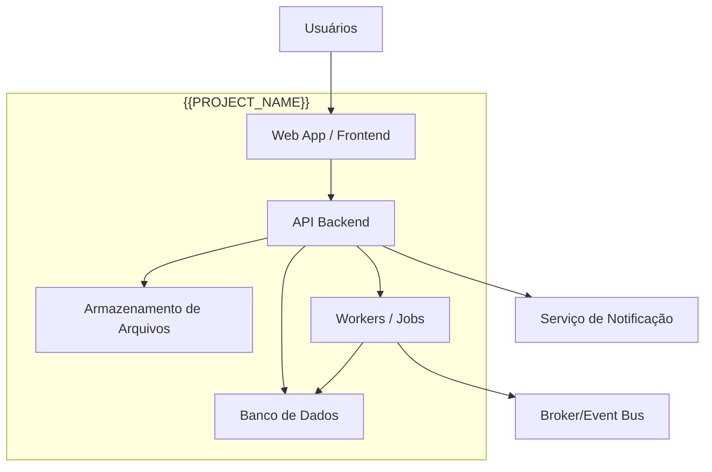

<!-- TEMPLATE: global-canon-template | DEST: docs/_canon/C4_CONTAINERS.md | SOURCE: .contract_driven/templates/globais/C4_CONTAINERS.md -->

# C4_CONTAINERS.md

## Objetivo
Descrever os containers principais de `{{PROJECT_NAME}}`.

## Containers
### Web App / Frontend
- Responsabilidade: interface do usuário
- Entrada: contratos OpenAPI / tipos gerados
- Saída: chamadas HTTP / upload / comandos do usuário

### API Backend
- Responsabilidade: regras de aplicação e exposição dos contratos HTTP
- Entrada: requests, autenticação, payloads
- Saída: responses, eventos, persistência

### Banco de Dados
- Responsabilidade: persistência transacional

### Armazenamento de Arquivos
- Responsabilidade: anexos, mídia, relatórios

### Workers / Jobs
- Responsabilidade: tarefas assíncronas, cálculos, integrações

## Relações Críticas
- Frontend consome apenas contratos públicos
- Backend implementa contratos
- Jobs não alteram semântica pública sem contrato

## Observações
- Adicionar componentes internos em ADR ou documentação específica quando necessário
