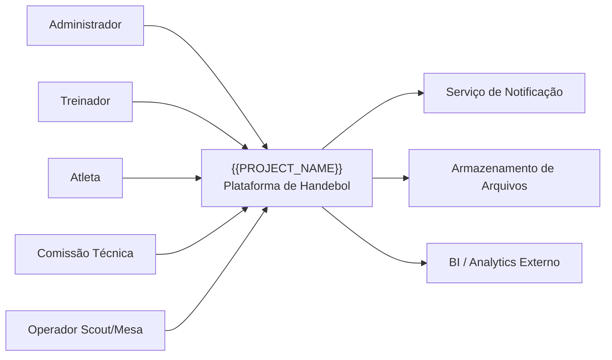

<!-- TEMPLATE: global-canon-template | DEST: docs/_canon/C4_CONTEXT.md | SOURCE: .contract_driven/templates/globais/C4_CONTEXT.md -->

# C4_CONTEXT.md

## Objetivo
Contextualizar `{{PROJECT_NAME}}` no ecossistema.

## Pessoas e Sistemas Externos
- Administrador
- Treinador
- Atleta
- Comissão técnica
- Operador de scout/mesa
- Serviços externos de notificação
- Armazenamento externo
- Sistemas externos de analytics/integradores

## Responsabilidades do Sistema
{{RESPONSIBILITIES_MD_LIST}}

## Fronteira do Contexto
Tudo que está fora deste diagrama deve ser tratado como externo ao controle direto de `{{PROJECT_NAME}}`.
