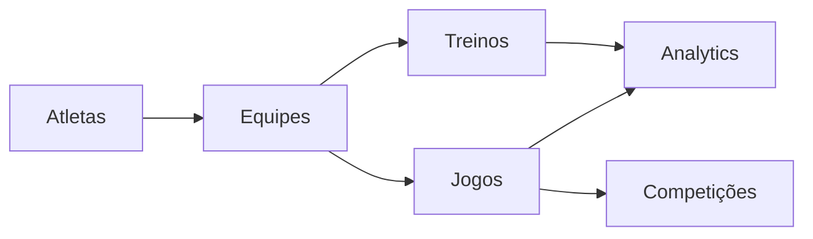

<!-- TEMPLATE: global-canon-template | DEST: docs/_canon/MODULE_MAP.md | SOURCE: .contract_driven/templates/globais/MODULE_MAP.md -->

# MODULE_MAP.md

## Nota de Taxonomia
Este template modela **macrodomínios de negócio** para comunicação com stakeholders, não a taxonomia técnica canônica de 16 módulos definida em `.contract_driven/CONTRACT_SYSTEM_LAYOUT.md` seção 2.

Para mapeamento técnico-canônico dos 16 módulos, consultar:
- `.contract_driven/CONTRACT_SYSTEM_LAYOUT.md` seção 2 (Canonical Module Taxonomy)
- `docs/_canon/ARCHITECTURE.md` ou ADR específico se houver mapeamento formal macrodomínio→módulo(s)

## Objetivo
Inventariar os módulos do sistema e seus relacionamentos.

## Módulos
| Módulo | Responsabilidade | Dependências | UI | API | Workflow | Eventos |
|---|---|---|---|---|---|---|
| Atletas | {{RESP_ATLETAS}} | {{DEP_ATLETAS}} | {{YES_NO}} | {{YES_NO}} | {{YES_NO}} | {{YES_NO}} |
| Equipes | {{RESP_EQUIPES}} | {{DEP_EQUIPES}} | {{YES_NO}} | {{YES_NO}} | {{YES_NO}} | {{YES_NO}} |
| Treinos | {{RESP_TREINOS}} | {{DEP_TREINOS}} | {{YES_NO}} | {{YES_NO}} | {{YES_NO}} | {{YES_NO}} |
| Jogos | {{RESP_JOGOS}} | {{DEP_JOGOS}} | {{YES_NO}} | {{YES_NO}} | {{YES_NO}} | {{YES_NO}} |
| Competições | {{RESP_COMPETICOES}} | {{DEP_COMPETICOES}} | {{YES_NO}} | {{YES_NO}} | {{YES_NO}} | {{YES_NO}} |
| Analytics | {{RESP_ANALYTICS}} | {{DEP_ANALYTICS}} | {{YES_NO}} | {{YES_NO}} | {{YES_NO}} | {{YES_NO}} |

## Relações

## Critérios
- Todo módulo deve ter pasta/documentação própria
- Todo módulo deve apontar para seu contrato OpenAPI
- Todo módulo com regra esportiva deve referenciar `HANDBALL_RULES_DOMAIN.md`

## Observações
Este documento pode ser assistido por script, mas a curadoria final é humana.
