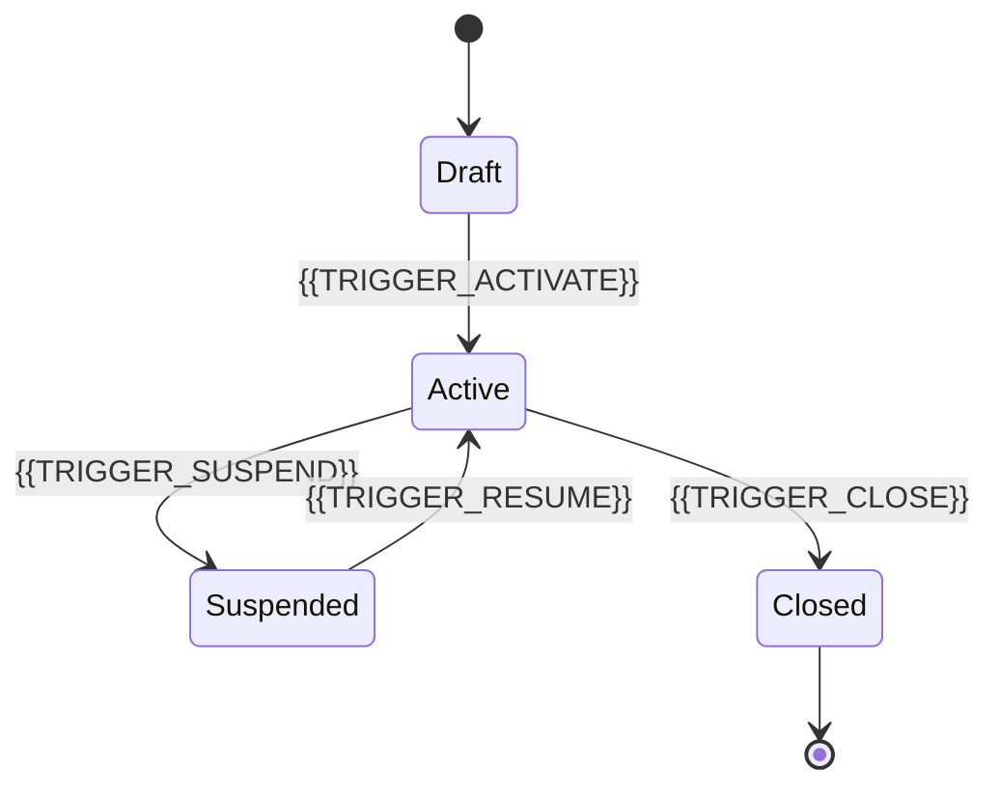

# STATE_MODEL_{{MODULE_NAME_UPPER}}.md

## Objetivo
Documentar os estados e transições válidas do módulo `{{MODULE_NAME}}`.

## Entidade principal
- `{{DOMAIN_ENTITY}}`

## Regras de modelagem
- Toda transição deve ter gatilho definido
- Toda transição inválida deve ser tratada como erro
- Toda transição crítica deve ter cobertura em `TEST_MATRIX_{{MODULE_NAME_UPPER}}.md`

## Diagrama de estados

## Tabela de estados
| Estado | Descrição | Estado inicial | Estado terminal |
|---|---|---|---|
| Draft | {{STATE_DESCRIPTION_DRAFT}} | Sim | Não |
| Active | {{STATE_DESCRIPTION_ACTIVE}} | Não | Não |
| Suspended | {{STATE_DESCRIPTION_SUSPENDED}} | Não | Não |
| Closed | {{STATE_DESCRIPTION_CLOSED}} | Não | Sim |

## Tabela de transições
| De | Para | Gatilho | Regra | Erro se inválido |
|---|---|---|---|---|
| Draft | Active | {{TRIGGER_ACTIVATE}} | {{RULE}} | {{ERROR_CODE}} |
| Active | Suspended | {{TRIGGER_SUSPEND}} | {{RULE}} | {{ERROR_CODE}} |
| Suspended | Active | {{TRIGGER_RESUME}} | {{RULE}} | {{ERROR_CODE}} |
| Active | Closed | {{TRIGGER_CLOSE}} | {{RULE}} | {{ERROR_CODE}} |

## Observações
Se houver regra esportiva impactando estado, citar explicitamente `HANDBALL_RULES_DOMAIN.md`.
