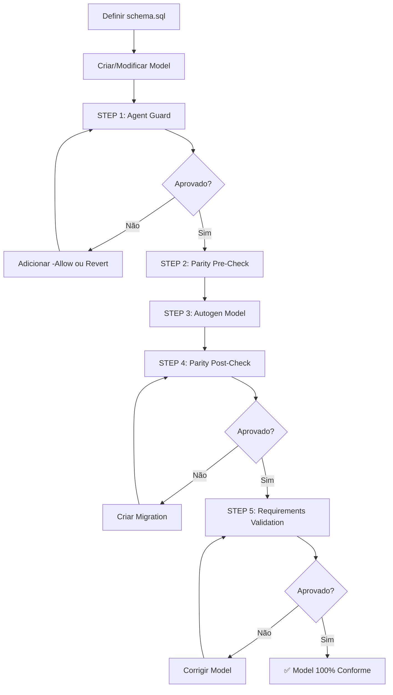

# Checklist Canônico: Criação e Validação de Models SQLAlchemy

Guia passo-a-passo para criação, modificação e validação de models SQLAlchemy no HB Track, garantindo conformidade 100% com schema.sql (SSOT).

**Referência:** ADR-MODELS-001  
**Versão:** 1.0  
**Data:** 2026-02-08

---

## 📋 Overview do Processo



---

## 🎯 Checklist Completo

### ✅ STEP 0: Definir Schema (DDL)

**Objetivo:** Estabelecer schema.sql como Single Source of Truth (SSOT).

**Ações:**
1. **Criar migration Alembic:**
   ```powershell
   alembic revision -m "create attendance table"
   ```

2. **Definir DDL completo:**
   ```sql
   -- migration: versions/0042_create_attendance.py
   def upgrade():
       op.create_table(
           'attendance',
           sa.Column('id', sa.Integer(), nullable=False),
           sa.Column('date', sa.Date(), nullable=False),
           sa.Column('athlete_id', sa.Integer(), nullable=False),
           sa.Column('is_medical_restriction', sa.Boolean(), 
                     nullable=False, server_default=sa.false()),
           sa.ForeignKeyConstraint(['athlete_id'], ['athletes.id'], 
                                   name='fk_attendance_athlete', ondelete='CASCADE'),
           sa.PrimaryKeyConstraint('id', name='pk_attendance'),
           sa.CheckConstraint("status IN ('present', 'absent', 'justified')", 
                             name='ck_attendance_status_valid'),
       )
       op.create_index('idx_attendance_date', 'attendance', ['date'])
   ```

3. **Aplicar migration:**
   ```powershell
   alembic upgrade head
   ```

4. **Regenerar schema.sql:**
   ```powershell
   python scripts\generate_docs.py
   # OU
   pg_dump -h localhost -U user -d hb_track_db --schema-only > docs\_generated\schema.sql
   ```

**Critério de sucesso:**
- ✅ Migration aplicada sem erros
- ✅ `schema.sql` contém definição completa da tabela
- ✅ Constraints (PK, FK, CHECK, INDEX) declaradas

---

### ✅ STEP 1: Agent Guard (Baseline)

**Objetivo:** Evitar modificações acidentais em arquivos protegidos (testes, APIs, tasks).

**Comando:**
```powershell
.\scripts\models_autogen_gate.ps1 -Table "attendance"
```

**Se falhar (exit=3):**
```powershell
# Opção A: Autorizar modificação explicitamente
.\scripts\models_autogen_gate.ps1 -Table "attendance" -Allow "app/routes/attendance.py"

# Opção B: Reverter arquivo modificado
git restore app/routes/attendance.py

# Opção C: Atualizar baseline (se mudança é permanente)
python scripts\agent_guard.py snapshot
```

**Critério de sucesso:**
- ✅ Exit code = 0 ou 2 (não 3)
- ✅ Nenhum arquivo protegido modificado (ou explicitamente permitido)

---

### ✅ STEP 2: Parity Pre-Check

**Objetivo:** Verificar se DB e Model já estão sincronizados antes de autogen.

**Comando:**
```powershell
.\scripts\parity_gate.ps1 -Table "attendance"
```

**Comportamento esperado:**
- **Exit 0:** DB e Model sincronizados (pular autogen)
- **Exit 2:** Diferenças detectadas (continuar para autogen)

**Nota:** Este step NÃO aborta o gate. É apenas um pre-check informativo.

---

### ✅ STEP 3: Autogen Model

**Objetivo:** Gerar/atualizar model Python a partir do schema PostgreSQL.

**Comando (automático via gate):**
```powershell
.\scripts\models_autogen_gate.ps1 -Table "attendance" -Create
```

**Ou manual:**
```powershell
python scripts\autogen_model_from_db.py apply --table attendance --create
```

**Resultado:**
- Model gerado/atualizado em `app/models/attendance.py`
- Estrutura reflete exatamente o schema.sql

**Critério de sucesso:**
- ✅ Arquivo `app/models/attendance.py` criado/modificado
- ✅ Nenhum erro de execução (Python + SQLAlchemy)

---

### ✅ STEP 4: Parity Post-Check

**Objetivo:** Confirmar que Model e DB estão 100% sincronizados após autogen.

**Comando:**
```powershell
.\scripts\parity_gate.ps1 -Table "attendance"
```

**Se falhar (exit=2):**
```powershell
# Identificar diferenças no output:
# Exemplo: modify_nullable(attendance, 'athlete_id', nullable=False → True)

# Opção A: Criar migration se diferença é legítima
alembic revision --autogenerate -m "fix attendance.athlete_id nullable"
alembic upgrade head

# Opção B: Rodar autogen novamente
.\scripts\models_autogen_gate.ps1 -Table "attendance"
```

**Critério de sucesso:**
- ✅ Exit code = 0
- ✅ Nenhuma diferença estrutural reportada

---

### ✅ STEP 5: Requirements Validation

**Objetivo:** Garantir conformidade estrutural independente de Alembic (detecta alucinações, tipos incorretos, constraints faltando).

**Comando:**
```powershell
python scripts\model_requirements.py --table attendance --profile strict
```

**Critério de sucesso:**
- ✅ Exit code = 0
- ✅ Output: `[OK] model_requirements strict profile passed`
- ✅ Total de violations = 0

**Se falhar (exit=4):**

#### 1. Analisar violations

```powershell
python scripts\model_requirements.py --table attendance --profile strict
# Output:
# [FAIL] model_requirements strict profile violations
#   - MISSING_SERVER_DEFAULT: is_medical_restriction expected_default=default_literal:false model_line=174
#   - TYPE_MISMATCH: date expected=date got=varchar|20 model_line=35
```

#### 2. Corrigir model com base nas fix suggestions

**Exemplo 1: MISSING_SERVER_DEFAULT**
```python
# ❌ ANTES (app/models/attendance.py linha 174)
is_medical_restriction: Mapped[bool] = mapped_column(Boolean, nullable=False)

# ✅ DEPOIS
from sqlalchemy import text
is_medical_restriction: Mapped[bool] = mapped_column(
    Boolean, 
    nullable=False, 
    server_default=text("false")
)
```

**Exemplo 2: TYPE_MISMATCH**
```python
# ❌ ANTES (linha 35)
date: Mapped[str] = mapped_column(String(20))

# ✅ DEPOIS
from datetime import date as date_type
date: Mapped[date_type] = mapped_column(Date, nullable=False)
```

**Exemplo 3: MISSING_USE_ALTER (ciclo FK)**
```python
# ❌ ANTES (teams.py)
season_id: Mapped[int] = mapped_column(Integer, ForeignKey("seasons.id"))

# ✅ DEPOIS
season_id: Mapped[int] = mapped_column(
    Integer,
    ForeignKey("seasons.id", use_alter=True, name="fk_teams_season_id")
)
```

#### 3. Revalidar após correções

```powershell
python scripts\model_requirements.py --table attendance --profile strict
# Esperado: [OK] ... (exit=0)
```

---

### ✅ STEP 6: Snapshot Baseline (se criação)

**Objetivo:** Atualizar baseline do agent_guard para incluir novo model.

**Comando (automático se -Create):**
```powershell
python scripts\agent_guard.py snapshot
```

**Critério de sucesso:**
- ✅ Baseline `.hb_guard/baseline.json` atualizado
- ✅ Novo model incluído no manifest

---

## 📊 Perfis de Validação

### Quando usar cada perfil?

| Perfil | Validações | Usar quando |
|--------|-----------|-------------|
| **strict** | A-H (100%) | Models novos, estáveis, sem metaprogramming |
| **fk** | A-D (colunas + tipos + nullable + FKs) | Ciclos FK documentados (teams ↔ seasons) |
| **lenient** | A-H com exceções | Metaprogramming, casos especiais documentados |

### Exemplos de uso

```powershell
# Model novo: strict (padrão)
.\scripts\models_autogen_gate.ps1 -Table "new_table" -Create -Profile "strict"

# Model com ciclo FK: fk
.\scripts\models_autogen_gate.ps1 -Table "teams" -Profile "fk" -AllowCycleWarning

# Model com exceções documentadas: lenient
.\scripts\models_autogen_gate.ps1 -Table "dynamic_table" -Profile "lenient"
```

---

## 🚨 Troubleshooting

### Q: Gate falha no STEP 1 (exit=3)

**Problema:** Arquivo protegido foi modificado sem autorização.

**Solução:**
```powershell
# Ver qual arquivo foi modificado (output do agent_guard)
# Exemplo: Modified: app/routes/attendance.py

# Se modificação é legítima:
.\scripts\models_autogen_gate.ps1 -Table "attendance" -Allow "app/routes/attendance.py"

# Se foi acidental:
git restore app/routes/attendance.py
```

---

### Q: Gate falha no STEP 4 (exit=2)

**Problema:** Model difere do DB após autogen.

**Causas comuns:**
- Autogen não capturou constraint corretamente
- Migration pendente não aplicada
- Schema.sql desatualizado

**Solução:**
```powershell
# 1. Verificar se migration está pendente
alembic current
alembic upgrade head

# 2. Regenerar schema.sql
python scripts\generate_docs.py

# 3. Rodar autogen novamente
.\scripts\models_autogen_gate.ps1 -Table "attendance"
```

---

### Q: Gate falha no STEP 5 (exit=4)

**Problema:** Requirements violations detectadas.

**Solução:** Ver [Guia de Model Requirements](../workflows/model_requirements_guide.md) para cada tipo de violation.

**Fix rápido:**
```powershell
# 1. Ver violations detalhadas
python scripts\model_requirements.py --table attendance --profile strict

# 2. Corrigir model (usar line numbers do output)

# 3. Revalidar
.\scripts\models_autogen_gate.ps1 -Table "attendance"
```

---

### Q: Autogen modifica arquivos não relacionados

**Problema:** `models_autogen_gate.ps1` tenta modificar testes/APIs.

**Solução:**
```powershell
# Usar -Allow para autorizar apenas o model específico
.\scripts\models_autogen_gate.ps1 -Table "attendance" -Allow "app/models/attendance.py"
```

---

### Q: Ciclo FK (teams ↔ seasons) falha validação

**Problema:** D4_MISSING_USE_ALTER violation em ciclos FK.

**Solução:**
```python
# Adicionar use_alter=True em UMA das FKs do ciclo
# teams.py
season_id: Mapped[int] = mapped_column(
    Integer,
    ForeignKey("seasons.id", use_alter=True, name="fk_teams_season_id")
)

# seasons.py (FK reversa não precisa use_alter)
team_id: Mapped[int] = mapped_column(
    Integer,
    ForeignKey("teams.id", name="fk_seasons_team_id")
)
```

---

## 📚 Comandos de Referência Rápida

```powershell
# ==================== Criação de Model (completo) ====================
# 1. Criar migration
alembic revision -m "create new_table"

# 2. Aplicar migration
alembic upgrade head

# 3. Regenerar schema.sql
python scripts\generate_docs.py

# 4. Rodar gate completo (cria model automaticamente)
.\scripts\models_autogen_gate.ps1 -Table "new_table" -Create -Profile "strict"

# ==================== Validação isolada ====================
# Apenas agent_guard
python scripts\agent_guard.py check --allow "app/models/attendance.py"

# Apenas parity
.\scripts\parity_gate.ps1 -Table "attendance"

# Apenas requirements
python scripts\model_requirements.py --table attendance --profile strict

# ==================== Casos especiais ====================
# Ciclo FK (perfil relaxado)
.\scripts\models_autogen_gate.ps1 -Table "teams" -Profile "fk" -AllowCycleWarning

# Model com allowlist explícita
.\scripts\models_autogen_gate.ps1 -Table "attendance" -Allow "app/models/attendance.py"

# Forçar recreação (skeleton + autogen)
.\scripts\models_autogen_gate.ps1 -Table "attendance" -Create

# ==================== Debugging ====================
# Ver exit code
$LASTEXITCODE

# Ver baseline atual
Get-Content ".hb_guard\baseline.json" | ConvertFrom-Json | Select-Object -ExpandProperty files

# Atualizar baseline
python scripts\agent_guard.py snapshot
```

---

## 🎓 Boas Práticas

### ✅ DO:
- **Sempre** definir schema.sql primeiro (SSOT)
- **Sempre** rodar gate completo após modificar model
- **Sempre** usar perfil `strict` como padrão (100% conformidade)
- **Sempre** verificar exit code explicitamente ($LASTEXITCODE)
- **Sempre** documentar exceções em `lenient` mode com `reason` claro
- **Sempre** manter schema.sql atualizado (regenerar após migrations)

### ❌ DON'T:
- Modificar model manualmente sem validar com gate
- Ignorar violations sem investigar (pode ser bug sério)
- Usar `lenient` mode como padrão (exceções devem ser justificadas)
- Pular validação em PRs (use CI/CD hook obrigatório)
- Criar migration sem antes validar model com gate
- Modificar arquivos protegidos sem `-Allow` explícito

---

## 📖 Referências

- **ADR:** [ADR-MODELS-001](./ADR-MODELS-001.md)
- **Exit Codes:** [exit_codes.md](../references/exit_codes.md)
- **Guia Requirements:** [model_requirements_guide.md](../workflows/model_requirements_guide.md)
- **EXEC_TASK:** [EXEC_TASK_ADR_MODELS_001.md](../_ai/EXEC_TASK_ADR_MODELS_001.md)

---

**Última atualização:** 2026-02-08  
**Responsável:** Tech Lead + AI Assistant  
**Status:** ✅ Implementado e validado
