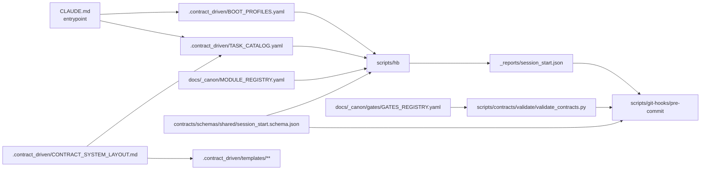

# PIPELINE_SOLUÇÕES — Checklist Determinístico de Correção

Objetivo: eliminar split-brain documental, intrusos em `_canon`, loopholes de commit, drift de templates e inconsistência de sessão, sem recriar prolixidade.

## Arquitetura-alvo

## Fase 1 — Fechar a autoridade de boot e routing

- [x] Mover `docs/_canon/BOOT_PROFILES.yaml` para `.contract_driven/BOOT_PROFILES.yaml`.
- [x] Mover `docs/_canon/TASK_CATALOG.yaml` para `.contract_driven/TASK_CATALOG.yaml`.
- [x] Mover `docs/_canon/gates/TRAINING_MODULE_DECISION_IR.yaml` para `docs/hbtrack/modulos/training/DECISION_IR_TRAINING.yaml`.
- [x] Atualizar [CLAUDE.md](/home/davis/HB-TRACK/CLAUDE.md) para apontar `Task routing` para `.contract_driven/TASK_CATALOG.yaml`.
- [x] Atualizar [CLAUDE.md](/home/davis/HB-TRACK/CLAUDE.md) para apontar `Boot profiles` para `.contract_driven/BOOT_PROFILES.yaml`.
- [x] Remover de [CLAUDE.md](/home/davis/HB-TRACK/CLAUDE.md) o mapa manual de task types e manter apenas referência ao catálogo.
- [x] Remover de [CLAUDE.md](/home/davis/HB-TRACK/CLAUDE.md) o resumo manual de status de módulos.
- [x] Atualizar [.contract_driven/CONTRACT_SYSTEM_RULES.md](/home/davis/HB-TRACK/.contract_driven/CONTRACT_SYSTEM_RULES.md) para substituir toda referência a `CLAUDE.md §7` por `.contract_driven/BOOT_PROFILES.yaml`.
- [x] Atualizar [docs/_canon/CONTRACT_PIPELINE.md](/home/davis/HB-TRACK/docs/_canon/CONTRACT_PIPELINE.md) para substituir toda referência a `CLAUDE.md §7` por `.contract_driven/BOOT_PROFILES.yaml`.
- [x] Atualizar [docs/_canon/gates/GATES_REGISTRY.yaml](/home/davis/HB-TRACK/docs/_canon/gates/GATES_REGISTRY.yaml) para `boot_profiles_ref: ".contract_driven/BOOT_PROFILES.yaml"`.
- [x] Atualizar [.contract_driven/GLOBAL_TEMPLATES.md](/home/davis/HB-TRACK/.contract_driven/GLOBAL_TEMPLATES.md) para refletir a nova localização dos SSOTs de boot/routing.
- [x] Atualizar [docs/_canon/README.md](/home/davis/HB-TRACK/docs/_canon/README.md) para remover `BOOT_PROFILES.yaml` e `TASK_CATALOG.yaml` de `_canon` e apontar para `.contract_driven/`.

## Fase 2 — Reconciliar paths canônicos e catálogo de tasks

- [x] Atualizar `.contract_driven/TASK_CATALOG.yaml` para `new_contract.artifacts_produced = contracts/openapi/paths/{module}.yaml`.
- [x] Atualizar `.contract_driven/TASK_CATALOG.yaml` para `contract_revision.artifacts_produced = contracts/openapi/paths/{module}.yaml`.
- [x] Atualizar `.contract_driven/TASK_CATALOG.yaml` para `new_workflow.artifacts_produced = contracts/workflows/{module}/{workflow_name}.arazzo.yaml`.
- [x] Atualizar `.contract_driven/TASK_CATALOG.yaml` para `new_state_model.artifacts_produced = docs/hbtrack/modulos/{module}/STATE_MODEL_{module_upper}.md`.
- [x] Atualizar `.contract_driven/TASK_CATALOG.yaml` para `new_ui_contract.artifacts_produced = docs/hbtrack/modulos/{module}/UI_CONTRACT_{module_upper}.md`.
- [x] Atualizar `.contract_driven/TASK_CATALOG.yaml` para `new_module.artifacts_produced` com nomes uppercase canônicos.
- [x] Declarar em `.contract_driven/TASK_CATALOG.yaml` que `generate_code` e `generate_frontend` permanecem `frozen` e não entram em `stage_allowed`.
- [x] Atualizar [CLAUDE.md](/home/davis/HB-TRACK/CLAUDE.md), [.contract_driven/agent_prompts/pre_contract_orchestrator.prompt.md](/home/davis/HB-TRACK/.contract_driven/agent_prompts/pre_contract_orchestrator.prompt.md) e [.contract_driven/agent_prompts/decision_discovery.prompt.md](/home/davis/HB-TRACK/.contract_driven/agent_prompts/decision_discovery.prompt.md) para consumirem o catálogo, não contagem manual de tasks.
- [x] Atualizar [.contract_driven/CONTRACT_SYSTEM_LAYOUT.md](/home/davis/HB-TRACK/.contract_driven/CONTRACT_SYSTEM_LAYOUT.md) para refletir exatamente os mesmos paths declarados no catálogo.

## Fase 3 — Corrigir `_canon` e a allowlist

- [x] Remover de `_canon` todos os arquivos que são governança de agente e não canon global.
- [x] Atualizar [docs/_canon/README.md](/home/davis/HB-TRACK/docs/_canon/README.md) para listar apenas arquivos realmente permitidos em `_canon`.
- [x] Atualizar [.contract_driven/CONTRACT_SYSTEM_LAYOUT.md](/home/davis/HB-TRACK/.contract_driven/CONTRACT_SYSTEM_LAYOUT.md) seção 4A para a lista real de `_canon`.
- [x] Atualizar [docs/_canon/gates/GATES_REGISTRY.yaml](/home/davis/HB-TRACK/docs/_canon/gates/GATES_REGISTRY.yaml) e o `CANON_ALLOWLIST_GATE` em [validate_contracts.py](/home/davis/HB-TRACK/scripts/contracts/validate/validate_contracts.py) para a mesma allowlist.
- [x] Remover de `docs/_canon/gates/` qualquer arquivo que não seja `GATES_REGISTRY.yaml` ou `README.md`.
- [x] Mover `TRAINING_MODULE_DECISION_IR.yaml` para o path de módulo definido na Fase 1.

## Fase 4 — Reparar CLI, sessão e migração

- [x] Atualizar [scripts/hb](/home/davis/HB-TRACK/scripts/hb) para carregar `BOOT_PROFILES` e `TASK_CATALOG` nos novos paths em `.contract_driven/`.
- [x] Remover de [scripts/hb](/home/davis/HB-TRACK/scripts/hb) a lista hardcoded de módulos e carregar módulos de `docs/_canon/MODULE_REGISTRY.yaml`.
- [x] Implementar em [scripts/hb](/home/davis/HB-TRACK/scripts/hb) detecção de `pipeline_version` incompatível em `_reports/session_start.json`.
- [x] Implementar em [scripts/hb](/home/davis/HB-TRACK/scripts/hb) migração automática: se o arquivo atual for inválido, mover para `_reports/legacy/session_start.<timestamp>.json` e iniciar sessão nova.
- [x] Implementar em [scripts/hb](/home/davis/HB-TRACK/scripts/hb) `hb reset` como limpeza explícita de sessão atual.
- [x] Implementar em [scripts/hb](/home/davis/HB-TRACK/scripts/hb) upsert determinístico de `stage2_artifacts` por `path`, sobrescrevendo hash, timestamp e exit code.
- [x] Implementar em [scripts/hb](/home/davis/HB-TRACK/scripts/hb) validação de `boot_profile_id` contra `.contract_driven/BOOT_PROFILES.yaml`.
- [x] Atualizar [contracts/schemas/shared/session_start.schema.json](/home/davis/HB-TRACK/contracts/schemas/shared/session_start.schema.json) para refletir exatamente o formato salvo pela CLI.
- [x] Proibir no schema qualquer campo legado (`timestamp`, `stages`, etc.) depois da migração.

## Fase 5 — Colocar o enforcement no hook realmente ativo

- [x] Reescrever [scripts/git-hooks/pre-commit](/home/davis/HB-TRACK/scripts/git-hooks/pre-commit) para substituir o wrapper antigo por enforcement real.
- [x] Validar no hook o schema de `_reports/session_start.json` via `contracts/schemas/shared/session_start.schema.json`.
- [x] Fazer o hook bloquear se `stage0_exit_code != 0`.
- [x] Fazer o hook bloquear se `stage1_exit_code != 0`.
- [x] Fazer o hook bloquear se qualquer arquivo staged em `contracts/` ou `docs/hbtrack/` não tiver entrada correspondente em `stage2_artifacts`.
- [x] Fazer o hook comparar o `sha256` do blob staged com o `sha256` salvo em `stage2_artifacts`.
- [x] Fazer o hook bloquear se `SESSION_HANDOFF.md` não estiver staged quando houver mudanças de contrato/docs governados.
- [x] Fazer o hook executar `python3 scripts/contracts/validate/validate_contracts.py --profile precommit` após a validação da sessão.
- [x] Remover qualquer lógica de hook em `.git/hooks/` e manter `core.hooksPath = scripts/git-hooks`.
- [x] Validar em shell que `git config --get core.hooksPath` continua retornando `scripts/git-hooks`.

## Fase 6 — Reparar templates e eliminar referências mortas

- [x] Atualizar [.contract_driven/templates/globais/README.md](/home/davis/HB-TRACK/.contract_driven/templates/globais/README.md) para remover `API_CONVENTIONS.md`, `ERROR_MODEL.md`, `UI_FOUNDATIONS.md` e `DESIGN_SYSTEM.md`.
- [x] Atualizar [.contract_driven/templates/globais/README.md](/home/davis/HB-TRACK/.contract_driven/templates/globais/README.md) para substituir esses destinos por `UI_CONTRACT_GUIDE.md` e `.contract_driven/templates/api/api_rules.yaml`.
- [x] Atualizar [.contract_driven/templates/modulos/ERRORS_{{MODULE_NAME_UPPER}}.md](/home/davis/HB-TRACK/.contract_driven/templates/modulos/ERRORS_%7B%7BMODULE_NAME_UPPER%7D%7D.md) para remover `error_model_ref` quebrado e apontar para `contracts/openapi/components/schemas/shared/problem.yaml` e `api_rules.yaml`.
- [x] Atualizar [.contract_driven/templates/modulos/STATE_MODEL_{{MODULE_NAME_UPPER}}.md](/home/davis/HB-TRACK/.contract_driven/templates/modulos/STATE_MODEL_%7B%7BMODULE_NAME_UPPER%7D%7D.md) para remover `adr_ref` fixo de `training`.
- [x] Atualizar [.contract_driven/templates/modulos/MODULE_DOC_HEADER_POLICY.yaml](/home/davis/HB-TRACK/.contract_driven/templates/modulos/MODULE_DOC_HEADER_POLICY.yaml) para refletir o novo campo de erro e refs válidas.
- [x] Atualizar [.contract_driven/templates/api/AddidasAPI.md](/home/davis/HB-TRACK/.contract_driven/templates/api/AddidasAPI.md) para remover referência a `docs/_canon/API_CONVENTIONS.md`.
- [x] Atualizar [.contract_driven/templates/api/OWASPAPI.md](/home/davis/HB-TRACK/.contract_driven/templates/api/OWASPAPI.md) para remover referência a `docs/_canon/ERROR_MODEL.md`.
- [x] Arquivar [.contract_driven/templates/api/REGRAS_API.md](/home/davis/HB-TRACK/.contract_driven/templates/api/REGRAS_API.md) em `templates/api/legacy/REGRAS_API.md` se os arquivos referenciados continuarem inexistentes.
- [x] Atualizar [.contract_driven/GLOBAL_TEMPLATES.md](/home/davis/HB-TRACK/.contract_driven/GLOBAL_TEMPLATES.md) para refletir apenas templates e destinos válidos.
- [x] Atualizar [.contract_driven/templates/README.md](/home/davis/HB-TRACK/.contract_driven/templates/README.md) para declarar política de validação automática da pasta.

## Fase 7 — Limpar legado e reduzir contexto

- [ ] Remover de [.contract_driven/CONTRACT_SYSTEM_LAYOUT.md](/home/davis/HB-TRACK/.contract_driven/CONTRACT_SYSTEM_LAYOUT.md) referências operacionais a `_reports/agent_execution/latest.json`.
- [ ] Remover de [.contract_driven/CONTRACT_SYSTEM_LAYOUT.md](/home/davis/HB-TRACK/.contract_driven/CONTRACT_SYSTEM_LAYOUT.md) referências operacionais a `_reports/evidence/boot_resolution_report.json`.
- [ ] Atualizar [docs/_canon/CONTRACT_PIPELINE.md](/home/davis/HB-TRACK/docs/_canon/CONTRACT_PIPELINE.md) para não mencionar mais `CLAUDE.md §7`.
- [ ] Atualizar [.contract_driven/CONTRACT_SYSTEM_RULES.md](/home/davis/HB-TRACK/.contract_driven/CONTRACT_SYSTEM_RULES.md) para não mencionar mais `CLAUDE.md §7`.
- [ ] Reduzir [.contract_driven/GLOBAL_TEMPLATES.md](/home/davis/HB-TRACK/.contract_driven/GLOBAL_TEMPLATES.md) a índice de navegação e ponteiros para templates válidos.
- [ ] Reduzir [.contract_driven/CONTRACT_SYSTEM_RULES.md](/home/davis/HB-TRACK/.contract_driven/CONTRACT_SYSTEM_RULES.md) removendo duplicações de precedência e boot.
- [ ] Reduzir [.contract_driven/CONTRACT_SYSTEM_LAYOUT.md](/home/davis/HB-TRACK/.contract_driven/CONTRACT_SYSTEM_LAYOUT.md) removendo árvores e legados que não governam mais o sistema.
- [ ] Reduzir [docs/_canon/CONTRACT_PIPELINE.md](/home/davis/HB-TRACK/docs/_canon/CONTRACT_PIPELINE.md) para pipeline vigente, hook vigente e SSOT vigente.

## Fase 8 — Validar por testes, não por aparência

- [x] Adicionar teste: `hb verify` sem `--task-type` e `--module` deve falhar.
- [x] Adicionar teste: `hb verify --task-type contract_revision --module training` em sessão legada deve migrar/arquivar e prosseguir.
- [x] Adicionar teste: `hb check --module training` sem sessão válida deve falhar.
- [x] Adicionar teste: `hb artifact contracts/openapi/paths/training.yaml` com `UI_DOC_VALIDATION_GATE` em `FAIL` deve retornar `exit != 0`.
- [x] Adicionar teste: hook deve bloquear `session_start.json` inválido.
- [x] Adicionar teste: hook deve bloquear hash stale de artefato staged.
- [x] Adicionar teste: `CANON_ALLOWLIST_GATE` deve passar no estado final do repo.
- [x] Adicionar teste: `rg "CLAUDE.md §7"` em arquivos ativos deve retornar zero referências de boot.
- [x] Adicionar teste: `rg "API_CONVENTIONS.md|ERROR_MODEL.md|UI_FOUNDATIONS.md|DESIGN_SYSTEM.md"` em templates ativos deve retornar zero referências.
- [x] Adicionar teste: diff entre paths de `TASK_CATALOG` e `LAYOUT` deve retornar vazio.
- [x] Adicionar teste: `python3 scripts/contracts/validate/validate_contracts.py --profile local` deve retornar `PASS` ou `DEGRADED`, nunca `FAIL`.

## Fase 9 — Critério de encerramento

- [x] Confirmar que `git config --get core.hooksPath` aponta para `scripts/git-hooks`.
- [x] Confirmar que o hook ativo contém a lógica de sessão e não o wrapper antigo.
- [x] Confirmar que `_reports/session_start.json` é recriado no schema novo sem campos legados.
- [x] Confirmar que `docs/_canon` não contém intrusos fora da allowlist final.
- [x] Confirmar que `TASK_CATALOG`, `LAYOUT`, `CLAUDE` e prompts descrevem o mesmo conjunto de tasks e os mesmos paths.
- [x] Confirmar que templates ativos não apontam para arquivos inexistentes.
- [x] Confirmar que `_reports/legacy/` contém os artefatos antigos removidos do fluxo ativo.
- [x] Confirmar que o audit atualizado fecha sem bloqueadores críticos novos.
