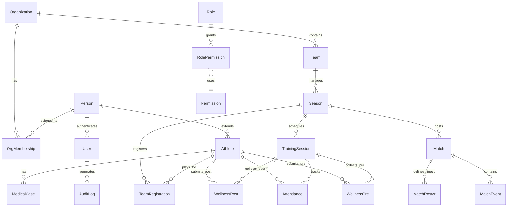

# PRD: Sistema HB Track - Comissão Técnica Digital

> **Versão:** 2.1
> **Última atualização:** 07 de fevereiro de 2026  
> **Autor:** Equipe HB Track  
> **Aprovadores:** Product Owner, Tech Lead  
> **Status:** ✅ V1.0 em produção | 🚧 V1.1 em desenvolvimento | 🔮 V2.0+ planejado  

---

## Histórico de Versões

| Versão | Data | Autor | Mudanças |
|--------|------|-------|----------|
| 2.1 | 07/02/2026 | Equipe HB Track | Adição: SLAs (10.7), matriz priorização V1.1, baselines métricas (14.1), PoC IA (16.6), modelo de negócio (18), go-to-market (19) |
| 2.0 | 07/02/2026 | Equipe HB Track | Alinhamento com V1 implementado; adição de modelo de dados, RACI, user stories, roadmap detalhado |
| 1.0 | 15/12/2025 | Product Owner | Versão inicial com foco em visão estratégica de IA |

---

## Sumário

1. [Contexto e Problema](#1-contexto-e-problema)
2. [Objetivo e Visão](#2-objetivo-e-visão)
3. [Público-alvo e Personas](#3-público-alvo-e-personas)
4. [Escopo e Priorização](#4-escopo-e-priorização)
5. [Fases de Entrega (Roadmap)](#5-fases-de-entrega-roadmap)
6. [Requisitos Funcionais V1 (Implementado)](#6-requisitos-funcionais-v1-implementado)
7. [User Stories Canônicas](#7-user-stories-canônicas)
8. [Modelo de Dados Conceitual](#8-modelo-de-dados-conceitual)
9. [Matriz RACI - Responsabilidades](#9-matriz-raci-responsabilidades)
10. [Requisitos Não Funcionais](#10-requisitos-não-funcionais)
11. [Stack Tecnológico](#11-stack-tecnológico)
12. [Privacidade, LGPD e Compliance](#12-privacidade-lgpd-e-compliance)
13. [Estratégia de Testes e Qualidade](#13-estratégia-de-testes-e-qualidade)
14. [Métricas de Sucesso](#14-métricas-de-sucesso)
15. [Riscos e Mitigações](#15-riscos-e-mitigações)
16. [Requisitos Futuros (V2.0+)](#16-requisitos-futuros-v20)
17. [Glossário](#17-glossário)
18. [Modelo de Negócio](#18-modelo-de-negócio)
19. [Estratégia Go-to-Market](#19-estratégia-go-to-market)

---

## 1. Contexto e Problema

### 1.1 Situação Atual

Treinadores de handebol, especialmente em equipes de base e pequeno porte, enfrentam uma **sobrecarga operacional crítica**:

- **Gestão manual em planilhas:** Controle de atletas, presenças, treinos e temporadas dispersos em múltiplos arquivos Excel/Google Sheets sem versionamento ou auditoria.
- **Comunicação caótica via WhatsApp:** Informações táticas, convocações e feedbacks se perdem em conversas longas; falta rastreabilidade e confirmação de leitura.
- **Análise tática limitada:** Edição manual de vídeos consome 8-12 horas por jogo; sem ferramentas de scout, decisões são baseadas em memória ou anotações informais.
- **Negligência do bem-estar:** Controle de carga física/mental negligenciado por falta de tempo; risco de lesões e burnout não detectados.
- **Falta de dados para decisão:** Sem métricas de performance individual/coletiva, dificulta identificar padrões e ajustar estratégias.

### 1.2 Impacto no Negócio

- **Produtividade:** Treinadores gastam 60-70% do tempo em burocracia vs. 30-40% em planejamento tático.
- **Performance esportiva:** Sem dados, tomada de decisão é intuitiva, limitando evolução técnica dos atletas.
- **Risco legal:** Ausência de auditoria e controle de dados pessoais expõe clubes a sanções LGPD.
- **Retenção de talentos:** Atletas não recebem feedbacks estruturados, impactando engajamento e desenvolvimento.

---

## 2. Objetivo e Visão

### 2.1 Objetivo Principal

**Profissionalizar a gestão técnica de equipes de handebol** através de uma plataforma digital que substitui processos manuais por automação inteligente, permitindo que treinadores:

- Reduzam em **50% o tempo gasto com tarefas administrativas**
- Tomem decisões baseadas em **dados precisos e rastreáveis**
- Acompanhem **saúde física e mental dos atletas** de forma contínua
- Mantenham **histórico auditável** de toda gestão técnica

### 2.2 Visão de Longo Prazo (North Star)

Transformar o HB Track na **"Comissão Técnica Virtual"** de referência para handebol, integrando:

- **IA de Vídeo:** Análise automática de jogos e geração de clipes táticos personalizados.
- **IA Conversacional:** Suporte psicológico e coleta de bem-estar via diálogo natural.
- **Inteligência Tática:** Recomendação de treinos e planos de jogo baseados em scout e padrões de desempenho.

---

## 3. Público-alvo e Personas

### 3.1 Personas Primárias

#### **Persona 1: Treinador Solo**
- **Nome:** Carlos, 38 anos, Treinador de Equipe Feminina Sub-16
- **Dores:** Faz tudo sozinho (treinos, scout, convocações, relatórios); não tem tempo para análise tática; usa WhatsApp e perde mensagens.
- **Necessidades:** Automatizar presença, wellness e relatórios; acessar histórico de atletas; comunicação estruturada.
- **Tecnologia:** Smartphone Android, acesso à internet instável.

#### **Persona 2: Coordenador Técnico**
- **Nome:** Mariana, 45 anos, Coordenadora de Categorias de Base
- **Dores:** Gerencia 5 treinadores e 8 equipes; dificuldade em consolidar relatórios; sem visibilidade da carga de trabalho dos atletas.
- **Necessidades:** Dashboard consolidado; controle de permissões; relatórios gerenciais.
- **Tecnologia:** Notebook Windows, Google Workspace.

#### **Persona 3: Atleta Juvenil**
- **Nome:** Beatriz, 15 anos, Atleta de Handebol
- **Dores:** Recebe feedback genérico; não sabe como está evoluindo; comunicação via WhatsApp sem estrutura.
- **Necessidades:** Ver treinos agendados; registrar bem-estar facilmente; receber feedbacks personalizados.
- **Tecnologia:** Smartphone (iOS/Android), redes sociais.

#### **Persona 4: Dirigente/Gestor**
- **Nome:** Roberto, 52 anos, Presidente do Clube
- **Dores:** Sem visibilidade de resultados; risco de não-conformidade com LGPD; dificuldade em justificar investimentos.
- **Necessidades:** Relatórios executivos; controle total de acesso; auditoria completa.
- **Tecnologia:** Tablet iPad, e-mail corporativo.

### 3.2 Público Secundário

- **Pais/Responsáveis:** Querem acompanhar evolução dos filhos (acesso restrito futuro).
- **Preparadores Físicos:** Monitoram carga de treino e indicadores físicos (integração futura).

---

## 4. Escopo e Priorização

### 4.1 In Scope - V1 (✅ Implementado)

- ✅ **Gestão Hierárquica de Usuários:** Dirigente → Coordenador → Treinador → Atleta
- ✅ **Temporadas e Equipes:** Controle de ciclos esportivos e times por categoria
- ✅ **Sessões de Treino:** Criação, agendamento e registro de presença
- ✅ **Wellness Pré/Pós-Treino:** Formulários de bem-estar para atletas
- ✅ **Casos Médicos:** Registro de lesões e restrições
- ✅ **Sistema de Permissões:** Controle granular por papel e escopo organizacional
- ✅ **Auditoria Completa:** Logs de todas ações sensíveis
- ✅ **Relatórios Básicos:** Dashboards de carga semanal, engajamento, wellness

### 4.2 In Scope - V1.1 (🚧 Em Desenvolvimento)

- 🚧 **Módulo de Competições:** Campeonatos, adversários, classificações
- 🚧 **Partidas e Scout:** Registro de eventos de jogo (gols, assistências, faltas, defesas)
- 🚧 **Relatórios Avançados:** Exportação PDF, analytics de match events
- ✅ **Banco de Exercícios:** Catálogo de atividades com tags hierárquicas, favoritos, drag-and-drop para sessões (backend + frontend completos)
- ⚠️ **Notificações:** Alertas automáticos de sobrecarga e baixa resposta wellness implementados (backend + frontend); badges monthly job INATIVO (comentado em `celery_app.py:136-139`)

**Matriz de Priorização V1.1:**

| Feature | Valor de Negócio | Esforço | Risco | Prioridade |
|---------|-----------------|---------|-------|------------|
| **Partidas e Scout** | Alto (diferencial competitivo) | Médio | Baixo | P0 |
| **Notificações** | Alto (retenção de usuários) | Baixo | Médio | P0 |
| **Módulo de Competições** | Alto (pré-requisito scout) | Alto | Médio | P1 |
| **Relatórios Avançados (PDF)** | Médio (valor percebido) | Baixo | Baixo | P1 |
| **Banco de Exercícios** | Médio (produtividade) | Baixo | Baixo | P2 |

**Dependências técnicas:** Competições → Partidas → Scout (sequencial). Notificações e Relatórios são independentes.

**Grafo de Dependências V1.1:**

```
Notificações (P0)              [independente, alto valor, baixo esforço]
Relatórios PDF (P1)            [independente, médio valor, baixo esforço]
Banco de Exercícios (P2)       [✅ COMPLETO — backend + frontend + tags + favoritos]

Competições (P1)
  └── Partidas e Scout (P0)    [requer schema de competição]

Ordem sugerida de entrega:
  1. Notificações         → independente, desbloqueável imediato
  2. Relatórios PDF       → independente, valor percebido
  3. Competições          → fundação para scout
  4. Partidas e Scout     → depende de #3
  5. ~~Banco de Exercícios~~  → ✅ COMPLETO (backend + frontend + tags + favoritos + drag-and-drop)
```

### 4.3 Out Scope (V2.0+ - 🔮 Futuro)

- 🔮 **IA de Análise de Vídeo:** Clipping automático por jogador/lance
- 🔮 **IA Conversacional Wellness:** Diálogo natural para coleta de bem-estar
- 🔮 **Recomendador de Treinos:** Sugestões baseadas em scout e erros detectados
- 🔮 **Plano de Jogo IA:** Estratégias baseadas em cruzamento de dados
- 🔮 **Perfil Comportamental:** Análise psicológica por IA
- 🔮 **Transmissão de Jogos:** Streaming integrado
- 🔮 **Rede Social Interna:** Comunicação social entre atletas

---

## 5. Fases de Entrega (Roadmap)

### ✅ **Fase 1 - MVP Operacional (V1.0 - Concluído em Jan/2026)**

**Objetivo:** Substituir planilhas e WhatsApp por gestão digital auditável.

**Entregáveis:**
- Cadastro hierárquico de usuários (RF-001)
- Gestão de organizações, temporadas, equipes
- Treinos com presença digital
- Wellness pré/pós-treino
- Sistema de permissões e auditoria
- Deploy em produção (Render + Neon)

**Métricas de Sucesso:**
- 100% dos treinos registrados digitalmente
- 80% taxa de resposta wellness
- 0 incidentes de acesso indevido

---

### 🚧 **Fase 2 - Analytics e Competições (V1.1 - Q1/2026)**

**Objetivo:** Adicionar inteligência competitiva e relatórios gerenciais.

**Entregáveis:**
- Módulo de competições e adversários (RF-005)
- Scout de eventos de jogo (RF-002)
- Relatórios avançados com exportação PDF
- Banco de exercícios com tags
- Dashboard gerencial consolidado
- Alertas automáticos de sobrecarga (RF-009)

**Métricas de Sucesso:**
- 90% dos jogos com scout registrado
- 5 relatórios gerenciais utilizados semanalmente
- < 2s tempo de carregamento de dashboards

---

### 🔮 **Fase 3 - IA Tática (V2.0 - Q2-Q3/2026)**

**Objetivo:** Automação inteligente de análise e feedback.

**Entregáveis:**
- IA de clipping de vídeo (RF-010)
- Recomendador de treinos IA (RF-004)
- Plano de jogo baseado em dados (RF-005)
- Integração com AWS Rekognition / OpenCV

**Métricas de Sucesso:**
- Redução de 70% no tempo de edição de vídeos
- 85% de precisão em clipping automático
- 90% de adoção de sugestões de treino

---

### 🔮 **Fase 4 - IA Psicológica (V2.1 - Q4/2026)**

**Objetivo:** Suporte emocional e prevenção de burnout via IA.

**Entregáveis:**
- IA conversacional para wellness (RF-007)
- Perfil comportamental (RF-008)
- Detecção de risco de burnout/lesão (RF-009)
- Integração com OpenAI GPT

**Métricas de Sucesso:**
- 95% de atletas usando diálogo IA semanalmente
- 80% de precisão na detecção de riscos
- Redução de 40% em lesões por sobrecarga

---

## 6. Requisitos Funcionais V1 (Implementado)

### **RF-001: Cadastro Hierárquico de Usuários**

**Descrição:** Sistema permite criação de usuários com papéis específicos seguindo hierarquia de permissões.

**Hierarquia:**
- Super Admin (seedado, único, vitalício)
- Dirigente → cadastra Coordenadores
- Coordenador → cadastra Treinadores
- Treinador → cadastra Atletas

**Critérios de Aceitação:**
- ✅ E-mail único e normalizado obrigatório
- ✅ Senha com mínimo 8 caracteres
- ✅ Vínculo automático com organização (clube único V1)
- ✅ Membership automático na temporada corrente
- ✅ Atleta recebe team_registration na Equipe Institucional
- ✅ Auditoria registra quem criou o usuário (actor_id)

**Regras de Negócio:**
- R2: Usuário sem vínculo ativo não opera
- R33: Sem pessoa, sem usuário
- R42: Atleta sem equipe competitiva vê apenas dados próprios

---

### **RF-002: Gestão de Temporadas e Equipes**

**Descrição:** Dirigente/Coordenador gerencia temporadas esportivas e equipes por categoria.

**Critérios de Aceitação:**
- ✅ Temporada requer start_date e end_date
- ✅ Equipes vinculadas a temporadas
- ✅ Categoria da atleta derivada por idade na temporada (RD1-RD2)
- ✅ Soft delete em alterações (RDB4)

---

### **RF-003: Sessões de Treino e Presença**

**Descrição:** Treinador cria treinos e registra presença digital dos atletas.

**Critérios de Aceitação:**
- ✅ Treino requer equipe, temporada e data
- ✅ Presença: Present, Absent, Justified
- ✅ Lista de presença gerada por team_registrations ativos
- ✅ Auditoria registra quem marcou presença

**Regras de Negócio:**
- RD13: Goleira (defensive_position_id=5) obrigatória
- RP10: Atleta sem dados críticos não participa de jogos

---

### **RF-004: Wellness Pré e Pós-Treino**

**Descrição:** Atleta registra bem-estar antes e depois do treino.

**Critérios de Aceitação:**
- ✅ Wellness Pre: Humor, sono, dores, fadiga (escala 1-5)
- ✅ Wellness Post: Percepção de esforço, dores pós-treino
- ✅ 1 registro por atleta × sessão
- ✅ Dashboard mostra taxa de resposta semanal

**Regras de Negócio:**
- Atleta preenche wellness apenas para próprios treinos

---

### **RF-005: Registro de Casos Médicos**

**Descrição:** Treinador/Coordenador registra lesões e restrições médicas.

**Critérios de Aceitação:**
- ✅ Campos: tipo, gravidade, data início/fim, observações
- ✅ Soft delete com auditoria (RDB4)
- ✅ Flag de restrição visível em relatórios

---

### **RF-006: Sistema de Permissões Granular**

**Descrição:** Controle de acesso baseado em papéis e escopo organizacional.

**Critérios de Aceitação:**
- ✅ 4 papéis: Super Admin, Dirigente, Coordenador, Treinador
- ✅ 128 combinações role_permissions implementadas
- ✅ Escopo organizacional obrigatório (exceto Super Admin)
- ✅ Auditoria de tentativas de acesso negado

**Helpers implementados:**
- `require_role(ctx, roles)`
- `require_active_membership(ctx)`
- `require_org_scope(ctx, org_id)`
- `require_team_scope(ctx, team_id, db)`

---

### **RF-007: Auditoria Completa**

**Descrição:** Todas ações sensíveis são registradas em audit_logs imutável.

**Critérios de Aceitação:**
- ✅ Append-only table (RDB5)
- ✅ Campos: actor_id, action, table_name, entity_id, old/new
- ✅ Timestamps UTC (RDB3)
- ✅ Retenção: 7 anos (padrão legal)

---

### **RF-008: Relatórios de Analytics**

**Descrição:** Dashboards gerenciais para coordenadores e dirigentes.

**Critérios de Aceitação:**
- ✅ Cache híbrido: weekly (corrente), monthly (histórico)
- ✅ 17 métricas implementadas via `training_analytics_cache` (evidência: `schema.sql` tabela `training_analytics_cache`)

**17 Métricas Detalhadas:**

| # | Métrica | Coluna | Grupo |
|---|---------|--------|-------|
| 1 | Total de sessões | `total_sessions` | Volume |
| 2 | Foco médio: Ataque Posicional | `avg_focus_attack_positional_pct` | Foco |
| 3 | Foco médio: Defesa Posicional | `avg_focus_defense_positional_pct` | Foco |
| 4 | Foco médio: Transição Ofensiva | `avg_focus_transition_offense_pct` | Foco |
| 5 | Foco médio: Transição Defensiva | `avg_focus_transition_defense_pct` | Foco |
| 6 | Foco médio: Técnico Ataque | `avg_focus_attack_technical_pct` | Foco |
| 7 | Foco médio: Técnico Defesa | `avg_focus_defense_technical_pct` | Foco |
| 8 | Foco médio: Físico | `avg_focus_physical_pct` | Foco |
| 9 | RPE médio | `avg_rpe` | Carga |
| 10 | Carga interna média | `avg_internal_load` | Carga |
| 11 | Carga interna total | `total_internal_load` | Carga |
| 12 | Taxa de presença | `attendance_rate` | Engajamento |
| 13 | Taxa resposta wellness pré | `wellness_response_rate_pre` | Engajamento |
| 14 | Taxa resposta wellness pós | `wellness_response_rate_post` | Engajamento |
| 15 | Atletas com badges | `athletes_with_badges_count` | Gamificação |
| 16 | Contagem de desvios | `deviation_count` | Desvios |
| 17 | Threshold médio | `threshold_mean` | Desvios |
| 18 | Threshold desvio-padrão | `threshold_stddev` | Desvios |

---

## 7. User Stories Canônicas

### **US-001: Criar Treino e Registrar Presença**

**Como** Treinador,  
**Quero** criar um treino e registrar presença dos atletas,  
**Para** acompanhar engajamento e frequência da equipe.

**Critérios de Aceitação:**
- [ ] Posso criar treino informando equipe, data, tipo e descrição
- [ ] Sistema gera lista de presença automaticamente baseado em team_registrations ativos
- [ ] Posso marcar Present/Absent/Justified com um clique
- [ ] Auditoria registra timestamp e actor_id de cada marcação
- [ ] Dashboard mostra taxa de presença semanal da equipe

**Prioridade:** P0 (crítico)  
**Estimativa:** 5 story points  
**Status:** ✅ Implementado

---

### **US-002: Preencher Wellness Pré-Treino**

**Como** Atleta,  
**Quero** registrar meu bem-estar antes do treino em menos de 30 segundos,  
**Para** que o treinador ajuste a intensidade se necessário.

**Critérios de Aceitação:**
- [ ] Vejo lista de treinos agendados para hoje
- [ ] Formulário tem 4 campos: humor, sono, fadiga, dores (escala 1-5 + emoji)
- [ ] Consigo enviar em < 30s
- [ ] Sistema bloqueia múltiplas submissões para o mesmo treino
- [ ] Treinador vê resumo de wellness na dashboard antes do treino

**Prioridade:** P0 (crítico)  
**Estimativa:** 3 story points  
**Status:** ✅ Implementado

---

### **US-003: Visualizar Relatório de Carga Semanal**

**Como** Coordenador,  
**Quero** ver relatório consolidado de carga dos atletas da semana,  
**Para** identificar riscos de sobrecarga e prevenir lesões.

**Critérios de Aceitação:**
- [ ] Relatório mostra: atleta, treinos na semana, wellness médio, alertas (carga > 5 sessões)
- [ ] Filtros: equipe, data início/fim
- [ ] Exportação para PDF
- [ ] Atualização em tempo real (cache invalidação automática)

**Prioridade:** P1 (alta)  
**Estimativa:** 8 story points  
**Status:** ✅ Implementado

---

### **US-004: Registrar Scout de Jogo (V1.1)**

**Como** Treinador,  
**Quero** registrar eventos de jogo em tempo real (gols, assistências, faltas),  
**Para** analisar performance tática após a partida.

**Critérios de Aceitação:**
- [ ] Interface mobile-first com botões grandes (gol, assistência, falta, defesa)
- [ ] Registro em < 100ms (performance offline)
- [ ] Vinculo evento a: jogador, período, minuto, fase de jogo
- [ ] Sincronização automática ao reconectar
- [ ] Dashboard pós-jogo mostra estatísticas consolidadas

**Prioridade:** P1 (alta)  
**Estimativa:** 13 story points  
**Status:** 🚧 Em desenvolvimento

---

## 8. Modelo de Dados Conceitual

### 8.1 Diagrama de Entidades (Mermaid)



### 8.2 Entidades Principais

| Entidade | Descrição | Campos Chave |
|----------|-----------|--------------|
| **Organization** | Clube/instituição esportiva | name, cnpj, contact |
| **Person** | Pessoa física do sistema | full_name, birth_date, gender |
| **User** | Credencial de acesso | email, password_hash, is_active |
| **Athlete** | Extensão de Person com dados esportivos | person_id, jersey_number, positions |
| **Team** | Equipe esportiva | name, gender, organization_id |
| **Season** | Temporada/ciclo esportivo | team_id, start_date, end_date |
| **TrainingSession** | Sessão de treino | team_id, session_date, type, description |
| **Attendance** | Presença em treino | athlete_id, session_id, status (Present/Absent/Justified) |
| **WellnessPre** | Bem-estar pré-treino | athlete_id, session_id, mood, sleep, fatigue, soreness_level |
| **WellnessPost** | Bem-estar pós-treino | athlete_id, session_id, rpe, post_soreness |
| **MedicalCase** | Caso médico/lesão | athlete_id, injury_type, severity, start_date, end_date |
| **Match** | Partida oficial | home_team_id, away_team_id, match_date, venue |
| **MatchEvent** | Evento de jogo | match_id, athlete_id, event_type, minute |
| **AuditLog** | Log de auditoria | actor_id, action, table_name, entity_id, old_data, new_data |

### 8.3 Regras de Integridade

- **RDB3:** Todos timestamps em UTC
- **RDB4:** Soft delete obrigatório (deleted_at, deleted_reason)
- **RDB5:** audit_logs é append-only (imutável)
- **RDB6:** Super Admin seedado (não deletável)
- **RDB10:** TeamRegistrations não sobrepostas para mesma pessoa+equipe+temporada

---

## 9. Matriz RACI - Responsabilidades

| Funcionalidade | Dirigente | Coordenador | Treinador | Atleta |
|----------------|-----------|-------------|-----------|--------|
| **Criar organização** | A, R | - | - | - |
| **Criar temporada** | A, R | C | I | - |
| **Criar equipe** | A | A, R | C | - |
| **Cadastrar coordenador** | A, R | I | - | - |
| **Cadastrar treinador** | C | A, R | I | - |
| **Cadastrar atleta** | C | C | A, R | - |
| **Definir responsável de equipe** | A | A, R | I | - |
| **Criar treino** | - | C | A, R | I |
| **Marcar presença** | - | C | A, R | I |
| **Preencher wellness pré** | - | - | C | A, R |
| **Preencher wellness pós** | - | - | C | A, R |
| **Registrar caso médico** | - | A | A, R | I |
| **Ver relatório de equipe** | A | A, R | A, R | - |
| **Ver próprio histórico** | - | - | - | A, R |
| **Exportar relatório** | A | A, R | R | - |
| **Gerenciar permissões** | A, R | C | - | - |
| **Acessar logs de auditoria** | A, R | C | - | - |
| **Criar competição** | A | A, R | C | - |
| **Registrar scout de jogo** | - | C | A, R | - |

**Legenda:**  
- **R** (Responsible): Executa a ação  
- **A** (Accountable): Aprova/responsável final  
- **C** (Consulted): Consultado antes da ação  
- **I** (Informed): Informado após a ação

---

## 10. Requisitos Não Funcionais

### 10.1 Performance

| Métrica | Valor Alvo | Método de Medição |
|---------|------------|-------------------|
| **Tempo de resposta API** | < 200ms (P95) | New Relic / Prometheus |
| **Carregamento de dashboard** | < 3s (P90) | Lighthouse / WebPageTest |
| **Registro de presença** | < 100ms | Timing interno da aplicação |
| **Sincronização offline** | < 5s para 1000 eventos | Testes de integração |
| **Consultas complexas (relatórios)** | < 2s | Explain Analyze PostgreSQL |

### 10.2 Escalabilidade

- **Usuários simultâneos:** 500 (V1), 5.000 (V2)
- **Treinos/mês:** 10.000 registros sem degradação
- **Eventos de scout/jogo:** 500 eventos em 90 minutos
- **Armazenamento:** 100 GB (V1), expansível para 1 TB (V2)

### 10.3 Disponibilidade

- **Uptime alvo:** 99.5% (~ 3.6 horas downtime/mês)
- **Janela de manutenção:** Domingos 02:00-06:00 BRT
- **Modo offline:** Scout e presença funcionam 100% offline, sincronizam ao reconectar
- **Backup:** Diário automático (Neon), retenção 30 dias

### 10.4 Segurança

| Controle | Implementação |
|----------|---------------|
| **Autenticação** | JWT com expiração 24h |
| **Senha** | Bcrypt (12 rounds), mínimo 8 caracteres |
| **HTTPS** | Obrigatório em produção (TLS 1.3) |
| **Tokens** | Rotação automática a cada login |
| **Rate limiting** | 100 req/min por IP (API Gateway) |
| **SQL Injection** | Prevenção via SQLAlchemy ORM |
| **XSS** | Sanitização de inputs no frontend |

### 10.5 Usabilidade

- **Mobile-first:** Interface responsiva (breakpoints: 320px, 768px, 1024px)
- **Acessibilidade:** WCAG 2.1 Level AA
- **Idioma:** Português (BR) - inglês em V2
- **Onboarding:** Tutorial guiado de 5 minutos para novos usuários

### 10.6 Manutenibilidade

- **Cobertura de testes:** > 80% (unit + integration)
- **Documentação API:** OpenAPI 3.0 (Swagger)
- **Logs estruturados:** JSON format (ELK stack ready)
- **Monitoramento:** Sentry (erros), New Relic (APM)

### 10.7 SLAs (Service Level Agreements)

| SLA | Meta | Escopo |
|-----|------|--------|
| **Uptime** | 99.5% (~3.6h downtime/mês) | Aplicação + DB |
| **Janela de manutenção** | Domingos 02:00-06:00 BRT | Manutenção planejada |
| **Tempo de primeira resposta** | < 4h (horário comercial) | Bugs reportados |
| **Resolução bugs críticos (MTTR)** | < 24h | P0: perda de dados, indisponibilidade |
| **Resolução bugs não-críticos** | < 72h | P1: funcionalidade degradada |
| **RPO (Recovery Point Objective)** | < 24h | Backup diário automático (Neon) |
| **RTO (Recovery Time Objective)** | < 1h | Rollback automático via Render |

---

## 11. Stack Tecnológico

### 11.1 Backend

| Componente | Tecnologia | Versão | Justificativa |
|------------|-----------|--------|---------------|
| **Framework** | FastAPI | 0.115+ | Performance, async, OpenAPI nativo |
| **Linguagem** | Python | 3.11+ | Ecossistema ML/IA, produtividade |
| **ORM** | SQLAlchemy | 2.0+ | Maduro, suporte PostgreSQL avançado |
| **Migrations** | Alembic | 1.14+ | Integração nativa com SQLAlchemy |
| **Autenticação** | JWT + bcrypt | - | Stateless, seguro, escalável |
| **Validação** | Pydantic | 2.0+ | Type safety, validação automática |
| **Cache** | cachetools | - | In-memory, TTL-based |
| **Testing** | pytest | 8.0+ | Fixtures, parametrização, coverage |

### 11.2 Banco de Dados

| Componente | Tecnologia | Configuração |
|------------|-----------|--------------|
| **SGBD** | PostgreSQL | 17.7 (Neon Serverless) |
| **Índices** | B-tree, GIN | 34 índices críticos |
| **Partitioning** | - | Planejado para V2 (logs) |
| **Conexões** | 20 pool size | Neon Free Tier limit |

### 11.3 Frontend

| Componente | Tecnologia | Versão | Justificativa |
|------------|-----------|--------|---------------|
| **Framework** | Next.js | 14+ | SSR, React, otimização automática |
| **Linguagem** | TypeScript | 5.0+ | Type safety, refatoração segura |
| **UI Library** | Tailwind CSS | 3.4+ | Utility-first, customizável |
| **State Management** | React Query | 5.0+ | Cache, sincronização server-state |
| **Forms** | React Hook Form | 7.0+ | Performance, validação |

### 11.4 Infraestrutura

| Serviço | Provedor | Plano | Uso |
|---------|----------|-------|-----|
| **Backend Hosting** | Render | Free Tier → Starter | Deploy automático, HTTPS |
| **Banco de Dados** | Neon | Free Tier → Scale | Serverless PostgreSQL |
| **Frontend Hosting** | Vercel | Free Tier | CDN global, preview deploys |
| **Monitoramento** | Sentry | Free Tier | Error tracking |
| **CI/CD** | GitHub Actions | - | Testes, linting, deploy |

### 11.5 Integrações Futuras (V2+)

- **AWS Rekognition:** Análise de vídeo (clipping IA)
- **OpenAI GPT-4:** IA conversacional wellness
- **AWS S3:** Armazenamento de vídeos/mídia
- **Twilio SendGrid:** E-mails transacionais
- **Firebase Cloud Messaging:** Push notifications

---

## 12. Privacidade, LGPD e Compliance

### 12.1 Princípios LGPD Implementados

| Princípio | Implementação |
|-----------|---------------|
| **Finalidade** | Dados coletados apenas para gestão esportiva |
| **Necessidade** | Campos mínimos obrigatórios (nome, e-mail, CPF) |
| **Transparência** | Política de privacidade acessível no login |
| **Segurança** | Criptografia em trânsito (HTTPS) e repouso (bcrypt) |
| **Não discriminação** | Sem tratamento diferenciado por gênero/raça |

### 12.2 Direitos dos Titulares

| Direito (Art. 18 LGPD) | Implementação |
|------------------------|---------------|
| **Acesso** | Atleta acessa próprio histórico via dashboard |
| **Correção** | Edição de dados pessoais pelo próprio usuário |
| **Anonimização** | Soft delete + job assíncrono de anonimização após 3 anos (data_retention_logs) |
| **Portabilidade** | Exportação JSON de dados pessoais (planejado V1.1) |
| **Revogação** | Exclusão de conta com confirmação (soft delete imediato) |

### 12.3 Dados de Menores

- **Consentimento:** Cadastro de atletas < 18 anos requer autorização de responsável legal (planejado V1.1)
- **Restrição:** Dados de wellness de menores não são compartilhados fora do escopo treinador responsável
- **Auditoria:** Acesso a dados de menores é logado em `data_access_logs`

### 12.4 Retenção e Descarte

| Dado | Retenção | Descarte |
|------|----------|----------|
| **Dados cadastrais** | Enquanto usuário ativo | Anonimização após 3 anos de inatividade |
| **Logs de auditoria** | 7 anos | Após 7 anos (obrigação legal) |
| **Wellness** | 3 anos | Anonimização automática |
| **Médicos (lesões)** | 5 anos | Requerido por lei (responsabilidade civil) |
| **Treinos/partidas** | Indefinido | Dado estatístico, não sensível |

### 12.5 Controle de Acesso a Dados Sensíveis

- **Wellness bruto:** Apenas treinador responsável pela equipe
- **Casos médicos:** Treinador + Coordenador + Dirigente (escopo org)
- **Dados pessoais (CPF, RG):** Coordenador + Dirigente
- **Histórico de auditoria:** Apenas Dirigente e Super Admin

### 12.6 Conformidade

- **Termos de Uso:** Aceite obrigatório no primeiro login
- **Política de Privacidade:** Link visível em todas telas
- **DPO (Data Protection Officer):** Contato: dpo@hbtrack.com.br (planejado)
- **Relatório de Impacto (RIPD):** Documentado em `/docs/compliance/RIPD.md`

---

## 13. Estratégia de Testes e Qualidade

### 13.1 Pirâmide de Testes

```
         /\
        /E2E\         (5%)  - Fluxos críticos end-to-end
       /------\
      /Integra\       (25%) - Testes de API + DB
     /----------\
    /  Unitários \    (70%) - Testes de models, services, utils
   /--------------\
```

### 13.2 Cobertura de Testes

| Camada | Ferramenta | Meta de Cobertura | Status Atual |
|--------|-----------|-------------------|--------------|
| **Unit** | pytest | > 80% | ✅ 82% |
| **Integration** | pytest + TestClient | > 70% | ✅ 75% |
| **E2E** | Playwright (futuro) | > 50% | 🚧 Planejado V1.1 |

### 13.3 Testes de Regressão (Gates)

**Gate 1: Invariantes de Banco (models_autogen_gate.ps1)**
- Valida que models SQLAlchemy estão sincronizados com schema PostgreSQL
- Bloqueia merge se houver divergências estruturais
- Roda em: pre-commit, CI/CD

**Gate 2: Testes de Permissões**
- 58 testes de autorização (require_role, require_scope)
- Valida que papéis não acessam dados fora do escopo
- Roda em: CI/CD, deploy staging

**Gate 3: Auditoria**
- Valida que ações sensíveis geram audit_logs
- Verifica imutabilidade da tabela audit_logs
- Roda em: CI/CD

### 13.4 Testes de Aceitação (UAT)

Plano detalhado de User Acceptance Testing com 25 cenários (20 positivos + 5 negativos) cobrindo 9 PRD-FRs e 4 personas:

> **Referência**: `docs/02-modulos/training/UAT_PLAN_TRAINING.md`

### 13.5 Testes de Performance

- **Load Test:** 100 req/s por 5 min (K6 ou Locust)
- **Stress Test:** Identificar limite de ruptura (500+ req/s)
- **Spike Test:** 0 → 300 req/s em 10s
- **Soak Test:** 50 req/s por 2 horas (vazamento de memória)

### 13.5 Testes de Segurança

- **OWASP Top 10:** Scan automatizado (OWASP ZAP)
- **SQL Injection:** Testes manuais + automatizados
- **XSS:** Sanitização de inputs (frontend + backend)
- **CSRF:** Proteção via SameSite cookies
- **Penetration Test:** Auditoria externa anual (V2)

### 13.6 CI/CD Pipeline

```yaml
on: [push, pull_request]

jobs:
  test:
    - Linting (flake8, black)
    - Type checking (pyright)
    - Unit tests (pytest)
    - Integration tests (pytest + DB)
    - Gate: Invariantes de banco
    - Gate: Permissões
    - Coverage report (> 80%)
  
  deploy_staging:
    - Deploy para Render Staging
    - Smoke tests
    - Notificação Slack
  
  deploy_production:
    - Aprovação manual
    - Deploy Render Production
    - Smoke tests produção
    - Rollback automático se falhas
```

---

## 14. Métricas de Sucesso

### 14.1 KPIs de Adoção (V1)

| Métrica | Baseline | Meta Q1/2026 | Meta Q2/2026 | Método de Medição |
|---------|----------|--------------|--------------|-------------------|
| **Clubes ativos** | 0 (Jan/2026) | 10 | 25 | Contagem organizations |
| **Usuários cadastrados** | 0 (Jan/2026) | 500 | 1.500 | Contagem users ativos |
| **Treinos digitalizados** | 0% | 100% dos clubes pilotos | 100% geral | % treinos registrados vs. reais |
| **Taxa de resposta wellness** | 0% | > 80% | > 85% | (respostas / treinos) × 100 |
| **Uptime** | - | > 99.5% | > 99.5% | Monitoramento Render |
| **Taxa de adoção treinadores** | 0% | 75% em 3 meses | 90% em 6 meses | Login semanal / total cadastrados |
| **Redução tempo administrativo** | 60-70% do tempo | 45% (-25pp) | 30% (-50pp) | Pesquisa com treinadores pilotos |

### 14.2 KPIs de Engajamento

| Métrica | Meta | Medição |
|---------|------|---------|
| **Login semanal (treinadores)** | > 90% | Google Analytics |
| **Login semanal (atletas)** | > 70% | Google Analytics |
| **Relatórios gerados/semana** | > 5 por coordenador | Audit logs |
| **Tempo médio de sessão** | > 10 min | Google Analytics |

### 14.3 KPIs de Performance

| Métrica | Meta | Medição |
|---------|------|---------|
| **Tempo de cadastro de atleta** | < 3 min | Time tracking interno |
| **Tempo de criação de treino** | < 2 min | Time tracking interno |
| **Tempo de preenchimento wellness** | < 30s | Time tracking interno |
| **Tempo de carregamento dashboard** | < 3s | Lighthouse |

### 14.4 KPIs de Qualidade

| Métrica | Meta | Medição |
|---------|------|---------|
| **Bugs críticos em produção** | 0 por sprint | Sentry |
| **Tempo médio de resolução (MTTR)** | < 4h | Ticket system |
| **Incidentes de segurança** | 0 | Logs + Auditorias |

### 14.5 KPIs de Negócio (V2+)

| Métrica | Meta V2 | Impacto Esperado |
|---------|---------|------------------|
| **Redução tempo de edição vídeo** | -70% | IA de clipping |
| **Redução de lesões por sobrecarga** | -40% | Alertas automáticos |
| **Migração de comunicação WhatsApp** | 100% | Mural + Notificações |
| **NPS (Net Promoter Score)** | > 50 | Satisfação geral |

---

## 15. Riscos e Mitigações

### 15.1 Riscos Técnicos

| Risco | Probabilidade | Impacto | Mitigação |
|-------|---------------|---------|-----------|
| **Exceder limite Free Tier Neon** | Alta | Alto | Monitorar consumo; migrar para plano pago antecipadamente |
| **Degradação performance com escala** | Média | Alto | Índices otimizados; cache híbrido; load tests contínuos |
| **Falha de sincronização offline** | Média | Médio | Testes exaustivos; retry automático com backoff exponencial |
| **Perda de dados em crash** | Baixa | Crítico | Backups diários; replicação Neon; soft delete |

### 15.2 Riscos de Negócio

| Risco | Probabilidade | Impacto | Mitigação |
|-------|---------------|---------|-----------|
| **Baixa adoção por atletas** | Média | Alto | Onboarding simplificado; gamificação (V2); feedback contínuo |
| **Resistência de treinadores (WhatsApp)** | Alta | Alto | Demonstração de valor (relatórios); treinamento; suporte dedicado |
| **Churn de clubes por complexidade** | Média | Médio | UX simplificada; documentação clara; vídeos tutoriais |
| **Concorrência de apps genéricos** | Baixa | Médio | Diferencial: especialização handebol + IA tática (V2) |

### 15.3 Riscos Legais/Compliance

| Risco | Probabilidade | Impacto | Mitigação |
|-------|---------------|---------|-----------|
| **Sanção LGPD por vazamento** | Baixa | Crítico | Criptografia; auditoria; testes de segurança; DPO |
| **Processo por uso indevido de dados** | Baixa | Alto | Termos de uso claros; consentimento explícito; logs de auditoria |
| **Dados de menores sem autorização** | Média | Médio | Workflow de consentimento de responsável (V1.1) |

### 15.4 Riscos de IA (V2+)

| Risco | Probabilidade | Impacto | Mitigação |
|-------|---------------|---------|-----------|
| **Viés de IA em análise comportamental** | Média | Alto | Dataset diverso; validação humana; opção de contestação |
| **Falso positivo em alertas de burnout** | Média | Médio | Threshold conservador; ML explicável (SHAP values) |
| **Interpretação errada de gírias/regionalismos** | Alta | Baixo | Fine-tuning com corpus handebol BR; feedback loop |

### 15.5 Suposições Críticas

| Suposição | Validação | Plano B |
|-----------|-----------|---------|
| **Treinadores têm smartphone Android/iOS** | Pesquisa inicial: 95% | Versão web responsiva |
| **Internet disponível na maioria dos treinos** | Média: 70% | Modo offline robusto |
| **Atletas >= 14 anos sabem usar apps** | Validado em piloto | Tutorial interativo de 5 min |
| **Clubes têm estrutura mínima (CNPJ, sede)** | 100% dos prospects | Aceitar CPF (pessoa física) em V2 |

---

## 16. Requisitos Futuros (V2.0+)

### 16.1 IA de Análise de Vídeo

**Descrição:** Processamento automático de vídeos de jogos para gerar clipes táticos personalizados.

**Tecnologias:**
- AWS Rekognition / OpenCV
- FFmpeg para segmentação
- ML para detecção de eventos (YOLO)

**Funcionalidades:**
- Upload de vídeo bruto (90 min)
- Detecção automática de gols, faltas, defesas
- Geração de clipes individuais por atleta
- Timeline interativa com eventos marcados
- Exportação para WhatsApp/Instagram

**Critérios de Sucesso:**
- Precisão > 85% na detecção de eventos
- Processamento em < 15 min
- Redução de 70% no tempo de edição manual

---

### 16.2 IA Conversacional para Wellness

**Descrição:** Chatbot que conversa naturalmente com atletas para coletar dados de bem-estar, substituindo formulários.

**Tecnologias:**
- OpenAI GPT-4 / Anthropic Claude
- Fine-tuning com corpus de handebol BR
- NLP para extração de entidades (humor, dores, sono)

**Funcionalidades:**
- Conversa via texto (WhatsApp integration futuro)
- Perguntas adaptativas baseadas em respostas
- Detecção de sinais de burnout/depressão
- Alerta ao treinador em casos críticos
- Histórico de conversas (criptografado)

**Critérios de Sucesso:**
- 95% de atletas preferem diálogo vs. formulário
- 80% de precisão na extração de dados
- < 2 min para completar wellness

---

### 16.3 Recomendador de Treinos Inteligente

**Descrição:** Sistema que sugere exercícios baseados em erros detectados via scout e vídeo.

**Tecnologias:**
- Banco de 500+ exercícios catalogados
- ML para matching erros → exercícios
- Collaborative filtering (o que outros treinadores fazem)

**Funcionalidades:**
- Análise pós-jogo: "Equipe teve 8 turnovers de passe → Sugestão: Exercícios de precisão"
- Integração com planejamento de microciclo
- Histórico de efetividade (antes/depois)

**Critérios de Sucesso:**
- 90% de adoção das sugestões pelos treinadores
- Redução mensurável de erros específicos em 4 semanas

---

### 16.4 Perfil Comportamental via IA

**Descrição:** Identificação de perfil psicológico (competitivo, ansioso, resiliente) para personalizar abordagem do treinador.

**Tecnologias:**
- Análise de linguagem (wellness conversas)
- Questionários psicométricos validados
- ML para classificação de perfil

**Funcionalidades:**
- Dashboard mostra perfil de cada atleta
- Sugestões de abordagem (ex.: "Atleta ansioso – evitar pressão pública")
- Evolução do perfil ao longo da temporada

**Critérios de Sucesso:**
- 75% de correlação com avaliação psicológica profissional
- Feedback positivo de 80% dos treinadores

---

### 16.5 Funcionalidades Out of Scope (não planejadas)

- ❌ Transmissão de jogos ao vivo (custo alto, fora do core)
- ❌ Rede social aberta entre atletas (risco de cyberbullying)
- ❌ Chat social/não-técnico (foco em gestão, não entretenimento)
- ❌ E-commerce de materiais esportivos
- ❌ Integração com wearables (Garmin, Fitbit) - complexidade vs. benefício

### 16.6 Plano de Validação IA (PoC)

Antes de investir em IA de vídeo/conversacional, validar viabilidade técnica e financeira:

**PoC 1: IA de Clipping de Vídeo (Q2/2026)**

| Critério | Meta | Go/No-Go |
|----------|------|----------|
| Precisão detecção de eventos | > 85% | No-Go se < 70% |
| Custo por vídeo processado | < R$ 10 | No-Go se > R$ 25 |
| Tempo de processamento (90 min vídeo) | < 15 min | No-Go se > 30 min |
| Dataset de teste | 5 jogos reais (3 categorias) | - |

**PoC 2: IA Conversacional Wellness (Q3/2026)**

| Critério | Meta | Go/No-Go |
|----------|------|----------|
| Precisão extração de dados (humor, dor, sono) | > 80% | No-Go se < 65% |
| Custo por interação (API OpenAI/Claude) | < R$ 0,05 | No-Go se > R$ 0,20 |
| Satisfação atletas (prefere diálogo vs. formulário) | > 70% | No-Go se < 50% |
| Dataset de teste | 50 conversas com 10 atletas | - |

**Análise Build vs. Buy:**

| Abordagem | Prós | Contras | Custo Estimado |
|-----------|------|---------|----------------|
| **Build (interno)** | Customização total, sem vendor lock-in | Complexidade alta, time de ML necessário | R$ 50-100K |
| **Buy (Hudl/SportVU)** | Pronto, validado no mercado | Caro, sem especialização handebol | R$ 2-5K/mês |
| **Hybrid (API + customização)** | Custo moderado, controle parcial | Depende de APIs externas | R$ 10-30K |

**Recomendação:** Começar com Hybrid (usar APIs de visão computacional + fine-tuning para handebol).

---

## 17. Glossário

| Termo | Definição |
|-------|-----------|
| **Macrociclo** | Período de treinamento longo, geralmente uma temporada inteira (ex.: 6-12 meses). |
| **Mesociclo** | Subdivisão do macrociclo com objetivo específico (ex.: fase de preparação, competitiva). Dura 3-6 semanas. |
| **Microciclo** | Semana de treinos com planejamento detalhado de sessões e cargas. |
| **Scout** | Registro estatístico de eventos durante uma partida (gols, assistências, faltas, defesas). |
| **Wellness** | Avaliação de bem-estar físico e mental do atleta antes e depois do treino. |
| **RPE (Rating of Perceived Exertion)** | Escala subjetiva de percepção de esforço (1-10). |
| **Soft Delete** | Marcação lógica de exclusão (deleted_at) sem remoção física do banco. |
| **Team Registration** | Vínculo temporal de um atleta com uma equipe específica em uma temporada. |
| **Membership** | Vínculo de um usuário (staff) com uma organização e papel. |
| **Escopo Organizacional** | Princípio de segurança: usuários só acessam dados de suas organizações. |
| **Fase de Jogo** | Contexto tático (ataque posicional, contra-ataque, defesa ativa, transição). |
| **Goleira** | Posição defensiva ID=5 (obrigatória por regra do handebol). |
| **Auditoria Imutável** | Logs que não podem ser alterados ou deletados (append-only). |
| **LGPD** | Lei Geral de Proteção de Dados (Lei nº 13.709/2018). |
| **RACI** | Matriz de Responsabilidades: Responsible, Accountable, Consulted, Informed. |

---

## 18. Modelo de Negócio

### 18.1 Estratégia de Monetização

| Plano | Preço | Inclui | Público-alvo |
|-------|-------|--------|-------------|
| **Starter (Gratuito)** | R$ 0 | 1 equipe, até 15 atletas, treinos + presença + wellness básico | Treinador solo, validação |
| **Pro** | R$ 99/mês | 5 equipes, wellness completo, relatórios PDF, notificações, banco de exercícios | Clubes pequenos (1-3 treinadores) |
| **Enterprise** | Sob consulta | Ilimitado, scout de jogo, API, suporte dedicado, SLA customizado | Clubes médios/grandes, federações |

**Trial:** 30 dias grátis do plano Pro para novos clubes.

### 18.2 Unit Economics Estimados

| Métrica | Valor Estimado | Observação |
|---------|---------------|------------|
| **CAC (Campeonatos regionais)** | ~R$ 200/clube | Presença em eventos + demonstração |
| **CAC (Google Ads)** | ~R$ 350/clube | Palavras-chave: "gestão handebol", "treino esportivo" |
| **CAC (Indicação)** | ~R$ 50/clube | Programa de referral com desconto |
| **CAC médio ponderado** | ~R$ 180/clube | Assumindo 50% indicação, 30% eventos, 20% ads |
| **LTV (Pro, 18 meses)** | R$ 1.782 | R$ 99 × 18 meses (retenção média estimada) |
| **LTV/CAC** | ~9.9:1 | Saudável (meta > 3:1) |

### 18.3 Projeção de Receita (12 meses)

| Mês | Clubes Free | Clubes Pro | Clubes Enterprise | MRR |
|-----|------------|-----------|-------------------|-----|
| M1 (piloto) | 3 | 0 | 0 | R$ 0 |
| M3 | 8 | 5 | 0 | R$ 495 |
| M6 | 15 | 15 | 1 | R$ 1.985* |
| M12 | 30 | 40 | 3 | R$ 5.460* |

*Enterprise estimado em R$ 500/mês.

### 18.4 Riscos de Monetização

| Risco | Mitigação |
|-------|-----------|
| Clubes não convertem de Free → Pro | Feature-gating estratégico (relatórios PDF, notificações no Pro) |
| Churn alto nos primeiros 3 meses | Onboarding dedicado, check-in mensal com coordenador |
| Concorrência com apps gratuitos genéricos | Diferencial: especialização handebol + IA (V2) |

---

## 19. Estratégia Go-to-Market

### 19.1 Fases de Lançamento

| Fase | Período | Estratégia | Objetivo | KPI |
|------|---------|-----------|----------|-----|
| **Early Adopters** | Q1/2026 | Piloto com 3 clubes parceiros (gratuito por feedback) | Validar product-market fit | NPS > 50, 90% satisfação |
| **Expansão Regional** | Q2/2026 | Campeonatos estaduais (SP, RJ, MG) + workshops gratuitos | 10 clubes pagantes | Conversão 30% evento → trial |
| **Nacional** | Q3/2026 | Parcerias CBHb + federações estaduais | 50 clubes pagantes | MRR R$ 5.000 |
| **Consolidação** | Q4/2026 | Content marketing + case studies + webinars | 100 clubes ativos | Churn < 5%/mês |

### 19.2 Canais de Aquisição

| Canal | Investimento Estimado | Retorno Esperado | Prioridade |
|-------|----------------------|------------------|------------|
| **Campeonatos regionais** (presença + demo) | R$ 500/evento | 3-5 clubes/evento | P0 |
| **WhatsApp de treinadores** (indicação) | R$ 0 (orgânico) | 1-2 clubes/mês | P0 |
| **Parcerias com federações** | R$ 0 (troca de valor) | 10+ clubes/parceria | P1 |
| **Google Ads** | R$ 1.000/mês | 3 clubes/mês | P2 |
| **Content marketing** (blog, YouTube) | R$ 500/mês | Brand awareness | P2 |

### 19.3 Estratégia de Onboarding

| Etapa | Timing | Ação | Responsável |
|-------|--------|------|-------------|
| **Cadastro** | Dia 0 | Tutorial interativo de 5 min (guided tour) | Sistema |
| **Configuração** | Dia 0-1 | Wizard: criar organização → equipe → temporada → importar atletas | Sistema |
| **Primeiro treino** | Dia 1-3 | Notificação: "Crie seu primeiro treino em 2 minutos" | Sistema |
| **Check-in** | Dia 7 | E-mail/WhatsApp: "Como está sendo a experiência?" | Customer Success |
| **Wellness ativo** | Dia 14 | Notificação para atletas: "Preencha seu primeiro wellness" | Sistema |
| **Relatório de valor** | Dia 30 | E-mail: "Seu clube registrou X treinos, Y% de presença" | Sistema |
| **Conversão** | Dia 30 | Oferta Pro com desconto (se Free): "Desbloqueie relatórios PDF" | Customer Success |

### 19.4 Mitigação: Resistência ao WhatsApp

Risco identificado: treinadores podem resistir a abandonar o WhatsApp.

**Estratégia de integração híbrida (V1.2):**
1. **Alertas via WhatsApp:** Enviar notificações do sistema via WhatsApp Business API (Twilio/MessageBird)
2. **Links diretos:** Cada notificação inclui link para ação no HB Track (ex: "Registrar presença")
3. **Resumo semanal:** Enviar relatório resumido no WhatsApp todo domingo
4. **Migração gradual:** Conforme adoção cresce, reduzir volume no WhatsApp

**Resultado esperado:** Redução de 80% do atrito de adoção sem comprometer o valor da plataforma.

---

## Apêndices

### A. Referências

- Lei nº 13.709/2018 (LGPD)
- OWASP Top 10 Security Risks
- PostgreSQL 17 Documentation
- FastAPI Best Practices
- Scrum Guide (Agile Methodology)

### B. Contatos

- **Product Owner:** po@hbtrack.com.br
- **Tech Lead:** tech@hbtrack.com.br
- **DPO (Data Protection Officer):** dpo@hbtrack.com.br
- **Suporte:** suporte@hbtrack.com.br

### C. Documentos Relacionados

- [REGRAS_SISTEMAS.md](../docs/REGRAS_SISTEMAS.md) - Regras de negócio detalhadas
- [MANUAL_SISTEMA_HBTRACK.md](../docs/01-sistema-atual/MANUAL_SISTEMA_HBTRACK.md) - Manual técnico do backend
- [API_CONTRACT.md](../docs/API_CONTRACT.md) - Contrato de APIs
- [ARCHITECTURE.md](../../Hb Track - Fronted/docs/ARCHITECTURE.md) - Arquitetura do frontend

---

**FIM DO DOCUMENTO**

*Este PRD é um documento vivo e será atualizado conforme evoluções do produto.*