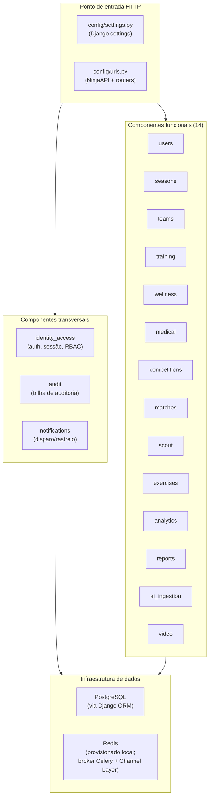
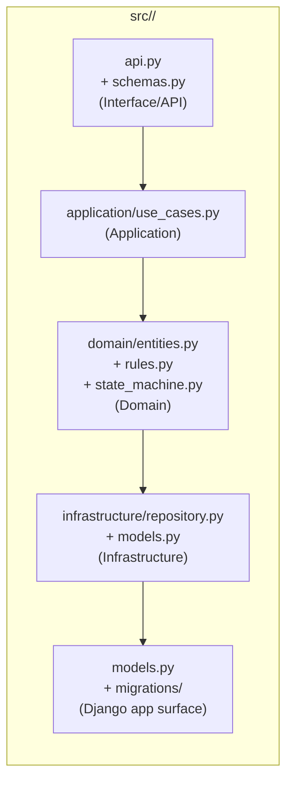
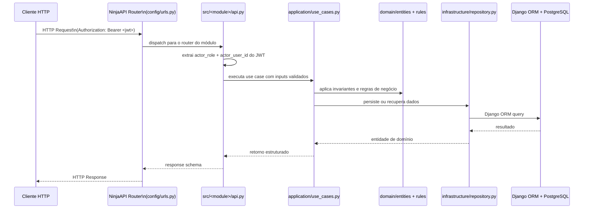

# C4 — Componentes do Backend — HB Track

## 0. Objetivo e limite de autoridade

Este documento descreve os **componentes internos do backend monolítico do HB Track** com base
no repositório atual. Ele fecha a lacuna entre `C4_CONTAINERS.md` (containers) e
`CODE_ARCHITECTURE.md` (regras de código).

Ele **não** substitui:

- `C4_CONTAINERS.md` — visão de containers e runtime deployável;
- `CODE_ARCHITECTURE.md` — regras de camadas e paths;
- `MODULE_MAP.md` — responsabilidades e boundaries funcionais por módulo;
- contratos em `contracts/**` — superfícies HTTP e esquemas de dados.

Leitura correta: todos os componentes aqui descritos existem no repositório atual e são
verificáveis via `src/`, `config/` e `tests/`.

---

## 1. Visão macro: o backend como conjunto de componentes

O backend é um **monolito modular Django + Django Ninja** onde cada módulo canônico constitui
um componente lógico independente, comunicado via camadas internas, não por rede.

---

## 2. Estrutura interna de cada componente/módulo

Cada um dos 17 módulos canônicos segue a mesma estrutura de componente interno:

| Subcamada | Arquivo(s) | Responsabilidade canônica |
|-----------|-----------|---------------------------|
| Interface/API | `api.py`, `schemas.py` | Receber request HTTP, adaptar para use case, retornar response |
| Application | `application/use_cases.py` | Orquestrar operação: autorização, regras, repositório |
| Domain | `domain/entities.py`, `domain/rules.py`, `domain/state_machine.py` | Modelagem de domínio, invariantes, FSM (quando aplicável) |
| Infrastructure | `infrastructure/repository.py`, `infrastructure/models.py` | Persistência, queries e adaptações ao ORM |
| Django surface | `models.py`, `apps.py`, `migrations/` | Exposição da app para o runtime Django |

---

## 3. Componentes transversais

### 3.1 `identity_access` — Autenticação, sessão e autorização

**Responsabilidade:** emitir e validar JWT RS256, gerenciar refresh token rotation, controlar
sessões ativas, gerenciar roles (RBAC) e MFA.

**Interfaces relevantes:**
- `POST /api/auth/login` → `LoginUseCase` → `AuthSession + access_token + refresh_token`
- `POST /api/auth/logout` → invalida sessão e refresh token
- `POST /api/auth/refresh` → `RefreshTokenUseCase` → novo par de tokens
- `GET /api/auth/session` → retorna sessão atual
- `POST /api/auth/roles/assign` / `revoke` → gerencia roles

**Boundary:** nenhum outro módulo define lógica de auth. Todos os módulos recebem o `actor_role`
e `actor_user_id` já validados pela camada HTTP antes de chamar use cases.

**Estado atual:** backend Django + router + migrations + testes materializado. JWT mock em testes;
validação RS256 completa depende de `JWT_PRIVATE_KEY` / `JWT_PUBLIC_KEY` em produção.

---

### 3.2 `audit` — Trilha imutável de auditoria

**Responsabilidade:** registrar e consultar eventos de auditoria de forma imutável.

**Interfaces relevantes:**
- `POST /api/audit/entries` → cria entrada de auditoria
- `GET /api/audit/entries` → lista com filtros (módulo, ação, ator, `correlation_id`)

**Observabilidade atual:** `correlation_id` (UUID opcional) existe como campo no schema de
auditoria. **Não existe middleware de propagação de `X-Flow-ID` end-to-end** no backend atual —
este campo é preenchido pontualmente pelos chamadores quando disponível.

**Estado atual:** backend + router + migrations + testes materializado.

---

### 3.3 `notifications` — Disparo e rastreio de notificações

**Responsabilidade:** registrar intenção de notificação e rastrear seu ciclo de entrega.

**Interfaces relevantes:**
- `POST /api/notifications/deliveries` → cria intent de entrega
- `GET /api/notifications/deliveries` → lista entregas
- `GET /api/notifications/preferences` / `PATCH` → preferências do usuário

**Nota de runtime:** o módulo já possui runtime assíncrono materializado em código
(`config/celery.py`, `src/notifications/tasks.py`, `CHANNEL_LAYERS`, `NotificationConsumer`).
O que continua target-state é a operação completa em produção dos canais externos
(push, e-mail, WhatsApp) e o provisionamento dedicado de worker/container.

**Estado atual:** backend + router + migrations + testes materializado.

---

## 4. Componentes funcionais — resumo

| Componente | Dependências internas | FSM | Workers (target) |
|------------|----------------------|-----|-----------------|
| `users` | `identity_access` (leitura) | não | não |
| `seasons` | — | não | não |
| `teams` | `users`, `seasons` | não | não |
| `training` | `wellness` (inline PSE), `exercises`, `seasons`, `teams` | sim (7 estados) | sim (target) |
| `wellness` | `training` (ref. opcional de sessão) | não | não |
| `medical` | `users`, `teams` | não | não |
| `competitions` | `seasons`, `teams` | não | não |
| `matches` | `competitions`, `teams`, `seasons` | não | não |
| `scout` | `matches`, `users` | não | não |
| `exercises` | — | não | não |
| `analytics` | leitura de múltiplos módulos via query | não | não |
| `reports` | `analytics`, `training`, `wellness` | não | sim (target) |
| `ai_ingestion` | múltiplos módulos como destino | não | sim (target) |
| `video` | `training`, `matches` | sim (3 estados) | sim (target) |

Leitura correta da coluna "Dependências internas": módulos não importam uns aos outros diretamente
via código Python (sem cross-import no runtime). As dependências são por dados — uma chave
estrangeira UUID ou uma operação de query cruzada que respeita a boundary.

---

## 5. Diagrama detalhado: componentes transversais e fluxo HTTP

---

## 6. Deltas ainda não comprovados como operação completa

| Componente | Fonte de aprovação | Delta ainda pendente |
|------------|--------------------|---------------------|
| Worker Celery dedicado em produção | ADR-031 | `config/celery.py` e `src/*/tasks.py` existem; falta prova de operação dedicada fora do processo principal |
| WebSocket / Channels em produção | ADR-031 | `config/asgi.py`, `CHANNEL_LAYERS` e `src/notifications/consumers.py` existem; falta prova de operação contínua em ambiente produtivo |
| Frontend SPA com deploy validado em CI/CD | ADR-030 | `frontend/` e `Dockerfile.frontend` existem; falta bind obrigatório entre build/deploy e prova operacional final |
| Canais externos de notificação | ADR-031 | intenção e tracking existem; entrega externa ainda depende de adapters e operação validada |

---

## 7. Referências

- [C4_CONTAINERS.md](./C4_CONTAINERS.md)
- [CODE_ARCHITECTURE.md](./CODE_ARCHITECTURE.md)
- [MODULE_MAP.md](./MODULE_MAP.md)
- [ARCHITECTURE.md](./ARCHITECTURE.md)
- [RUNTIME_CURRENT_STATE.md](./RUNTIME_CURRENT_STATE.md)
- [decisions/ADR-031-backend-framework.md](./decisions/ADR-031-backend-framework.md)
