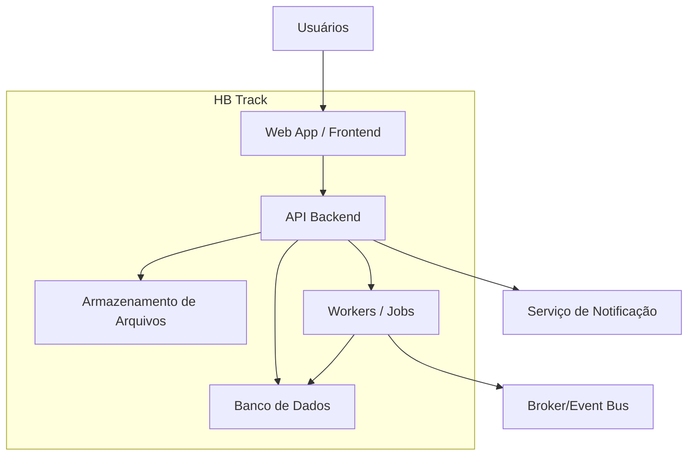

# C4_CONTAINERS.md

## Objetivo
Descrever os containers principais do **HB Track**.

## Containers

### Web App / Frontend
- Responsabilidade: interface do usuário.
- Entrada: contratos OpenAPI e tipos/clients gerados quando aplicável.
- Saída: chamadas HTTP, upload e comandos do usuário.

### API Backend
- Responsabilidade: regras de aplicação e exposição dos contratos HTTP.
- Entrada: requests, autenticação, payloads.
- Saída: responses, persistência e eventos quando aplicável.

### Banco de Dados
- Responsabilidade: persistência transacional.

### Armazenamento de Arquivos
- Responsabilidade: anexos, mídia e relatórios.

### Workers / Jobs
- Responsabilidade: tarefas assíncronas, cálculos e integrações.

## Relações Críticas
- Frontend consome apenas contratos públicos.
- Backend implementa contratos; a implementação não redefine o contrato.
- Jobs não alteram semântica pública sem mudança contratual.

## Observações
- Detalhes de infraestrutura, provedores e integrações externas devem ser registrados em ADRs quando relevantes.

