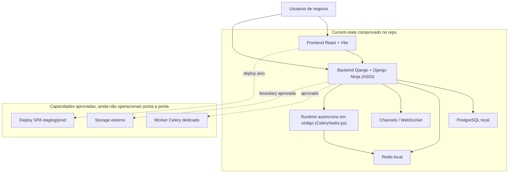

# C4_CONTAINERS.md

## 0. Objetivo e limite de autoridade

Este C4 descreve containers e superfícies de runtime relevantes **sem confundir
materialização local com prontidão operacional total de produção**.

Ele não substitui:

- [ARCHITECTURE.md](./ARCHITECTURE.md) para leitura macro;
- [CODE_ARCHITECTURE.md](./CODE_ARCHITECTURE.md) para estrutura do código;
- [RUNTIME_CURRENT_STATE.md](./RUNTIME_CURRENT_STATE.md) para inventário factual detalhado;
- [DEPLOY_PIPELINE.md](./DEPLOY_PIPELINE.md) para deploy alvo.

## 1. Containers e superfícies atuais comprovados

| Container / superfície | Evidência | Papel atual |
|---|---|---|
| Backend monolítico ASGI | `config/urls.py`, `config/asgi.py`, `config/settings.py`, `src/<module>/` | API HTTP Django + Django Ninja, com runtime ASGI apto a HTTP e WebSocket |
| PostgreSQL local | `infra/docker-compose.yml` | banco de desenvolvimento materializado no repo |
| Redis local | `infra/docker-compose.yml` | suporte ao broker Celery e ao Channel Layer |
| Frontend web SPA | `frontend/`, `frontend/package.json`, `frontend/src/`, `vite.config.ts` | workspace frontend React + Vite materializado |
| Runtime assíncrono no backend | `config/celery.py`, `src/notifications/tasks.py`, `src/*/tasks.py` | fila assíncrona e execução de tasks materializadas no código |
| Endpoint WebSocket / Channels | `config/asgi.py`, `config/settings.py`, `src/notifications/consumers.py` | comunicação realtime via Django Channels |

## 2. Elementos aprovados, mas ainda não fechados como operação de produção

| Item | Fonte de aprovação | O que ainda falta |
|---|---|---|
| Worker Celery dedicado em container separado | `ADR-031`, `DEPLOY_PIPELINE.md` | provisionamento infra e operação dedicada fora do processo principal |
| Deploy de SPA frontend em staging/produção | `ADR-030`, `DEPLOY_PIPELINE.md` | pipeline e hosting operacionalizados ponta a ponta |
| Object storage adapter | `SYSTEM_SCOPE.md`, `DEPLOY_PIPELINE.md` | boundary aprovada, sem integração materializada no runtime atual |

## 3. Diagrama de containers

```mermaid
flowchart TB
  user["Usuarios de negocio"]

  subgraph current["Current-state comprovado no repo"]
    web["Frontend React + Vite"]
    api["Backend Django + Django Ninja (ASGI)"]
    ws["Channels / WebSocket"]
    db["PostgreSQL local"]
    redis["Redis local"]
    tasks["Runtime assíncrono em código (Celery/tasks.py)"]
  end

  subgraph target["Capacidades aprovadas, ainda não operacionais ponta a ponta"]
    worker_prod["Worker Celery dedicado"]
    storage["Storage externo"]
    web_prod["Deploy SPA staging/prod"]
  end

  user --> web
  user --> api
  web --> api
  api --> db
  api --> redis
  api --> ws
  api --> tasks
  tasks --> redis

  api -. aprovado .-> worker_prod
  api -. boundary aprovada .-> storage
  web -. deploy alvo .-> web_prod
```

Legenda: setas sólidas representam materialização comprovada no workspace. Setas tracejadas representam
capacidade aprovada, mas ainda não fechada como operação de produção.

## 4. Regras de leitura

- `frontend/` existente prova materialização de workspace frontend; **não** prova deploy de SPA em produção.
- `config/celery.py`, `tasks.py` e `CHANNEL_LAYERS` provam runtime assíncrono materializado no código; **não** provam operação dedicada de worker separado.
- Channels/WebSocket configurado no backend prova superfície realtime no código; **não** substitui validação de operação de produção.
- Nenhum documento deste C4 pode negar a existência de `frontend/`, `config/celery.py`, `tasks.py`, `config/asgi.py` ou `CHANNEL_LAYERS` enquanto esses artefatos existirem no repo.

## 5. Referências

- [ARCHITECTURE.md](./ARCHITECTURE.md)
- [CODE_ARCHITECTURE.md](./CODE_ARCHITECTURE.md)
- [RUNTIME_CURRENT_STATE.md](./RUNTIME_CURRENT_STATE.md)
- [FRONTEND_CONTRACT.md](./FRONTEND_CONTRACT.md)
- [DEPLOY_PIPELINE.md](./DEPLOY_PIPELINE.md)
