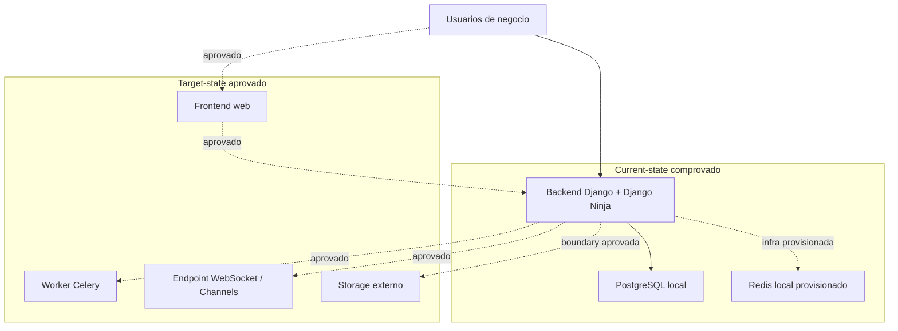

# C4_CONTAINERS.md

## 0. Objetivo e limite de autoridade

Este C4 descreve containers relevantes para implementacao e deploy **sem vender target-state como runtime atual**.

Ele nao substitui:

- [ARCHITECTURE.md](./ARCHITECTURE.md) para leitura macro;
- [CODE_ARCHITECTURE.md](./CODE_ARCHITECTURE.md) para estrutura do backend;
- [FRONTEND_CONTRACT.md](./FRONTEND_CONTRACT.md) para frontend aprovado;
- [DEPLOY_PIPELINE.md](./DEPLOY_PIPELINE.md) para deploy alvo.

## 1. Containers atuais comprovados

| Container | Evidencia | Papel atual |
|-----------|-----------|-------------|
| Backend monolitico | `config/urls.py`, `config/settings.py`, `src/<module>/` | API HTTP Django + Django Ninja com 17 apps montados em um unico processo logico |
| PostgreSQL local | `infra/docker-compose.yml` | banco de desenvolvimento materializado no repo |
| Redis local | `infra/docker-compose.yml` | servico de apoio provisionado; ainda nao prova worker Celery em execucao |

## 2. Containers aprovados, mas nao materializados

| Container | Fonte de aprovacao | Motivo de ainda nao ser runtime atual |
|-----------|--------------------|---------------------------------------|
| Frontend web SPA | `ADR-030`, `FRONTEND_CONTRACT.md` | `frontend/` nao existe e `package.json` nao declara toolchain de frontend real |
| Worker assíncrono | `ADR-031` | nao existe `config/celery.py` nem `src/<module>/tasks.py` |
| Endpoint WebSocket | `ADR-031` | nao existe configuracao Channels no backend atual |
| Object storage adapter | `SYSTEM_SCOPE.md`, `DEPLOY_PIPELINE.md` | boundary aprovada, mas sem implementacao comprovada no repo |

## 3. Diagrama de containers

```mermaid
flowchart TB
  user["Usuarios de negocio"]

  subgraph current["Current-state comprovado"]
    api["Backend Django + Django Ninja"]
    db["PostgreSQL local"]
    redis["Redis local provisionado"]
  end

  subgraph target["Target-state aprovado"]
    web["Frontend web"]
    worker["Worker Celery"]
    ws["Endpoint WebSocket / Channels"]
    storage["Storage externo"]
  end

  user --> api
  api --> db
  api -. infra provisionada .-> redis

  user -. aprovado .-> web
  web -. aprovado .-> api
  api -. aprovado .-> worker
  api -. aprovado .-> ws
  api -. boundary aprovada .-> storage
```

Legenda: setas solidas representam runtime comprovado no repo; setas tracejadas representam target-state ou boundary aprovada sem materializacao local suficiente.

## 4. Regras de leitura

- ausencia de container materializado bloqueia qualquer afirmacao de operacao end-to-end;
- frontend e worker nao podem ser tratados como ativos em handoff, readiness ou DONE sem arquivos e validacoes correspondentes;
- Redis provisionado sem Celery configurado nao equivale a fila assíncrona em producao;
- deploy so pode tratar `staging` ou `production` como operacionais quando `GET /health` existir e o pipeline de deploy tiver assets reais.

## 5. Referencias

- [ARCHITECTURE.md](./ARCHITECTURE.md)
- [CODE_ARCHITECTURE.md](./CODE_ARCHITECTURE.md)
- [FRONTEND_CONTRACT.md](./FRONTEND_CONTRACT.md)
- [DEPLOY_PIPELINE.md](./DEPLOY_PIPELINE.md)
