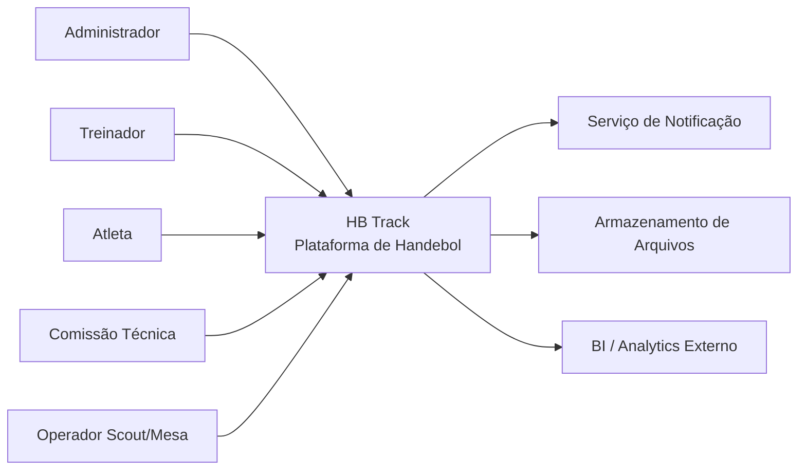

# C4_CONTEXT.md

## Objetivo
Contextualizar o sistema **HB Track** no ecossistema.

## Pessoas e Sistemas Externos
- Administrador
- Treinador
- Atleta
- Comissão técnica
- Operador de scout/mesa
- Serviços externos de notificação
- Armazenamento externo
- Sistemas externos de analytics/integradores

## Responsabilidades do Sistema
- Gestão de atletas, equipes e temporadas.
- Planejamento, execução e registro de treinos e wellness/medical quando aplicável.
- Operação de competições/partidas (incluindo scout) e geração de relatórios/analytics.

## Fronteira do Contexto
Tudo que está fora deste diagrama deve ser tratado como externo ao controle direto do HB Track.

