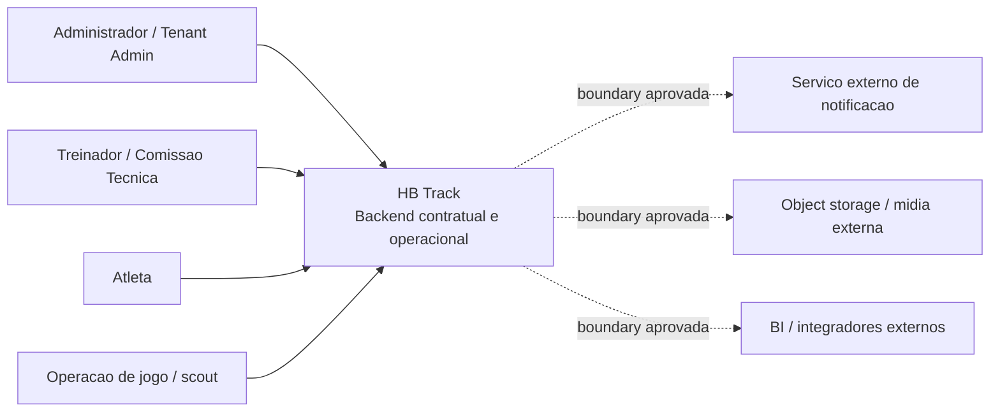

# C4_CONTEXT.md

## 0. Objetivo e uso no sistema contratual

Este C4 existe para delimitar **o que esta dentro** e **o que esta fora** do HB Track antes de:

- criar contratos;
- decidir boundaries entre modulos;
- propor integracoes externas;
- abrir ADR para novo dominio ou novo adapter.

Ele nao e SSOT de runtime atual, status de modulo ou detalhes de API.

## 1. Contexto do sistema

```mermaid
flowchart LR
  userAdmin["Administrador / Tenant Admin"]
  userCoach["Treinador / Comissao Tecnica"]
  userAthlete["Atleta"]
  userOps["Operacao de jogo / scout"]

  system["HB Track\nBackend contratual e operacional"]

  extNotif["Servico externo de notificacao"]
  extStorage["Object storage / midia externa"]
  extBI["BI / integradores externos"]

  userAdmin --> system
  userCoach --> system
  userAthlete --> system
  userOps --> system

  system -. boundary aprovada .-> extNotif
  system -. boundary aprovada .-> extStorage
  system -. boundary aprovada .-> extBI
```

Legenda: setas solidas representam interacao de negocio assumida pelo sistema; setas tracejadas representam limites de integracao aprovados, mas nao comprovam adapter ativo no runtime atual.

## 2. Atores de negocio cobertos

As familias de atores canônicos continuam sendo as definidas em [SYSTEM_SCOPE.md](./SYSTEM_SCOPE.md):

- plataforma e administracao;
- gestao esportiva;
- comissao tecnica;
- performance e saude;
- operacao de competicoes, jogo e scout;
- atletas.

Este documento existe para o nivel de contexto. Regras detalhadas de permissao continuam em `identity_access`.

## 3. Sistemas externos e leitura correta

| Sistema externo | Papel arquitetural | Leitura correta hoje |
|-----------------|--------------------|----------------------|
| Servico de notificacao | boundary aprovada para email/push/in-app | a boundary existe no escopo; o repo atual ainda nao prova adapter externo operacional |
| Storage externo / midia | boundary aprovada para anexos, relatorios e video | a boundary existe no escopo; o repo atual ainda nao prova integracao materializada |
| BI / integradores externos | consumo ou troca de dados fora do monolito | a boundary e valida para decisao de contrato; nao deve ser tratada como integracao ativa sem evidencia |

## 4. Regras de contexto para CDD

- se um fluxo cabe dentro dos 17 modulos canônicos, ele permanece dentro do sistema;
- se exigir um dominio novo fora do escopo aprovado, deve gerar ADR antes de contrato;
- se tocar servicos externos, a integracao continua sendo boundary explicita, nunca modulo implicito;
- documentacao de contexto nao pode ser usada para inventar endpoint, evento, role ou workflow.

## 5. Referencias

- [SYSTEM_SCOPE.md](./SYSTEM_SCOPE.md)
- [MODULE_MAP.md](./MODULE_MAP.md)
- [.contract_driven/CONTRACT_SYSTEM_RULES.md](/home/davis/HB-TRACK/.contract_driven/CONTRACT_SYSTEM_RULES.md)
