# Fluxos de Integração — HB Track

## 0. Objetivo e limite de autoridade

Este documento descreve os **fluxos críticos de integração entre módulos** do HB Track. Cada
fluxo é descrito tanto no seu formato atual (backend HTTP + banco de dados) quanto no target-state
aprovado (quando aplicável).

Este documento **não substitui**:

- contratos técnicos em `contracts/**` — esses são soberanos sobre shape HTTP e dados;
- regras de domínio em `docs/hbtrack/modulos/<module>/` — essas governam invariantes;
- `CODE_ARCHITECTURE.md` — esse governa a estrutura de implementação;
- `C4_COMPONENTS_BACKEND.md` — esse descreve os componentes internos.

Leitura correta: os fluxos aqui descritos seguem as camadas reais do backend atual
(`Interface → Application → Domain → Infrastructure`). Componentes marcados como
`[target-state]` ainda não existem no runtime.

---

## 1. Fluxo: Autenticação e Sessão

**Módulo soberano:** `identity_access`  
**ADRs:** ADR-007 (JWT RS256), ADR-008 (RBAC)  
**Estado atual:** backend materializado

### 1.1 Login (obtenção de tokens)

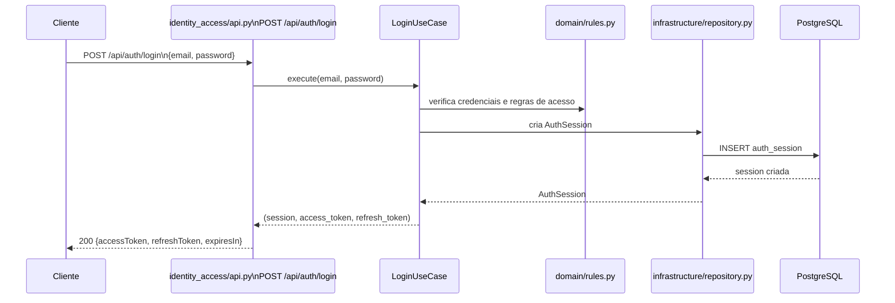

**Claims do access token:** `sub` (user UUID), `iss`, `aud`, `iat`, `exp`, `jti`, `roles`,
`teamId`. Algoritmo: RS256. Lifetime: 15 min (access) + 7 dias sliding (refresh).

### 1.2 Uso do access token nos demais módulos

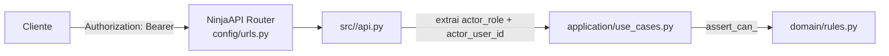

Cada módulo extrai `actor_role` e `actor_user_id` do JWT validado antes de chamar o use case.
Nenhum módulo repete lógica de autenticação — apenas usa os dados do token já validado.

### 1.3 Refresh e revogação

- `POST /api/auth/refresh` → emite novo par (access + refresh), invalida refresh anterior.
- `POST /api/auth/logout` → invalida sessão e refresh token.
- `GET /api/auth/session` → retorna sessão ativa atual.
- `POST /api/auth/roles/assign` / `revoke` → gerencia RBAC.

---

## 2. Fluxo: Training → Wellness → Analytics → Reports

Este é o fluxo operacional central de gestão de carga e performance atlética.

### 2.1 Visão macro

```mermaid
flowchart LR
  TR[training\n(sessão de treino)] -->|training_session_id| WE[wellness\n(check-in PSE)]
  TR -->|agrega dados| AN[analytics\n(snapshot de métricas)]
  WE -->|contribui para| AN
  AN -->|alimenta| RE[reports\n(job de relatório)]
```

### 2.2 Criação de sessão de treino

**Módulo:** `training` | `POST /api/training/sessions`

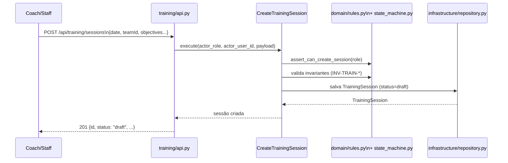

**FSM de treinamento:** `draft → scheduled → ongoing → completed | cancelled | suspended`

### 2.3 Check-in de wellness pós-treino

**Módulo:** `wellness` | `POST /api/wellness/entries`

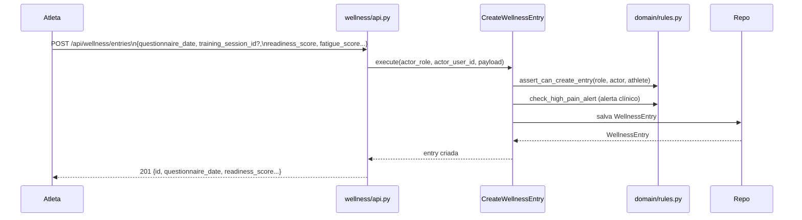

**Nota:** o campo `training_session_id` é opcional e referencia a sessão de treino correspondente.
Não há chamada de código de `wellness` para `training` — apenas a chave UUID é armazenada.

### 2.4 Criação de snapshot de analytics

**Módulo:** `analytics` | `POST /api/analytics/snapshots`

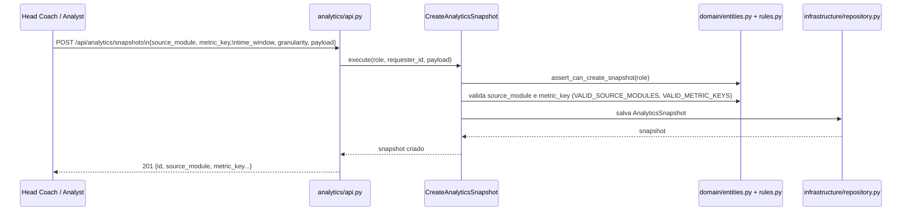

**`source_module`** é o módulo de origem dos dados (ex: `training`, `wellness`, `matches`).
O analytics não faz queries diretas a outros módulos no runtime atual — consome dados agregados
passados pelo chamador.

### 2.5 Geração de relatório

**Módulo:** `reports` | `POST /api/reports/jobs`

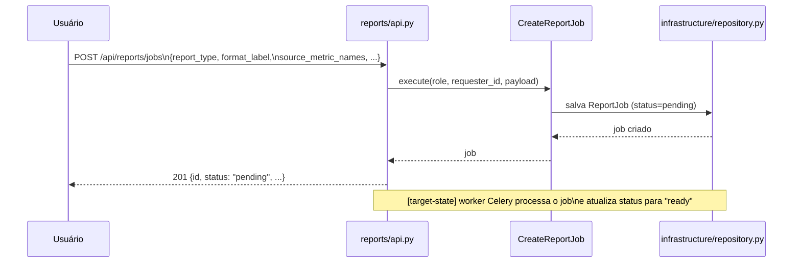

**Estado atual:** `ReportJob` é criado com `status=pending`. O processamento real (geração do
arquivo/PDF) depende de worker Celery — ainda `[target-state]`.

---

## 3. Fluxo: Notificações

**Módulo soberano:** `notifications`  
**Estado atual:** intenção de entrega persistida; despacho externo é `[target-state]`

### 3.1 Ciclo de vida de uma notificação

```mermaid
flowchart LR
  Any[Qualquer módulo\nou sistema externo] -->|cria intent| NR[notifications\nPOST /api/notifications/deliveries]
  NR --> DB[(PostgreSQL\nNotificationDelivery)]
  DB -->|[target-state]\nworker Celery| Ext[Canal externo\npush / e-mail / WhatsApp]
```

### 3.2 Criação de intent de entrega

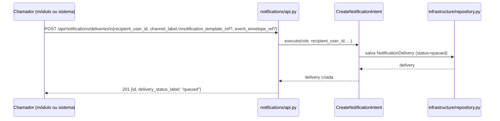

**`delivery_status_label`:** `queued → dispatched → delivered | failed`

**Nota:** no runtime atual, o status permanece `queued` até que um worker (target-state)
processe e atualize. O canal real de despacho (push notification, e-mail, etc.) não está
implementado.

---

## 4. Fluxo: Vídeo e Scout

### 4.1 Vídeo — captura e sessão de mídia

**Módulo:** `video`  
**ADR:** ADR-033  
**Estado atual:** backend + FSM materializado; worker de processamento é `[target-state]`

```mermaid
flowchart LR
  User -->|POST /api/video/sessions| VS[VideoSession\n(FSM: created→processing→ready|failed)]
  VS -->|[target-state]\nworker Celery| Storage[Object Storage externo]
  VS -->|clips| VC[VideoClip]
```

**FSM de vídeo:** `created → processing → ready | failed`

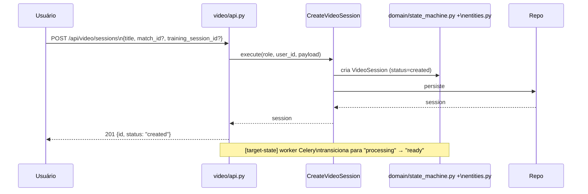

### 4.2 Scout — análise tática e eventos de jogo

**Módulo:** `scout`  
**Estado atual:** backend materializado; eventos são registrados via API síncronos

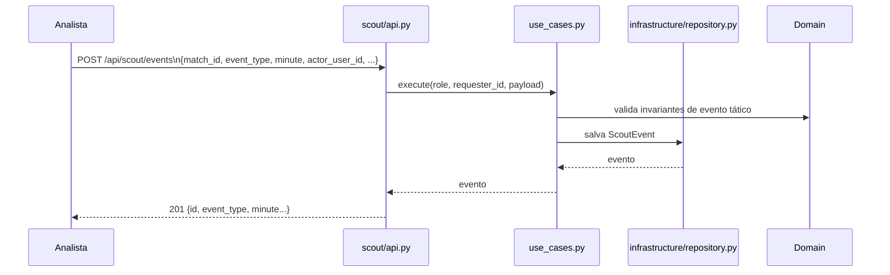

---

## 5. Fluxo: Ingestão via IA

**Módulo:** `ai_ingestion`  
**Estado atual:** backend materializado; jobs de importação são registrados; processamento real
depende de worker `[target-state]`

```mermaid
flowchart LR
  Ext[Sistema externo\nou agente IA] -->|POST /api/ingestion/jobs| Ingest[ai_ingestion\n(IngestionJob)]
  Ingest -->|[target-state]\nworker Celery| Modules[Módulos destino\n(training, wellness, medical...)]
  Ingest --> DB[(PostgreSQL)]
```

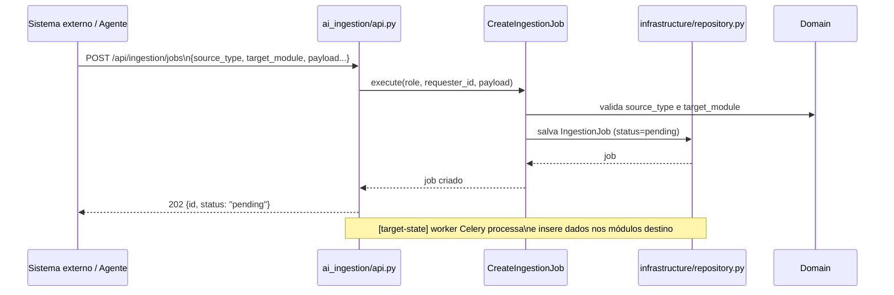

---

## 6. Propagação de identidade entre fluxos

Em todos os fluxos acima, a identidade do ator é propagada da seguinte forma:

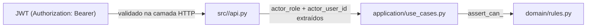

**Regra invariante:** nenhum use case confia em inputs não validados pela camada HTTP.
O `actor_role` determina permissões; o `actor_user_id` determina o escopo de dados visíveis.

---

## 7. Fluxos target-state ainda não implementados

| Fluxo | Dependência bloqueante |
|-------|------------------------|
| Despacho real de notificações | Worker Celery + canal externo |
| Processamento de relatórios | Worker Celery |
| Processamento de vídeo | Worker Celery + Object Storage |
| Ingestão processada de dados externos | Worker Celery |
| Propagação de `X-Flow-ID` entre módulos | Middleware Django (ADR-013) |
| Notificações WebSocket em tempo real | Django Channels + Redis (ADR-031) |

---

## 8. Referências

- [C4_COMPONENTS_BACKEND.md](./C4_COMPONENTS_BACKEND.md)
- [MODULE_MAP.md](./MODULE_MAP.md)
- [CODE_ARCHITECTURE.md](./CODE_ARCHITECTURE.md)
- [RUNTIME_CURRENT_STATE.md](./RUNTIME_CURRENT_STATE.md)
- [decisions/ADR-007-auth-strategy.md](./decisions/ADR-007-auth-strategy.md)
- [decisions/ADR-008-authz-strategy.md](./decisions/ADR-008-authz-strategy.md)
- [decisions/ADR-013-logging-policy.md](./decisions/ADR-013-logging-policy.md)
- [decisions/ADR-031-backend-framework.md](./decisions/ADR-031-backend-framework.md)
- [decisions/ADR-033-video-module-canonicalization.md](./decisions/ADR-033-video-module-canonicalization.md)
