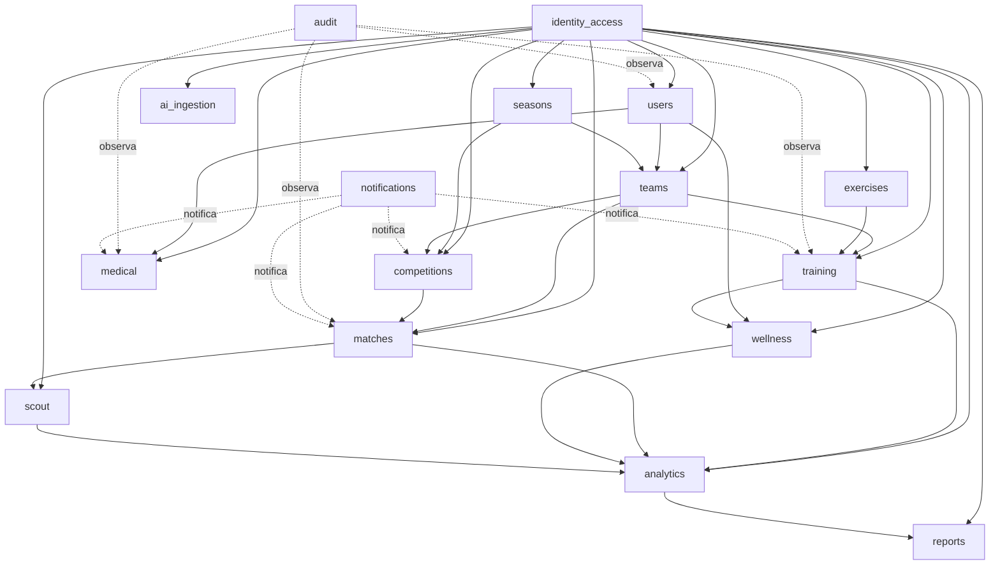

# Mapa de Módulos — HB Track

## 1. Nota de Taxonomia

Os macrodomínios de negócio (SYSTEM_SCOPE.md §5) são agrupamentos funcionais para comunicação com stakeholders. Os 16 módulos técnicos abaixo são a taxonomia canônica do sistema. Um macrodomínio pode cruzar múltiplos módulos.

**Regra fundamental**: se um módulo não estiver nesta lista, ele não existe no sistema sem decisão formal registrada em `docs/_canon/decisions/`.

---

## 2. Módulos Funcionais (13)

| Módulo | Responsabilidade | Dependências | API | UI | Workers | Eventos |
|--------|-----------------|--------------|-----|----|---------|---------|
| `users` | Perfis de usuário, preferências, dados cadastrais (sem auth) | `identity_access` | Sim | Sim | Não | `user.updated` |
| `seasons` | Temporadas, mesociclos, microciclos, configuração de período | Nenhuma | Sim | Sim | Não | `season.started`, `season.ended` |
| `teams` | Equipes, composição de elenco, categorias | `users`, `seasons` | Sim | Sim | Não | `team.composition.changed` |
| `training` | Sessões de treino, planos, exercícios em contexto tático | `teams`, `exercises`, `wellness` | Sim | Sim | Sim (Celery) | `session.created`, `session.completed` |
| `wellness` | Check-in diário de bem-estar, PSE pós-treino, carga de treino | `training`, `users` | Sim | Sim | Não | `wellness.submitted` |
| `medical` | Lesões, histórico médico, retorno ao jogo, prontuário esportivo | `users`, `teams` | Sim | Sim | Não | `injury.reported` |
| `competitions` | Torneios, fases, classificação, calendário competitivo | `teams`, `seasons` | Sim | Sim | Não | `competition.phase.started` |
| `matches` | Partidas, placar, eventos de jogo, súmula oficial | `competitions`, `teams` | Sim | Sim | Sim (Celery) | `match.started`, `match.ended`, `match.event` |
| `scout` | Análise tática, eventos detalhados de partida, estatísticas por jogador | `matches`, `teams` | Sim | Sim | Sim (Celery) | `scout.event` |
| `exercises` | Biblioteca de exercícios, categorias, mídia, metadados | Nenhuma | Sim | Sim | Não | Nenhum |
| `analytics` | Dashboards, métricas agregadas, relatórios dinâmicos, KPIs | `training`, `matches`, `wellness`, `scout` | Sim | Sim | Sim (Celery) | Nenhum |
| `reports` | Geração de relatórios (PDF/Excel), exportação, entrega de saída | `analytics`, `matches` | Sim | Sim | Sim (Celery) | `report.ready` |
| `ai_ingestion` | Ingestão de dados externos, integração com IA, importação em lote | Múltiplos | Sim | Não | Sim (Celery) | `ingestion.completed` |

**Coluna Workers**: indica se o módulo possui tasks Celery assíncronas. Módulos sem workers operam exclusivamente de forma síncrona via requisições HTTP.

---

## 3. Módulos Transversais (3)

| Módulo | Responsabilidade | Consumido por |
|--------|-----------------|---------------|
| `identity_access` | Autenticação JWT, RBAC, scopes de permissão, gestão de credenciais e sessão | Todos os módulos funcionais |
| `audit` | Log de auditoria imutável de eventos críticos, rastreabilidade de ações | Todos os módulos com ação auditável |
| `notifications` | Disparo de notificações (email/push/in-app), rastreamento de entrega | `training`, `matches`, `medical`, `competitions` |

**Módulos transversais não possuem domínio funcional próprio.** Eles provêm infraestrutura comportamental que outros módulos consomem. Um módulo transversal não deve absorver responsabilidade funcional de nenhum módulo que o consome.

---

## 4. Fronteiras Críticas

As fronteiras abaixo são as que mais geram confusão em decisões de implementação e modelagem.

| Fronteira | Módulo A | Módulo B | Regra de Separação |
|-----------|----------|----------|-------------------|
| `users` vs `identity_access` | `users`: dados de perfil, nome, foto, preferências, vínculo funcional | `identity_access`: credenciais, JWT, scopes, MFA, sessão | Nunca misturar perfil de pessoa com autenticação/autorização |
| `training` vs `exercises` | `training`: sessão de treino com contexto tático, data, atletas, objetivos | `exercises`: biblioteca de exercícios reutilizáveis, definição pura | `exercises` é lookup; `training` é evento operacional |
| `matches` vs `scout` | `matches`: resultado oficial, placar, súmula, estado do jogo | `scout`: análise tática detalhada por evento por jogador | `matches` é canônico; `scout` é derivado analítico |
| `wellness` vs `medical` | `wellness`: auto-report diário (PSE, carga, sono, humor, energia) | `medical`: diagnóstico clínico, lesões, prontuário, retorno ao jogo | `wellness` é operacional rotineiro; `medical` é clínico |
| `analytics` vs `reports` | `analytics`: cálculo, agregação, métrica, análise, KPIs | `reports`: empacotamento, formatação, entrega de saída analítica | Relatório não é fonte da métrica; analytics não formata saída final |
| `competitions` vs `matches` | `competitions`: estrutura do torneio, fases, classificação geral | `matches`: partida individual com placar e eventos | Partida pertence a competição, mas tem lifecycle próprio |

---

## 5. Diagrama de Dependências (Mermaid)

**Convenção**: setas sólidas são dependências diretas (o módulo de origem chama o de destino); setas tracejadas são observação ou notificação assíncrona (os transversais não acoplam funcionalmente).

---

## 6. Localização dos Contratos por Módulo

Documentação normativa de módulo vive em:

- `docs/hbtrack/modulos/<module>/`

Conjunto mínimo esperado por módulo (ver `.contract_driven/CONTRACT_SYSTEM_RULES.md`):
- `README.md`
- `MODULE_SCOPE_<MOD>.md`
- `DOMAIN_RULES_<MOD>.md`
- `INVARIANTS_<MOD>.md`
- `TEST_MATRIX_<MOD>.md`

Contratos técnicos vivem em:
- OpenAPI (por módulo): `contracts/openapi/paths/<module>.yaml`
- JSON Schemas (por módulo): `contracts/schemas/<module>/`
- Workflows (quando aplicável): `contracts/workflows/<module>/`
- Eventos (quando aplicável): `contracts/asyncapi/**` (root: `contracts/asyncapi/asyncapi.yaml`)

**Readiness e completude** são avaliados pelos contract gates (ver `CI_CONTRACT_GATES.md`) e evidenciados em `_reports/contract_gates/latest.json`.

---

## 7. Readiness de Módulo (Contract-Driven)

Um módulo é considerado **pronto para implementação** apenas quando:
- seus artefatos mínimos de documentação existem no path canônico
- seus contratos técnicos (quando aplicáveis) existem e passam nos gates
- não há placeholders residuais em artefatos normativos
- boundaries críticas (ex.: `users` vs `identity_access`) não são violadas

Evolução de módulo segue `CHANGE_POLICY.md` e deve ser validada por `python3 scripts/validate_contracts.py`.

---

## 8. Heurística de Decisão de Módulo

Ao decidir onde uma nova regra, contrato ou comportamento pertence, responder:

1. Isso descreve **quem é a pessoa** ou **quem pode acessar o quê**? → `users` ou `identity_access`
2. Isso descreve **treino**, **exercício**, **jogo** ou **evento de scout**? → módulo específico correspondente
3. Isso é **métrica** ou **saída formatada**? → `analytics` ou `reports`
4. Isso é **bem-estar rotineiro** ou **informação clínica**? → `wellness` ou `medical`
5. Isso é **organização competitiva** ou **partida individual**? → `competitions` ou `matches`
6. Isso é responsabilidade funcional de um módulo ou preocupação transversal (auth, auditoria, notificação)? → módulo funcional ou transversal correspondente

Se a resposta continuar ambígua após estas perguntas, a decisão deve ser formalizada via ADR antes da implementação.

---

## 9. Regras de Expansão do Mapa

Um novo módulo só pode ser criado se todas as condições abaixo forem atendidas:
- Não couber semanticamente em nenhum dos 16 módulos existentes
- Não puder ser tratado como responsabilidade transversal formal já existente
- A sobrecarga semântica em um módulo atual for comprovada com evidências
- Houver decisão formal registrada em `docs/_canon/decisions/` antes de qualquer implementação

---

## 10. Referências Normativas

Este documento deve ser lido em conjunto com:
- `SYSTEM_SCOPE.md` — macrodomínios e escopo do produto
- `CONTRACT_SYSTEM_LAYOUT.md` — estrutura de filesystem e nomenclatura
- `CONTRACT_SYSTEM_RULES.md` — regras operacionais do sistema contract-driven
- `HANDBALL_RULES_DOMAIN.md` — regras formais do handebol (relevante para `training`, `competitions`, `matches`, `scout`, `analytics`)
- `CI_CONTRACT_GATES.md` — gates que determinam readiness e integridade
