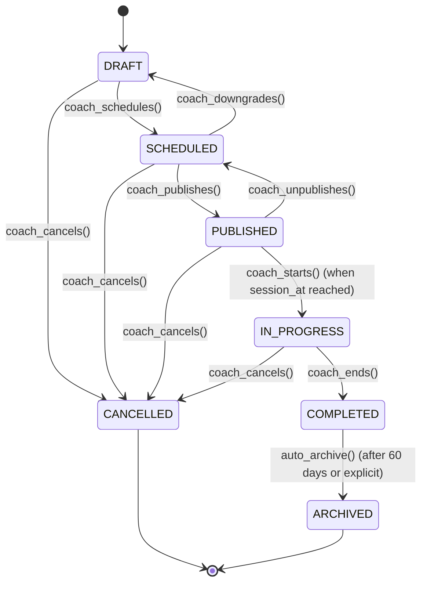

# STATE_MODEL_TRAINING.md

## Objetivo
Documentar os estados e transições válidas para a entidade `training_session` do módulo `training`.

Esta especificação implementa **ADR-017: State Machine Canônica de `training_session`** e conforma-se aos axiomas globais em `.contract_driven/DOMAIN_AXIOMS.json`.

## Entidade principal
- **`training_session`** — Sessão de treinamento planejada, executada e revisada por atleta/coach.

## Regras de modelagem
- Toda transição deve ter gatilho (ação de agente ou sistema) definido.
- Toda transição inválida deve ser tratada como **erro** (HTTP 409 Conflict ou campo de erro no schema).
- Toda transição crítica deve ter cobertura em `TEST_MATRIX_TRAINING.md` (ver testes de máquina de estados).
- Estados terminais (`CANCELLED`, `ARCHIVED`) são imutáveis — nenhuma transição sai deles.
- O estado `PUBLISHED` marca o ponto em que a sessão torna-se visível ao atleta.

## Diagrama de estados

## Tabela de estados

| Estado | Descrição | Editável? | Visível ao atleta? | Estado inicial? | Estado terminal? |
|---|---|---|---|---|---|
| **DRAFT** | Sessão em rascunho, não publicada. Coach pode editar livremente. | Sim (livre) | Não | **Sim** | Não |
| **SCHEDULED** | Sessão planejada internamente. Coach pode editar subset de campos. | Sim (limitado) | Não | Não | Não |
| **PUBLISHED** | Sessão publicada e visível ao atleta. Coach pode editar campos limitados. | Sim (limitado) | **Sim** | Não | Não |
| **IN_PROGRESS** | Sessão em execução. Bloqueada contra edição destrutiva. | Não | **Sim** | Não | Não |
| **COMPLETED** | Sessão encerrada e revisada. Imutável por edição destrutiva. | Não (histórico) | **Sim** (leitura) | Não | Não |
| **CANCELLED** | Sessão cancelada com motivo registrado. Imutável. | Não | **Sim** (cancelada) | Não | **Sim** |
| **ARCHIVED** | Sessão histórica arquivada (>60 dias ou marcação explícita). Somente leitura. | Não | Somente leitura | Não | **Sim** |

## Tabela de transições

| De | Para | Gatilho / Ação | Condição / Regra | Erro se inválido | HTTP |
|---|---|---|---|---|---|
| `DRAFT` | `SCHEDULED` | `coach_schedules()` | Dados mínimos presentes (session_name, session_at, duration_minutes) | `INSUFFICIENT_DATA` | 400 Bad Request |
| `DRAFT` | `CANCELLED` | `coach_cancels()` | Qualquer momento | — | 200 OK |
| `SCHEDULED` | `PUBLISHED` | `coach_publishes()` | Dados mínimos OK; session_at no futuro | `INVALID_SESSION_TIME` | 400 Bad Request |
| `SCHEDULED` | `DRAFT` | `coach_downgrades()` | Perda de campos mínimos ou re-edição | — | 200 OK |
| `SCHEDULED` | `CANCELLED` | `coach_cancels()` | Qualquer momento | — | 200 OK |
| `PUBLISHED` | `IN_PROGRESS` | `coach_starts()` | `session_at` atingido; timestamp ≥ session_at | `SESSION_NOT_YET_STARTED` | 400 Bad Request |
| `PUBLISHED` | `SCHEDULED` | `coach_unpublishes()` | Despublicação explícita (antes de session_at) | — | 200 OK |
| `PUBLISHED` | `CANCELLED` | `coach_cancels()` | Qualquer momento | — | 200 OK |
| `IN_PROGRESS` | `COMPLETED` | `coach_ends()` | Coach encerra sessão; dados de conclusão registrados | — | 200 OK |
| `IN_PROGRESS` | `CANCELLED` | `coach_cancels()` | Cancelamento lógico (não exclusão física) | — | 200 OK |
| `COMPLETED` | `ARCHIVED` | `auto_archive()` | Automático após 60 dias ou marcação explícita | — | N/A (job assíncrono) |

## Transições proibidas (sempre erro)

| De | Para | Motivo | Erro retornado |
|---|---|---|---|
| `DRAFT` | `COMPLETED` | Sessão não iniciada | `INVALID_STATE_TRANSITION` |
| `DRAFT` | `IN_PROGRESS` | Sessão não iniciada | `INVALID_STATE_TRANSITION` |
| `DRAFT` | `ARCHIVED` | Transição direta inválida | `INVALID_STATE_TRANSITION` |
| `SCHEDULED` | `COMPLETED` | Sessão não iniciada | `INVALID_STATE_TRANSITION` |
| `SCHEDULED` | `IN_PROGRESS` | Transição direta inválida | `INVALID_STATE_TRANSITION` |
| `SCHEDULED` | `ARCHIVED` | Transição direta inválida | `INVALID_STATE_TRANSITION` |
| `PUBLISHED` | `DRAFT` | Despublicação para rascunho inválida (usar `SCHEDULED`) | `INVALID_STATE_TRANSITION` |
| `PUBLISHED` | `COMPLETED` | Transição direta inválida (exige IN_PROGRESS) | `INVALID_STATE_TRANSITION` |
| `PUBLISHED` | `ARCHIVED` | Transição direta inválida | `INVALID_STATE_TRANSITION` |
| `IN_PROGRESS` | `DRAFT` | Regressão inválida | `INVALID_STATE_TRANSITION` |
| `IN_PROGRESS` | `SCHEDULED` | Regressão inválida | `INVALID_STATE_TRANSITION` |
| `IN_PROGRESS` | `PUBLISHED` | Regressão inválida | `INVALID_STATE_TRANSITION` |
| `IN_PROGRESS` | `ARCHIVED` | Transição direta inválida | `INVALID_STATE_TRANSITION` |
| `COMPLETED` | `*` (qualquer) | Terminal — imutável | `INVALID_STATE_TRANSITION` |
| `CANCELLED` | `*` (qualquer) | Terminal — imutável | `INVALID_STATE_TRANSITION` |
| `ARCHIVED` | `*` (qualquer) | Terminal — imutável | `INVALID_STATE_TRANSITION` |

## Conformidade com axiomas globais

Esta máquina de estados conforma-se ao `training_state_machine` definido em `.contract_driven/DOMAIN_AXIOMS.json`:

- ✅ Initial states: `["DRAFT"]`
- ✅ Terminal states: `["CANCELLED", "ARCHIVED"]`
- ✅ Closed set: sim (nenhum estado fora da lista)
- ✅ All transitions: validadas contra `allowed_transitions` do axioma
- ✅ Forbidden transitions: explicitadas acima

## Migração de v0.x → v1.0

O estado atual (v0.x em INV-TRAIN-006) usa 5 estados: `draft, scheduled, in_progress, pending_review, readonly`.

| Estado v0.x | Estado v1.0 (canônico) | Nota |
|---|---|---|
| `draft` | `DRAFT` | 1:1 |
| `scheduled` | `SCHEDULED` ou `PUBLISHED` | Split obrigatório v1.0 |
| `in_progress` | `IN_PROGRESS` | 1:1 |
| `pending_review` | Substatus de `IN_PROGRESS` → eliminado | Coach transita diretamente a `COMPLETED` |
| `readonly` | `ARCHIVED` | Semanticamente equivalente |

**Cronograma:**
- v0.x: estados operacionais permanecem válidos.
- v1.0: migração para canônico. INV-TRAIN-006 atualizado.

## Referências
- **ADR-017**: `docs/_canon/decisions/ADR-017-training-session-state-machine.md`
- **DOMAIN_AXIOMS**: `.contract_driven/DOMAIN_AXIOMS.json` (section: `state_axioms.training_state_machine`)
- **Invariantes**: `docs/hbtrack/modulos/training/INVARIANTS_TRAINING.md` (INV-TRAIN-006, INV-TRAIN-065)
- **Testes**: `docs/hbtrack/modulos/training/TEST_MATRIX_TRAINING.md` (seção: "State Transitions")
- **Regras de handebol**: `docs/_canon/HANDBALL_RULES_DOMAIN.md`
