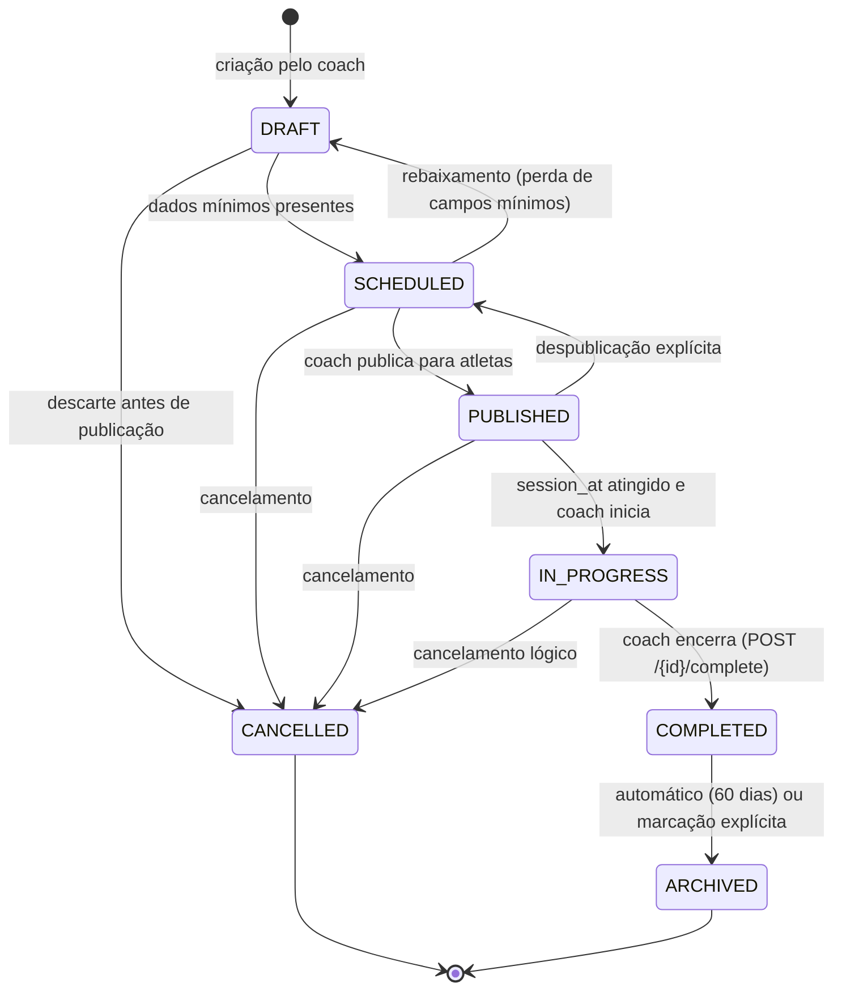
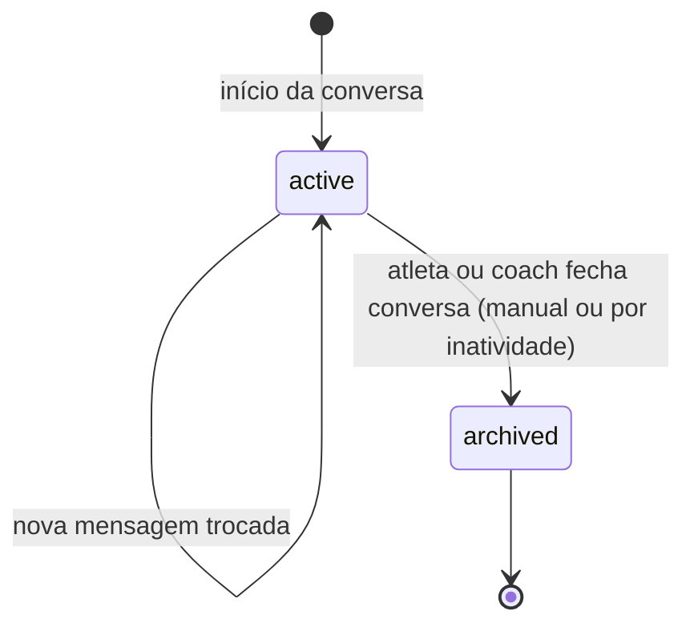
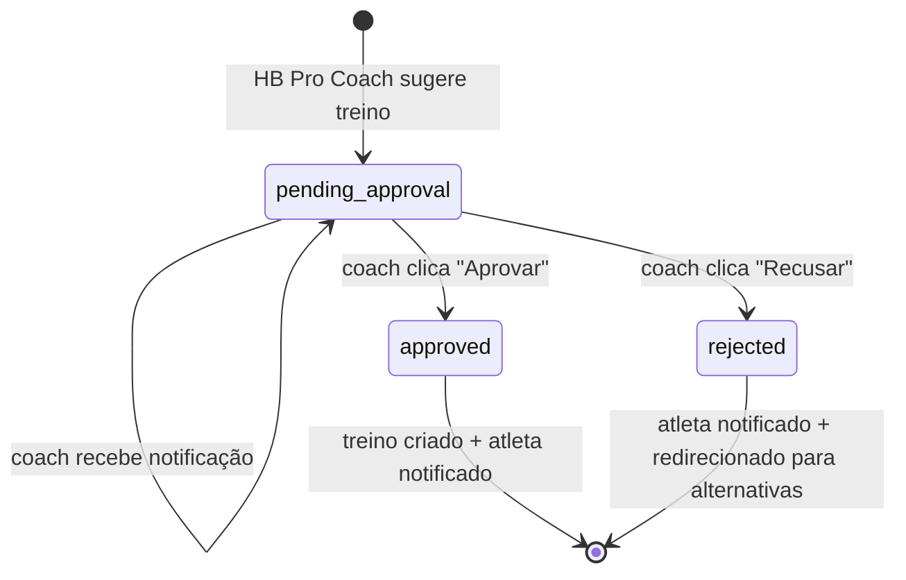

# STATE_MODEL_TRAINING.md

> **Fonte canônica soberana:** Este documento materializa a State Machine canônica
> definida em [`ADR-017`](../../../_canon/decisions/ADR-017-training-session-state-machine.md).
> Em caso de divergência, ADR-017 é soberano.
> DOMAIN_AXIOMS enum: `training_state` (closed_set: true, strict_match: true).

## Objetivo

Documentar os estados, transições válidas e invariantes da entidade `training_session`
no módulo `training`. Esta máquina de estados é fechada — transições não listadas
abaixo são inválidas e devem retornar erro.

## Entidade principal

`training_session` — ciclo de vida de uma sessão de treinamento.

---

## Diagrama de estados

---

## Tabela de estados

| Estado | Semântica | Editável? | Visível ao atleta? | Estado inicial | Estado terminal |
|---|---|---|---|---|---|
| `DRAFT` | Rascunho interno — não publicado | Sim (livre) | Não | Sim | Não |
| `SCHEDULED` | Planejado internamente — não publicado ao atleta | Sim (subconjunto) | Não | Não | Não |
| `PUBLISHED` | Publicado e visível ao atleta | Sim (campos limitados) | Sim | Não | Não |
| `IN_PROGRESS` | Em execução | Não (bloqueado — ver TRAIN-DEC-020) | Sim | Não | Não |
| `COMPLETED` | Encerrado e revisado — imutável por edição destrutiva | Não | Sim (histórico) | Não | Não |
| `CANCELLED` | Cancelado com motivo registrado | Não | Sim (cancelada) | Não | Sim |
| `ARCHIVED` | Histórico arquivado (>60 dias ou marcação explícita) | Não | Somente leitura | Não | Sim |

---

## Tabela de transições

| De | Para | Gatilho (endpoint) | Condição | Invariante | Erro se inválido |
|---|---|---|---|---|---|
| `DRAFT` | `SCHEDULED` | `PATCH /{id}` (status change) ou implícito | Dados mínimos presentes (INV-TRAIN-086) | INV-TRAIN-017 | `422 TRAINING_INVALID_STATE_TRANSITION` |
| `DRAFT` | `CANCELLED` | `POST /{id}/cancel` | — | INV-TRAIN-019 | — |
| `SCHEDULED` | `PUBLISHED` | `POST /{id}/publish` | Campos mínimos publicáveis presentes; plannedContentSnapshot gravado | INV-TRAIN-017, INV-TRAIN-086 | `422 TRAINING_INVALID_STATE_TRANSITION` |
| `SCHEDULED` | `DRAFT` | Automático (perda de campos mínimos) | Campos mínimos removidos | INV-TRAIN-017 | — |
| `SCHEDULED` | `CANCELLED` | `POST /{id}/cancel` | — | INV-TRAIN-019 | — |
| `PUBLISHED` | `IN_PROGRESS` | `POST /{id}/start` | `session_at` atingido | INV-TRAIN-018 | `422 TRAINING_INVALID_STATE_TRANSITION` |
| `PUBLISHED` | `SCHEDULED` | `POST /{id}/unpublish` | Despublicação explícita | INV-TRAIN-017 | — |
| `PUBLISHED` | `CANCELLED` | `POST /{id}/cancel` | — | INV-TRAIN-019 | — |
| `IN_PROGRESS` | `COMPLETED` | `POST /{id}/complete` | — (revisão pendente não bloqueia: INV-TRAIN-065) | INV-TRAIN-018 | `422 TRAINING_INVALID_STATE_TRANSITION` |
| `IN_PROGRESS` | `CANCELLED` | `POST /{id}/cancel` | Cancelamento lógico — sem exclusão física | INV-TRAIN-019 | — |
| `COMPLETED` | `ARCHIVED` | Automático (60 dias) ou `POST /{id}/archive` | — | INV-TRAIN-018 | `422 TRAINING_INVALID_STATE_TRANSITION` |

### Transições explicitamente proibidas (matriz completa — RC-1)

> **Regra**: toda transição não listada na tabela de transições válidas acima é proibida e deve retornar `422 TRAINING_INVALID_STATE_TRANSITION`. A tabela abaixo documenta os casos de maior risco de confusão.

| De | Para | Motivo | Invariante |
|---|---|---|---|
| `DRAFT` | `PUBLISHED` | Deve passar por `SCHEDULED` antes de `PUBLISHED` | INV-TRAIN-017 |
| `DRAFT` | `IN_PROGRESS` | Salto de estado inválido — sessão não publicada não pode ser iniciada | INV-TRAIN-017 |
| `DRAFT` | `COMPLETED` | Salto de estado inválido | INV-TRAIN-017 |
| `DRAFT` | `ARCHIVED` | Salto de estado inválido — arquivamento só pós-COMPLETED | INV-TRAIN-017 |
| `SCHEDULED` | `IN_PROGRESS` | Deve passar por `PUBLISHED` antes de iniciar execução | INV-TRAIN-017 |
| `SCHEDULED` | `COMPLETED` | Salto de estado inválido | INV-TRAIN-017 |
| `SCHEDULED` | `ARCHIVED` | Salto de estado inválido | INV-TRAIN-017 |
| `PUBLISHED` | `DRAFT` | Reverter publicação diretamente para rascunho é proibido — usar `POST /{id}/unpublish` (PUBLISHED → SCHEDULED), depois aguardar rebaixamento automático SCHEDULED → DRAFT | INV-TRAIN-017 |
| `PUBLISHED` | `COMPLETED` | Salto de estado inválido — sessão deve passar por IN_PROGRESS | INV-TRAIN-017 |
| `PUBLISHED` | `ARCHIVED` | Salto de estado inválido | INV-TRAIN-017 |
| `IN_PROGRESS` | `DRAFT` | Sessão em execução não pode regredir para rascunho | INV-TRAIN-017 |
| `IN_PROGRESS` | `SCHEDULED` | Sessão em execução não pode ser re-agendada | INV-TRAIN-017 |
| `IN_PROGRESS` | `PUBLISHED` | Sessão em execução não retroage a publicada | INV-TRAIN-017 |
| `IN_PROGRESS` | `ARCHIVED` | Sessão em execução não pode ser arquivada diretamente | INV-TRAIN-017 |
| `COMPLETED` | `DRAFT` | Sessão concluída é imutável por edição destrutiva (TRAIN-DEC-013) | INV-TRAIN-017, INV-TRAIN-006 |
| `COMPLETED` | `SCHEDULED` | Sessão concluída não pode regredir | INV-TRAIN-017 |
| `COMPLETED` | `PUBLISHED` | Sessão concluída não pode regredir | INV-TRAIN-017 |
| `COMPLETED` | `IN_PROGRESS` | Imutabilidade pós-COMPLETED (TRAIN-DEC-013) | INV-TRAIN-017, INV-TRAIN-018 |
| `COMPLETED` | `CANCELLED` | Sessão concluída não pode ser cancelada — é histórico definitivo | INV-TRAIN-017 |
| `CANCELLED` | qualquer | Estado terminal absoluto — nenhuma transição de saída permitida | INV-TRAIN-017, INV-TRAIN-019 |
| `ARCHIVED` | qualquer | Estado terminal absoluto | INV-TRAIN-017 |

> **Nota implementação**: o guard de transição deve verificar o estado atual no banco ANTES de aceitar a operação. Race conditions de atualização concorrente devem usar SELECT FOR UPDATE ou equivalente para evitar dupla-transição.

---

## Invariantes vinculadas

| Invariante | Descrição |
|---|---|
| `INV-TRAIN-006` | Estado de sessão pertence ao conjunto canônico de 7 valores (migração v0.x → v1.0) |
| `INV-TRAIN-017` | Transições de estado seguem somente as listadas na tabela acima |
| `INV-TRAIN-018` | `IN_PROGRESS → COMPLETED` é unidirecional; `COMPLETED → ARCHIVED` é automático |
| `INV-TRAIN-019` | Cancelamento disponível de qualquer estado pré-terminal; exige `cancellationReason` |
| `INV-TRAIN-065` | `POST /{id}/complete` permitido mesmo com revisão pendente |
| `INV-TRAIN-086` | Sessão `PUBLISHED` exige `individualizationMode`, `sessionAt`, e ao menos 1 `session_objective` |
| `INV-TRAIN-088` | `plannedContentSnapshot` é imutável após gravação na transição para `PUBLISHED` |

---

## Notas de migração (v0.x → v1.0)

| Estado v0.x | Estado canônico | Nota |
|---|---|---|
| `draft` | `DRAFT` | Equivalência direta |
| `scheduled` | `SCHEDULED` ou `PUBLISHED` | Requer split antes de v1.0 |
| `in_progress` | `IN_PROGRESS` | Equivalência direta |
| `pending_review` | Substatus interno (eliminado) | v1.0: coach transita direto para `COMPLETED` |
| `readonly` | `ARCHIVED` | `readonly` era estado implícito por data; substituído por `ARCHIVED` explícito |

---

## Apêndice A: State Machine da Chat Conversation (HB Pro Coach)

A conversa de chat (UIF-TRAINING-006) não tem máquina de estados complexa — é simples:

### Estados de `athlete_chat_conversation`

**Invariantes:**
- Conversa com `status=active` permite envio de mensagens
- Conversa com `status=archived` é somente-leitura (UI desabilita input)
- Não há soft delete — arquivos continuam consultáveis (relatórios)

---

### Estados de `training_suggestion`

Submáquina mais relevante — fluxo de aprovação de treino sugerido:

**Invariantes:**
- Uma sugestão em `pending_approval` bloqueia novos pedidos do mesmo atleta (max 1 ativa por vez)
- Transição `pending_approval → approved` gera novo `training_session` com `status=SCHEDULED`
- Transição `pending_approval → rejected` desativa sugestão mas não impede futuras tentativas

---

## Conflito ativo (BLOCKED_CONTRACT_CONFLICT)

> ⚠️ **TRAIN-DEC-020** — Edição viva de sessão (`IN_PROGRESS`) está marcada como
> `BLOCKED_CONTRACT_CONFLICT`: ADR-017 classifica `IN_PROGRESS` como "Não editável",
> mas TRAIN-DEC-020 exige endpoints de ajuste ao vivo. Nenhum endpoint de live
> adjustment pode ser aberto até que ADR-017 seja formalmente adendado distinguindo
> "imutabilidade do agregado estrutural" de "fatos de ajuste append-only" (ADR-018 HYBRID).
> Ver: `DOMAIN_RULES_TRAINING.md` — DR-TRAIN-020 (conflito documentado).

---

## Referências

- [`ADR-017`](../../../_canon/decisions/ADR-017-training-session-state-machine.md) — State Machine Canônica (soberano)
- [`DOMAIN_AXIOMS.json`](../../../../.contract_driven/DOMAIN_AXIOMS.json) — enum `training_state`
- [`INVARIANTS_TRAINING.md`](./INVARIANTS_TRAINING.md) — INV-TRAIN-006, 017, 018, 019, 065, 086, 088
- [`TRAIN-DEC-026`](../decisoes/ARCH_DECISIONS_TRAINING.md#train-dec-026) — Decisão original
