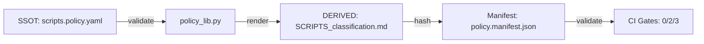

# Scripts Policy — Canonical Contracts

**Version:** 1.0.0  
**Last Updated:** 2026-02-15  
**Authority:** This document defines immutable contracts for the scripts governance system.

---

## 1. Canonical File Paths

These paths are **part of the contract** between SSOT, DERIVED, gates, and CI.  
Changes require CI workflow updates and manifest regeneration.

| Constant | Value | Description |
|----------|-------|-------------|
| **SSOT_YAML_RELPATH** | `scripts/_policy/scripts.policy.yaml` | Single Source of Truth (policy YAML) |
| **DERIVED_MD_RELPATH** | `docs/_canon/_agent/SCRIPTS_classification.md` | Generated Markdown (documentation for AI agents) |
| **MANIFEST_JSON_RELPATH** | `scripts/_policy/policy.manifest.json` | Evidence file with SHA256 hashes |
| **HEURISTICS_YAML_RELPATH** | `scripts/_policy/side_effects_heuristics.yaml` | Auxiliary policy (side-effects detection) |

**Path Rationale:**
- `_canon/` = Canonical documentation (authoritative)
- `_agent/` = Documentation for AI agents (not ephemeral, versioned for LLM consumption)

**Enforcement:**
- Python: Constants defined in [policy_lib.py](policy_lib.py#L49-L52)
- PowerShell: Constants validated against Python via [check_path_constants.py](check_path_constants.py)
- CI: Consistency gate runs on every PR (Windows + Ubuntu)

---

## 2. Exit Code Convention

All gates follow a **deterministic 3-value exit code contract**:

| Exit Code | Meaning | When to Use |
|-----------|---------|-------------|
| **0** | OK | All validations passed; no policy violations |
| **2** | POLICY_VIOLATION / DRIFT | Script violates policy OR DERIVED file drifted from SSOT |
| **3** | HARNESS_ERROR | Missing dependencies, parse errors, file not found, unexpected failures |

**Examples:**

| Gate | Exit 0 | Exit 2 | Exit 3 |
|------|--------|--------|--------|
| **check_scripts_policy.ps1** | All scripts comply | Script missing headers, wrong prefix, side-effects violation | Python not found, policy_lib.py missing |
| **check_policy_md_is_derived.ps1** | DERIVED MD matches generated | DERIVED edited by hand (drift detected) | Generator crashed, temp file I/O error |
| **check_policy_manifest.ps1** | All hashes match | Hash mismatch (files changed) | Manifest JSON invalid, files missing |

**Propagation Rules (PowerShell → Python):**
```powershell
$ExitCode = $LASTEXITCODE

switch ($ExitCode) {
    0 { exit 0 }   # OK
    2 { exit 2 }   # VIOLATION/DRIFT
    3 { exit 3 }   # HARNESS_ERROR
    default { exit 3 }  # Unknown → treat as harness error
}
```

---

## 3. Determinism Guarantees

### 3.1 Encoding and Line Endings
- **Encoding:** UTF-8 (no BOM)
- **Line Endings:** LF (Unix-style, enforced via `.gitattributes`)
- **Normalization:** All text files normalized to CRLF → LF before hashing

### 3.2 Hash Algorithm
- **Algorithm:** SHA256
- **Scope:** File content after EOL normalization (UTF-8 bytes)
- **Purpose:** Detect tampering of SSOT, DERIVED, or heuristics

**Implementation:**
- Python: [policy_lib.py](policy_lib.py#L224-L255) `compute_file_hash()`
- PowerShell: [check_policy_manifest.ps1](check_policy_manifest.ps1#L78-L109) `Get-FileHashSHA256`

### 3.3 Cross-Platform Compatibility
- **Windows:** PowerShell 5.1 (native)
- **Ubuntu:** pwsh 7+ (installed via apt)
- **Validation:** CI runs gates on both OS to catch platform-specific issues

### 3.4 Git Configuration (Required for Contributors)

**Windows Contributors - Disable `core.autocrlf`:**
```bash
# Per-repository (recommended)
git config core.autocrlf false

# Global (affects all repos)
git config --global core.autocrlf false
```

**Why:** Even with `.gitattributes` forcing LF, `core.autocrlf=true` causes Git to "touch" files on checkout (converting LF→CRLF in working copy), generating noise in `git status` and triggering unnecessary re-hashing. Setting `false` keeps working copy identical to repository.

**Verification:**
```bash
# Check current setting
git config core.autocrlf
# Expected output: false (or empty)

# Verify .gitattributes is active
git check-attr text scripts/_policy/scripts.policy.yaml
# Expected: scripts/_policy/scripts.policy.yaml: text: set
```

**macOS/Linux:** No action needed (`core.autocrlf` defaults to `false`)

---

## 4. Python Dependencies (Pinned Versions)

All Python tooling uses **pinned dependencies** to prevent drift from parser changes.

**Installation:**
```bash
pip install -r scripts/_policy/requirements.txt
```

**Current Pins (as of 2026-02-15):**
- `PyYAML==6.0.1` (YAML parser, required by policy_lib.py)
- `jsonschema==4.21.1` (Schema validator)

**Update Policy:**
- ✅ **Security patches:** Update immediately (test gates first)
- ⚠️ **Minor versions:** Require validation (regenerate manifest + test all gates)
- ❌ **Major versions:** Architecture review required (may change parser semantics)

**Verification:**
```bash
pip freeze | grep -E "(PyYAML|jsonschema)"
# Expected output matches requirements.txt exactly
```

---

## 5. SSOT → DERIVED Pipeline



**Workflow:**
1. Edit SSOT: `scripts/_policy/scripts.policy.yaml`
2. Validate: `python scripts/_policy/render_policy_md.py --check`
3. Regenerate: `python scripts/_policy/render_policy_md.py`
4. Update manifest: `python scripts/_policy/generate_manifest.py`
5. Commit all 3 files together

---

## 5. CI Workflow Stages

| Stage | Runner | Gates | Purpose |
|-------|--------|-------|---------|
| **Consistency Check** | Windows + Ubuntu | check_path_constants.py | Validate Python vs PowerShell constants match |
| **Policy Validation** | Windows + Ubuntu | check_scripts_policy.ps1 | Validate all scripts comply with policy |
| **Anti-Drift** | Windows + Ubuntu | check_policy_md_is_derived.ps1 | Ensure DERIVED not manually edited |
| **Manifest Check** | Windows | check_policy_manifest.ps1 | Verify file hashes match manifest |
| **Path/Case Check** | Ubuntu | git ls-files + grep | Detect typos, case sensitivity issues |
| **Summary** | Ubuntu | - | Aggregate results (fail if any gate failed) |

---

## 6. Maintenance Rules

### 6.1 Adding a New Canonical Path
1. Add constant to [policy_lib.py](policy_lib.py#L49-L52)
2. Update [check_path_constants.py](check_path_constants.py#L44-L47) (automatically via import)
3. Update this CONTRACT.md (Section 1)
4. Update CI workflow if path impacts gates
5. Regenerate manifest

### 6.2 Changing Exit Codes
**PROHIBITED.** Exit codes are immutable once released.  
Violating this breaks CI contracts and downstream tooling.

### 6.3 Modifying SSOT Schema
1. Update [scripts.policy.schema.json](scripts.policy.schema.json)
2. Test with `python -c "from policy_lib import load_policy; load_policy(...)"`
3. Update DERIVED generator if fields change
4. Regenerate DERIVED + manifest

---

## 7. Emergency Rollback

If governance gates block legitimate work:

**Option A: Bypass Gate (Temporary)**
```powershell
# Skip policy gates (USE WITH CAUTION)
$env:SKIP_POLICY_GATES = "1"
git commit --no-verify -m "emergency: bypass policy gates"
```

**Option B: Add Exception**
Edit `scripts.policy.yaml`:
```yaml
exceptions:
  - script: "scripts/temp/emergency_fix.py"
    rule_id: "HB004"  # Missing headers
    reason: "Emergency hotfix, to be refactored"
    expires_on: "2026-03-01"
    ticket: "INCIDENT-123"
```

**Option C: Rollback Commit**
```bash
git revert <commit-sha>
```

---

## 8. Contacts

| Issue | Contact | Response SLA |
|-------|---------|--------------|
| **Policy violation (unclear rule)** | Tech Lead | 4h (business hours) |
| **CI gate failure (false positive)** | DevOps | 2h |
| **Schema change request** | Architecture Team | 48h |

---

## Appendix: Glossary

| Term | Definition |
|------|------------|
| **SSOT** | Single Source of Truth: `scripts.policy.yaml` (immutable authority) |
| **DERIVED** | Generated artifact: `SCRIPTS_classification.md` (never edit by hand) |
| **Drift** | DERIVED file differs from SSOT-generated version (exit=2) |
| **Harness Error** | Gate infrastructure failure (exit=3), not policy violation |
| **Canonical Generator** | `scripts/_policy/render_policy_md.py` (only script that writes DERIVED) |
| **Consistency Gate** | Validates Python and PowerShell constants match (prevents duplicated drift) |

---

**Last Reviewed:** 2026-02-15  
**Next Review:** 2026-05-15 (quarterly)
